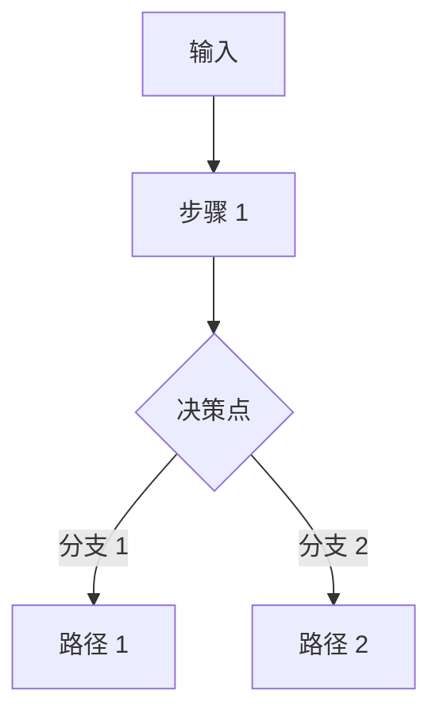
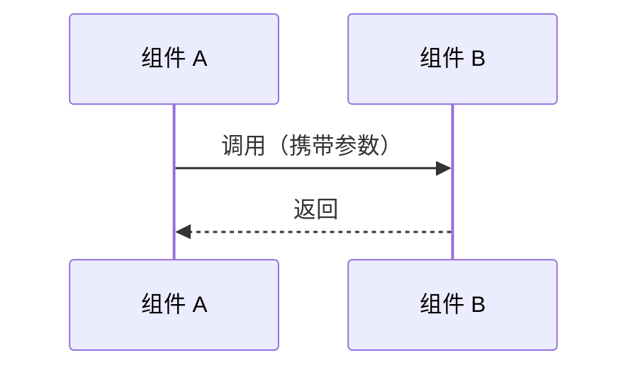
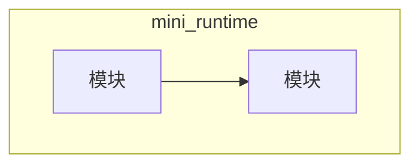
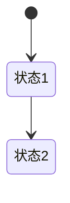

# 章节模板（Chapter Template）

复制本文件开始新章节。所有 `<!-- -->` 注释在成稿时删除。

```markdown
<!--
章节元信息（成稿时保留此注释块，供维护者使用）
chapter: chNN
part: partX_xxx
title: 章节中文标题
status: draft | review | done
-->

# 章节标题（英文副标题）

!!! abstract "本章内容"
    用 3–5 句话预告：本章解决什么问题、理论主线是什么、用什么代码验证、读者将获得什么能力。

---

## 1. Motivation 动机

<!-- 为什么会出现这个技术？它解决什么问题？如果没有它，会发生什么？
     结合 GPU、Memory、Latency、Throughput 等工程背景解释。 -->

- 问题场景描述（给出具体数字示例，如"一个 7B 模型 KV Cache 需要 X GB"）
- 没有该技术时的表现（baseline 行为）
- 该技术带来的核心收益（预期收益，量化）

## 2. Theory 理论

<!-- 第一性原理推导。要求：
     1. 从第一性原理推导，不假设读者已知道背景
     2. 画出系统流程
     3. 给出时序图
     4. 给出数据流
     5. 给出复杂度分析
     6. 给出设计权衡（Trade-off）
     不只是解释概念，要解释"为什么"。 -->

### 2.1 问题建模

<!-- 定义问题：输入、输出、约束条件 -->

### 2.2 第一性原理推导

<!-- 从最底层的约束（硬件特性/算法本质）出发推导 -->

### 2.3 系统流程



### 2.4 时序与数据流



### 2.5 复杂度分析

| 指标 | 表达式 | 直观含义 |
|------|--------|---------|
| 时间 | $O(\cdot)$ | ... |
| 空间 | $O(\cdot)$ | ... |

### 2.6 设计权衡（Trade-off）

| 方向 | 收益 | 代价 | 适用场景 |
|------|------|------|---------|
| 方案 A | ... | ... | ... |
| 方案 B | ... | ... | ... |

## 3. Industrial Implementations 工业实现

<!-- 覆盖 vLLM / TensorRT-LLM / SGLang / DeepSpeed / Megatron / HF TGI / llama.cpp 中的相关实现。
     说明为什么不同框架采用不同方案，各自的 Trade-off。 -->

### 3.1 vLLM

### 3.2 TensorRT-LLM

### 3.3 SGLang / DeepSpeed / llama.cpp ...

### 3.4 方案对比

| 框架 | 核心思路 | 关键权衡 | 适用场景 |

## 4. mini-runtime Implementation

<!-- 分析 mini-runtime 中该技术的实现。
     要求：
     1. 优先给架构设计（模块图/类图），不直接堆代码
     2. 说明修改哪些模块、新增哪些类
     3. Scheduler / Memory / 数据结构 / 生命周期 如何变化
     4. 给 Theory → Code 对应表
     5. 关键代码片段（带仓库路径注释）作为理论验证 -->

### 4.1 架构设计



### 4.2 模块与类

| 模块 | 类/函数 | 职责 | 文件路径 |

### 4.3 生命周期与数据结构变化



### 4.4 关键代码（理论验证）

```python
# mini_runtime/xxx.py:行号范围
# 代码片段，验证 2.2 节的推导
```

### 4.5 Theory → Code 对应表

| 理论机制（§2） | 代码实现 | 验证要点 |
|----------------|----------|---------|

## 5. Performance Analysis 性能分析

<!-- 从以下维度分析性能提升：GPU 利用率 / 内存带宽 / Latency / TTFT / TPOT /
     Throughput / Occupancy / Kernel Launch / Memory Fragmentation / Cache Locality /
     Roofline。必要时提供 Benchmark 方法。 -->

### 5.1 性能维度拆解

### 5.2 Benchmark 方法

```bash
# 可复现的 benchmark 命令
PYTHONPATH=. python benchmarks/scenarios/xxx.py
```

### 5.3 结果解读

<!-- 结合指标解释"为什么性能提升"，而不是只贴数据 -->

## 6. Evolution 演进

<!-- 技术后续发展路线。例如：
     Continuous Batching → Chunked Prefill → Disaggregated Prefill → PD Separation
     → Speculative Decode。 -->


## 7. Summary 总结

<!-- 回答：这个技术解决了什么？
     它在整个 AI Infra 中的位置？
     它依赖什么？
     它影响什么？ -->

| 维度 | 结论 |
|------|------|
| 解决的问题 | ... |
| 在 AI Infra 中的位置 | ... |
| 依赖 | ... |
| 影响 | ... |

### 思考题

1. ...
2. ...

### 延伸阅读

- 论文/博客/源码链接
```
