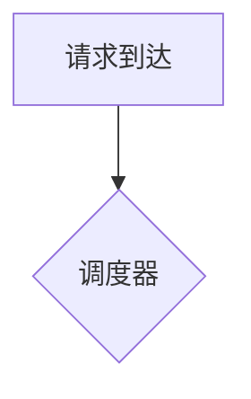

# 写作规范（Writing Guide）

本文档定义全书的统一写作标准。所有章节必须遵循本规范，以保证多作者协同时风格一致、可长期维护。

## 1. 全书定位

本书是**一本介于《CSAPP》《CUDA Programming Guide》《DDIA》与 vLLM 源码解析之间的工程教材**。

- **不是**科普书：不回避数学推导，不省略关键 trade-off。
- **不是** API 文档：代码不是主体，而是理论的验证工具。
- **追求**：第一性原理、系统设计、Trade-off、性能分析、工业实践，理论与代码相互验证。

## 2. Theory ↔ Practice 双主线

全书以**知识地图（Theory）**为骨架、以 **mini-runtime 代码（Practice）**为验证手段：

- 每个章节同时回答两个问题：*为什么需要它*（理论动机）与 *它在 mini-runtime 里如何落地*（代码验证）。
- 章节 4（mini-runtime Implementation）**必须**与章节 2（Theory）形成闭环：理论中提出的每个机制，都要在代码中指明对应实现；代码中每个关键类/函数，都要回指理论动机。
- 禁止"两本内容拼在一起"：理论章节与实现章节之间要有明确的映射关系（可用表格列出 Theory → Code 对应表）。

## 3. 章节统一结构（7 段）

每章严格按以下 7 段组织，标题固定为英文锚点友好的编号格式：

| # | 段落标题 | 内容要求 |
|---|---------|---------|
| 1 | `## 1. Motivation 动机` | 为什么出现？解决什么问题？没有它会怎样？结合 GPU/Memory/Latency/Throughput 背景 |
| 2 | `## 2. Theory 理论` | 第一性原理推导；系统流程；时序图；数据流；复杂度分析；设计权衡。不假设读者有背景，讲清"为什么" |
| 3 | `## 3. Industrial Implementations 工业实现` | vLLM / TensorRT-LLM / SGLang / DeepSpeed / Megatron / HF TGI / llama.cpp 等。说明**为什么不同框架采用不同方案**、各自的 trade-off |
| 4 | `## 4. mini-runtime Implementation` | 分析该技术在 mini-runtime 中的实现：改哪些模块、新增哪些类、Scheduler/Memory/数据结构/生命周期如何变化。**优先给架构设计，不直接堆代码** |
| 5 | `## 5. Performance Analysis 性能分析` | GPU 利用率 / 内存带宽 / Latency / TTFT / TPOT / Throughput / Occupancy / Kernel Launch / Memory Fragmentation / Cache Locality / Roofline。必要时给 Benchmark 方法 |
| 6 | `## 6. Evolution 演进` | 技术后续发展路线，如 Continuous Batching → Chunked Prefill → Disaggregated Prefill → PD Separation → Speculative Decode |
| 7 | `## 7. Summary 总结` | 解决了什么；在 AI Infra 中的位置；依赖什么；影响什么 |

## 4. 图示约定

图是本书最重要的表达手段。使用 **Mermaid**，禁止用 ASCII 艺术替代。

| 场景 | Mermaid 类型 | 说明 |
|------|-------------|------|
| 系统架构/模块关系 | `flowchart TD` | 标注模块名 + 一句话职责 |
| 时序交互 | `sequenceDiagram` | 跨组件调用序列，标注关键参数 |
| 状态迁移 | `stateDiagram-v2` | 请求/块/缓存条目的生命周期 |
| 性能/规模关系 | `quadrantChart` 或表格 | 权衡分析 |
| 数据流 | `flowchart LR` | 数据在管线中的流向 |

每张图**必须**配一段文字解释，禁止"图 + 无说明"。代码块内使用：

````markdown

````

## 5. 公式约定（KaTeX）

- 行内公式用 `$...$`，独立公式用 `$$...$$`。
- 公式必须有编号引用习惯：`$$A = B \tag{1}$$`，正文引用"如式 (1) 所示"。
- 关键推导**不可跳过中间步骤**；可用"式 (1) 到式 (2) 的推导如下"给出过程。
- 复杂度分析用 $O(\cdot)$ 表示并给出直观解释（如"与序列长度 $L$ 成平方关系"）。

## 6. 代码约定

- 代码块必须标注语言：`python` / `bash` / `cpp` / `text`。
- 引用 mini-runtime 源码时，首行注释给出仓库相对路径：
  ```python
  # mini_runtime/engine.py:120-135
  ```
- 代码展示以"关键逻辑片段"为原则，完整文件用链接引用，禁止整文件粘贴。
- 用代码**验证**理论（如"下面代码展示了式 (3) 的实现"），而不是为了展示而展示。

## 7. 交叉引用约定

- 章节引用：`[第 8 章 连续批处理](../part2_runtime_architecture/ch08_continuous_batching.md)`。
- 同一 part 内可相对路径，跨 part 必须从 `book/` 出发的相对路径。
- 术语首次出现用 **粗体**；需要在术语表登记的，写入 `glossary.md`（TODO）。

## 8. Admonition 约定

| 类型 | 用途 |
|------|------|
| `!!! note` | 补充说明、读者常见误区 |
| `!!! tip` | 工程实践提示 |
| `!!! warning` | 容易踩坑的细节、版本差异 |
| `!!! example` | 代码/数据示例 |
| `!!! abstract` | 章节开头的内容预告 |

## 9. 语言与术语

- 正文使用中文；首次出现的英文术语保留原文并给出中文：**Continuous Batching（连续批处理）**。
- 专有名词（vLLM、CUDA、KV Cache）保留英文。
- 代码注释用英文（与代码库一致），正文用中文。

## 10. 文件组织

```
book/
├── index.md                         # 首页：知识地图 + 阅读指南
├── partN_xxx/
│   ├── index.md                     # Part 综述：本部分知识地图
│   └── chNN_xxx.md                  # 章节，NN 为全局连续编号
├── guides/
│   ├── writing_guide.md             # 本文件
│   └── chapter_template.md          # 章节模板
└── javascripts/                     # MkDocs 渲染脚本（勿改）
```

- 章节编号全局连续（ch01–ch41），方便交叉引用与 PDF 导出排序。
- 文件名用小写 + 下划线，英文命名。
