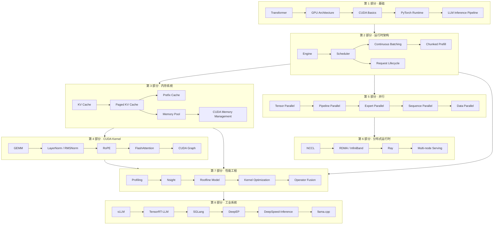

# 大模型推理系统：从原理到实现

> **AI Infra 知识体系教材** —— Theory ↔ Practice 双主线，以 [mini-runtime](https://github.com/KIOSHIROI/mini-runtime) 验证理论，以理论指导代码阅读。

本书不是一本传统的教材，而是一套**长期维护、持续迭代的 AI Infra 知识体系**。每一章都遵循统一的七段结构：**动机 → 理论 → 工业实现 → mini-runtime 实现 → 性能分析 → 演进 → 总结**，形成"理论建立知识地图、实践验证理论"的闭环。

## 知识地图



## 如何使用本书

### 路径一：从零构建（推荐通读）

按第 1 → 8 部分顺序阅读。每一章的理论部分建立知识地图，mini-runtime 实现部分作为理论验证，最终读者应当能够**独立设计、实现、优化一个工业级 LLM Runtime**。

### 路径二：问题驱动

带着工程问题跳读：

| 想解决的问题 | 推荐章节 |
|-------------|---------|
| 显存不够放 KV Cache | [第 12 章 Paged KV Cache](part3_memory_system/ch12_paged_kv_cache.md)、[第 13 章 Prefix Cache](part3_memory_system/ch13_prefix_cache.md) |
| 服务吞吐上不去 | [第 8 章 Continuous Batching](part2_runtime_architecture/ch08_continuous_batching.md)、[第 9 章 Chunked Prefill](part2_runtime_architecture/ch09_chunked_prefill.md) |
| 首 token 延迟高 | [第 5 章 Inference Pipeline](part1_fundamentals/ch05_inference_pipeline.md)、[第 20 章 FlashAttention](part4_cuda_kernels/ch20_flash_attention.md) |
| 单卡装不下模型 | [第 5 部分 · 并行](part5_parallelism/index.md) |
| 想知道为什么慢 | [第 7 部分 · 性能工程](part7_performance_engineering/index.md) |
| 想对比工业框架 | [第 8 部分 · 工业系统](part8_industrial_systems/index.md) |

### 代码验证

本书以仓库中的 [mini-runtime](https://github.com/KIOSHIROI/mini-runtime) 作为实践主线。阅读本书时请保持仓库在本地：

```bash
git clone git@github.com:KIOSHIROI/mini-runtime.git
PYTHONPATH=. python tests/test_offset.py   # 运行 CPU 测试
PYTHONPATH=. python benchmarks/scenarios/baseline.py  # 运行基准
```

每章第 4 节均给出 **Theory → Code 对应表**，指出理论机制与 `mini_runtime/` 源码的映射关系。

## 全书核心问题

贯穿全书，我们反复回答四个问题：

1. **为什么慢？** —— GPU 利用率、内存带宽、kernel launch、碎片化……（[第 7 部分](part7_performance_engineering/index.md)）
2. **如何利用 GPU？** —— 并行、批处理、算子融合……（[第 2、4、5 部分](part2_runtime_architecture/index.md)）
3. **显存从哪来、到哪去？** —— KV Cache、页式管理、前缀共享……（[第 3 部分](part3_memory_system/index.md)）
4. **工业界怎么做？** —— 从 vLLM 到 TensorRT-LLM 的工程取舍……（[第 8 部分](part8_industrial_systems/index.md)）

!!! tip "读者前置要求"
    本书默认读者具备：Python 基础、基本的深度学习概念（前向/反向传播、注意力机制）、
    线性代数与概率论基础。不要求 CUDA 或系统编程经验——这些会在书中逐步建立。
