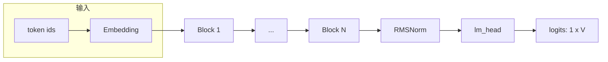
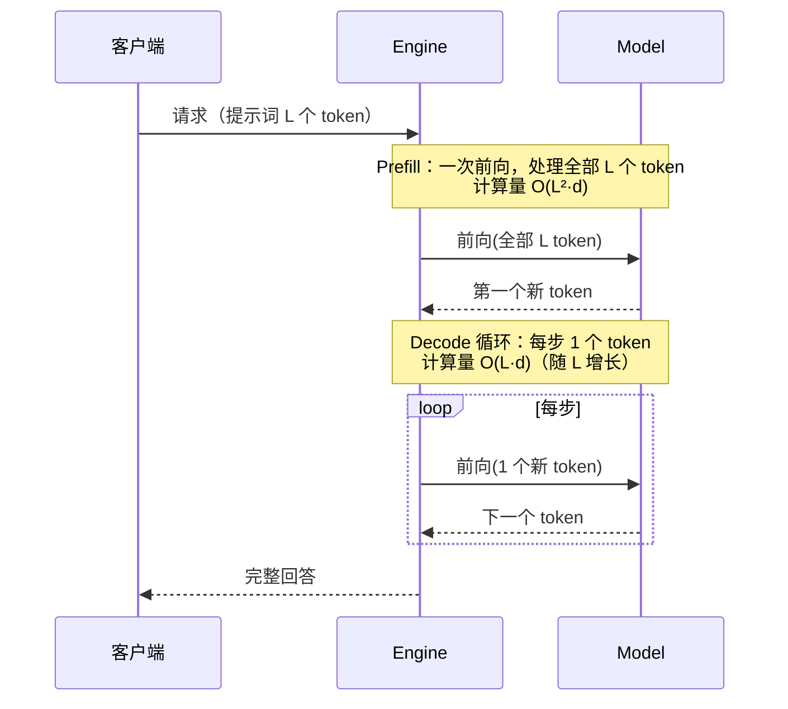
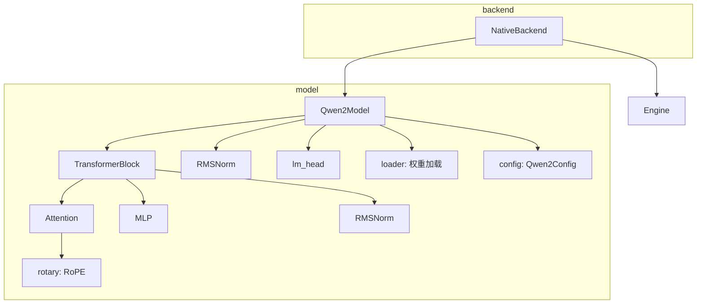
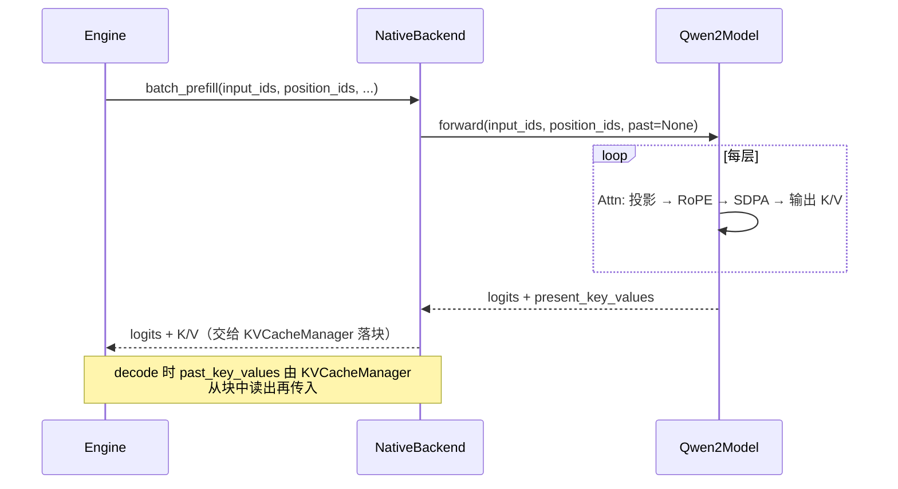
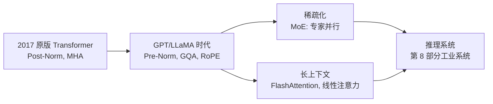

<!--
chapter: ch01
part: part1_fundamentals
title: Transformer：推理系统面对的计算对象
status: done
-->

# 第 1 章 Transformer：推理系统面对的计算对象

!!! abstract "本章内容"
    本章回答全书的第一个问题：**推理系统到底在优化什么？** 我们从 Transformer 的
    计算结构出发，推导出 prefill 与 decode 两种截然不同的计算形态，引出 KV Cache
    的必要性，并给出算力与访存（FLOPs 与 bytes）的第一性原理分析。最后用
    mini-runtime 的 `mini_runtime/model/` 目录验证全部结论。

---

## 1. Motivation 动机

现代大语言模型（LLM）几乎全部基于 Transformer 架构。这意味着：**任何推理系统的优化，
本质上都是对 Transformer 计算结构的优化**。如果不理解 Transformer 的计算特征，就无法
回答下面这些问题：

- 为什么 prefill 阶段 GPU 利用率高、decode 阶段却低得可怜？
- 为什么长上下文推理会"变慢"？
- 为什么需要 KV Cache、Paged Attention、算子融合、模型并行？
- 为什么 TTFT（首 token 延迟）和 TPOT（每 token 延迟）是两种不同的优化目标？

!!! example "一个具体的规模感"
    Qwen2.5-0.5B（mini-runtime 的默认模型）：$N \approx 4.9\times 10^8$ 参数。
    - fp16 权重占用约 **1 GB** 显存；
    - 推理每个 token 需要约 $2N \approx 1$ GFLOPs 计算；
    - 单卡 A100（312 TFLOPS fp16）理论上每毫秒可处理约 300 个 token 的计算量——
      但实际远远达不到。为什么？本章的访存分析给出答案。

如果没有对 Transformer 计算结构的系统认识，后续所有章节（调度、缓存、kernel、并行）
都将是空中楼阁。本章为全书建立统一的分析框架：**任何技术都可以用"算力、访存、延迟、
吞吐"四个维度来评估**。

## 2. Theory 理论

### 2.1 宏观结构：token 序列的变换

Transformer 接收一个 token 序列 $\mathbf{X} \in \mathbb{R}^{L \times d}$（$L$ 为序列长度，
$d$ 为隐藏维度），经过 $N$ 层相同的 Transformer Block，最后经归一化与线性映射输出
下一个 token 的概率分布：



其中每层 Block 的输入输出维度相同（都是 $\mathbb{R}^{L \times d}$），这是残差结构的
直接结果——网络深度可以无限叠加而不会引起维度不匹配。

### 2.2 Transformer Block：Pre-Norm 残差结构

现代 LLM（Qwen、LLaMA 等）普遍采用 **Pre-Norm** 结构：归一化在子层之前执行。

$$
\mathbf{x}' = \mathbf{x} + \mathrm{Attn}(\mathrm{RMSNorm}(\mathbf{x}))
\tag{1}
$$

$$
\mathbf{x}'' = \mathbf{x}' + \mathrm{MLP}(\mathrm{RMSNorm}(\mathbf{x}'))
\tag{2}
$$

子层注意力（Attention）负责 token 之间的信息交换（跨位置的混合），MLP 负责逐 token 的
非线性变换（无跨位置依赖）。这一分工决定了它们的计算形态截然不同，也决定了后文
性能分析的方法。

### 2.3 自注意力：唯一的序列依赖算子

以多头注意力为例（单头推导，$d_k$ 为头维度）。输入 $\mathbf{x} \in \mathbb{R}^{L \times d}$：

$$
\mathbf{Q} = \mathbf{W}_q \mathbf{x},\quad
\mathbf{K} = \mathbf{W}_k \mathbf{x},\quad
\mathbf{V} = \mathbf{W}_v \mathbf{x}
\tag{3}
$$

注意力分数与输出：

$$
\mathrm{Attn}(\mathbf{Q}, \mathbf{K}, \mathbf{V}) =
\mathrm{softmax}\!\left(\frac{\mathbf{Q}\mathbf{K}^{\mathsf{T}}}{\sqrt{d_k}}\right)\mathbf{V}
\tag{4}
$$

其中 $\mathbf{Q}\mathbf{K}^{\mathsf{T}} \in \mathbb{R}^{L \times L}$ 是 $L^2$ 规模的
矩阵——**序列长度的二次方是 Transformer 计算复杂度的核心来源**。

实际模型使用 **GQA（Grouped Query Attention）**：$n_q$ 个 query 头共享 $n_{kv}$ 个
KV 头（$n_{kv} < n_q$）。Qwen2.5-0.5B 中 $n_q = 14, n_{kv} = 2$，KV 权重与 KV Cache
均缩减为原来的 $n_{kv}/n_q = 1/7$。

### 2.4 两个阶段的计算形态：prefill 与 decode

LLM 生成是自回归的：每步输出一个 token，并作为下一步的输入。因此一次推理分为两个阶段：



**复杂度分析**（$d_k$ 视为常数，单层单头）：

| 阶段 | 序列长度 | 注意力矩阵 | 每步 FLOPs | 算术强度 |
|------|---------|-----------|-----------|---------|
| Prefill | $L$ | $L \times L$ | $O(L^2 d_k + L d^2)$ | 高（计算密集） |
| Decode | $1$（对 $L$ 个历史） | $1 \times L$ | $O(L d_k + d^2)$ | 低（访存密集） |

!!! note "关键洞察"
    Decode 阶段每步只算 1 个 token，却要与**全部 $L$ 个历史 token** 做注意力。
    如果不缓存历史 K/V，就必须每步重算所有历史 token 的前向——复杂度退化为
    $O(L^2)$，即 **KV Cache 存在的根本理由**。KV Cache 的详细设计见
    [第 11 章](../part3_memory_system/ch11_kv_cache.md)。

### 2.5 算术强度：为什么 decode 慢

定义算术强度 $I = \mathrm{FLOPs} / \mathrm{Bytes}$（每读入 1 字节数据做多少次运算）。
GPU 的算力（FLOPs/s）与带宽（Bytes/s）之比称为平衡点 $I^*$（例如 A100：
$312\text{TFLOPS} / 1.6\text{TB/s} \approx 195$）。

- **Prefill**：$L=2048$ 时，一个 token 的计算量 $O(L d_k)$ 远大于读取权重 $O(d^2)$，
  $I \gg I^*$，**计算瓶颈**——GPU 的矩阵乘法单元是满的。
- **Decode**（batch=1）：每步 FLOPs $\approx 2N$，但必须从 HBM 读取全部权重
  $\approx 2N$ bytes（fp16）。$I \approx 1 \ll 195$，**带宽瓶颈**——GPU 在"等数据"。

!!! example "Qwen2.5-0.5B 的量化直觉"
    单 token decode：FLOPs $\approx 1$ GFLOPs，权重读取 $\approx 1$ GB。
    在 A100 上理论计算时间 $\approx 3\,\mu$s，理论读取时间 $\approx 0.6$ ms——
    差距两个数量级。这就是为什么 decode 必须靠**批处理**（多请求共享权重读取）才能
    提升吞吐，也是 [第 8 章 Continuous Batching](../part2_runtime_architecture/ch08_continuous_batching.md)
    的动机。

### 2.6 设计权衡（Trade-off）

| 维度 | 选择 | 收益 | 代价 |
|------|------|------|------|
| 归一化位置 | Pre-Norm | 训练稳定，可加深网络 | 相比 Post-Norm 表达力略有损失 |
| KV 头数 | GQA ($n_{kv}=2$) | KV Cache 缩小 7 倍，带宽压力小 | 表达力略低于 MHA |
| 激活函数 | SwiGLU | 更好质量 | 3 个投影矩阵，参数增多 |
| 位置编码 | RoPE | 外推能力强、相对位置编码 | 每步需旋转计算 |

这些权衡不是推理系统的直接决策，但它们决定了推理系统面对的**参数规模、访存模式、
可优化空间**。

## 3. Industrial Implementations 工业实现

### 3.1 HuggingFace Transformers

最经典的模型实现方式：每个组件是一个 `nn.Module`，前向用 eager 逐算子执行。
优点：结构清晰、与论文一一对应、便于研究；缺点：eager 模式每算子一次 kernel launch，
且 `past_key_values` 以 Python 元组传递，存在大量 CPU 侧开销。它是 mini-runtime
的直接参考对象，也是学术界默认基准。

### 3.2 vLLM

模型层仍保留 PyTorch Module 结构，但有两个关键差异：

1. **KV Cache 外置**：注意力不再维护 `past_key_values` 元组，而是写入由
   `PagedAttention` kernel 管理的显存块（见 [第 12 章](../part3_memory_system/ch12_paged_kv_cache.md)）；
2. **计算图优化**：通过 `torch.compile` 或手写 kernel 融合 RMSNorm + QKV 投影，
   减少 kernel launch 开销。

vLLM 的哲学是"模型与运行时解耦"：模型只提供前向函数，调度与显存由 Engine 控制，
因此换模型不需要改调度器。

### 3.3 TensorRT-LLM

彻底放弃 Python 前向：模型在构建期被编译为 **TensorRT Engine**（算子融合、kernel
自动调优、显存静态规划），运行时零 Python 解释开销。代价是**构建时间长、动态形状
支持受限**、需要为每种模型尺寸单独构建。适合对延迟要求苛刻的生产部署。

### 3.4 方案对比

| 框架 | 模型表示 | 运行时开销 | 灵活性 | 适合场景 |
|------|---------|-----------|--------|---------|
| HF Transformers | eager Module | kernel launch 多、Python 开销大 | 最高 | 研究、实验 |
| vLLM | Module + 外置 KV | 中（CUDA Graph 缓解） | 高 | 高吞吐在线服务 |
| TensorRT-LLM | 编译期 Engine | 最低 | 低（需重新构建） | 低延迟生产部署 |
| SGLang | Module + Radix Cache | 中 | 高 | 高并发共享前缀 |

## 4. mini-runtime Implementation

### 4.1 架构设计

mini-runtime 的模型层位于 `mini_runtime/model/`，与 HF 同构但刻意极简：



### 4.2 模块与类

| 模块 | 类 | 职责 | 文件 |
|------|----|------|------|
| `Qwen2Model` | 顶层模型 | 组装 embedding + blocks + norm + lm_head | `qwen2_model.py` |
| `TransformerBlock` | 单层 | Pre-Norm 残差：Attn + MLP | `transformer_block.py` |
| `Attention` | 多头注意力 | GQA 投影、RoPE、SDPA、KV 拼接 | `attention.py` |
| `MLP` | SwiGLU | gate/up/down 三段线性 | `mlp.py` |
| `RMSNorm` | 归一化 | 方差归一化 + 可学习缩放 | `rms_norm.py` |
| `rotary` | 位置编码 | 预计算 cos/sin + 旋转应用 | `rotary.py` |
| `Qwen2Config` | 配置 | 模型超参（见 §2.3 数字） | `config.py` |

### 4.3 关键设计决策

**决策一：前向只输出最后一个 token 的 logits。**
`qwen2_model.py:45` 中 `logits = self.lm_head(x[:, -1:, :])`。
推理（尤其 decode）只需要下一个 token 的分布，截断 `lm_head` 的输入可省去
$O(L \cdot V)$ 的巨型矩阵乘法（$V = 151936$），这是针对推理形态的刻意裁剪。

**决策二：KV 显式返回，由上层管理。**
`Attention.forward` 返回 `(output, K_cache, V_cache)`，而 `Qwen2Model.forward` 把
每层的 K/V 收集进 `present_key_values` 列表返回。**模型本身不做缓存决策**——是否
缓存、缓存到哪里（Paged KV Cache 的块）由 Engine/KVCacheManager 决定
（[第 12 章](../part3_memory_system/ch12_paged_kv_cache.md)）。这个解耦是
mini-runtime 借鉴 vLLM 的关键设计。

**决策三：GQA 用 `repeat_interleave` 展开。**
`attention.py:43-44`：KV 头数 $= 2$，通过 `repeat_interleave(num_kv_groups, dim=1)`
复制为 14 个 query 头对应的 KV，然后调用 PyTorch 的
`scaled_dot_product_attention`（SDPA）。这是"以显存换实现简洁"的取舍——
展开后的 K/V 在注意力计算期间占用 $7\times$ 内存，但避免了手写 GQA kernel。
工业实现（vLLM/TensorRT-LLM）会用 GQA 专用 kernel 避免这一步。

**决策四：RoPE 用实数旋转变换。**
`rotary.py:12-20`：按奇偶分半后做 $2\times 2$ 旋转矩阵乘法，替代了早期复数乘法
实现（文件底部注释保留的旧版）。实数版避免了复数张量的中间分配。

### 4.4 生命周期与数据流



### 4.5 Theory → Code 对应表

| 理论机制（§2） | 代码实现 | 验证要点 |
|----------------|----------|---------|
| Pre-Norm 残差（式 1、2） | `transformer_block.py:23,29` | norm 在子层之前，残差相加 |
| GQA（§2.3） | `config.py:14-15`, `attention.py:43` | $n_q/n_{kv} = 7$，repeat_interleave |
| decode 只算末 token（§2.4） | `qwen2_model.py:45` | `x[:, -1:, :]` |
| KV 缓存决策外置（§2.4） | `qwen2_model.py:34` | K/V 返回而非内部维护 |
| RoPE 旋转（§2.6） | `rotary.py:16-19` | 奇偶分半旋转 |

## 5. Performance Analysis 性能分析

### 5.1 两个阶段的性能画像

| 指标 | Prefill（$L=2048$） | Decode（1 token） |
|------|--------------------|--------------------|
| 计算量 | $O(L^2 d_k)$ 注意力 + $O(L d^2)$ 投影 | $O(L d_k)$ + $O(d^2)$ |
| 算术强度 | $\gg I^*$（计算密集） | $\approx 1$（访存密集） |
| 主要瓶颈 | 矩阵乘法单元 | HBM 带宽 |
| GPU 利用率 | 高（>50%） | 低（<10% 常见） |
| 优化手段 | FlashAttention、chunked prefill | 批处理、权重量化、算子融合 |

### 5.2 Benchmark 方法

模型层 profiling 已内建：`Qwen2Model` 通过 `module_profiler` 记录
`forward/embedding`、`forward/attention`、`forward/mlp`、`forward/norm+lm_head`
四段耗时（`qwen2_model.py:25,40-41,46`）。复现方法：

```bash
PYTHONPATH=. python benchmarks/scenarios/baseline.py
```

该脚本输出每个模块的耗时占比——读者可以观察到 prefill 下 attention 占比随
$L$ 增长而上升（$O(L^2)$），验证 §2.4 的复杂度结论。

### 5.3 结果解读

- **Prefill**：注意力矩阵 $L \times L$ 的计算随 $L$ 平方增长，长提示词下
  FlashAttention（[第 20 章](../part4_cuda_kernels/ch20_flash_attention.md)）与
  chunked prefill（[第 9 章](../part2_runtime_architecture/ch09_chunked_prefill.md)）
  是两大优化方向。
- **Decode**：单 token 前向的时间几乎全花在读取权重上，因此**批处理是 decode
  吞吐的第一优化手段**（权重读取被 batch 分摊），这也直接催生了 Continuous Batching
  调度器。

## 6. Evolution 演进

Transformer 架构的演进直接改变推理系统的优化目标：



- **MoE（Mixture of Experts）**：激活参数远小于总参数，引入 Expert Parallel
  （[第 24 章](../part5_parallelism/ch24_expert_parallel.md)）与通信优化（DeepEP）。
- **长上下文**：KV Cache 线性增长，催生 Paged KV Cache、前缀缓存、投机解码等
  一系列推理侧创新——它们全部可以追溯到本章的复杂度分析。

## 7. Summary 总结

| 维度 | 结论 |
|------|------|
| 解决的问题 | 界定推理系统的优化对象：prefill（计算密集）与 decode（访存密集）两种形态 |
| 在 AI Infra 中的位置 | 计算图的最底层——一切调度、缓存、kernel 优化的直接操作对象 |
| 依赖 | 矩阵乘法、归一化、位置编码等基础算子；GPU 算力与带宽 |
| 影响 | 决定 KV Cache 必要性、批处理收益、长上下文成本、并行切分策略 |

### 思考题

1. 推导 decode 阶段算术强度 $I \approx 1$ 的过程，并说明若改用 int8 权重，
   $I$ 如何变化、对延迟有什么影响。
2. GQA 的 `repeat_interleave` 展开在 batch 很大时显存峰值是多少？工业实现如何避免？
3. 为什么 mini-runtime 选择让模型返回 K/V 而非内部缓存？这个解耦对
   [第 12 章](../part3_memory_system/ch12_paged_kv_cache.md)的 Paged KV Cache 意味着什么？

### 延伸阅读

- Vaswani et al., *Attention Is All You Need*, 2017
- Ainslie et al., *GQA: Training Generalized Multi-Query Transformer Models from Multi-Head Checkpoints*, 2023
- Su et al., *RoFormer: Enhanced Transformer with Rotary Position Embedding*, 2021
- mini-runtime 源码：`mini_runtime/model/` 全部文件
