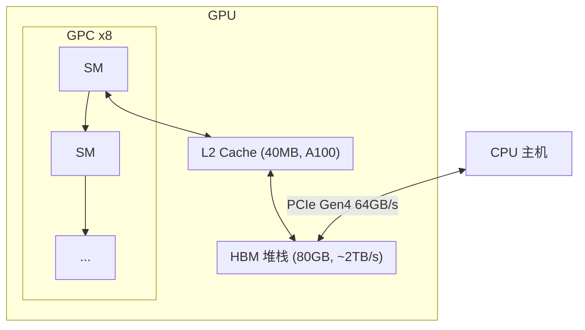
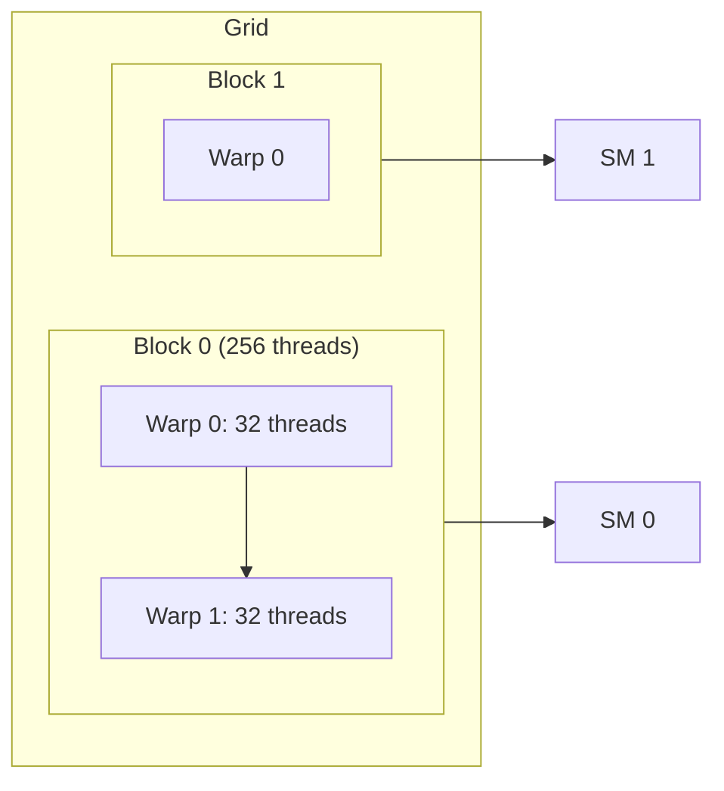
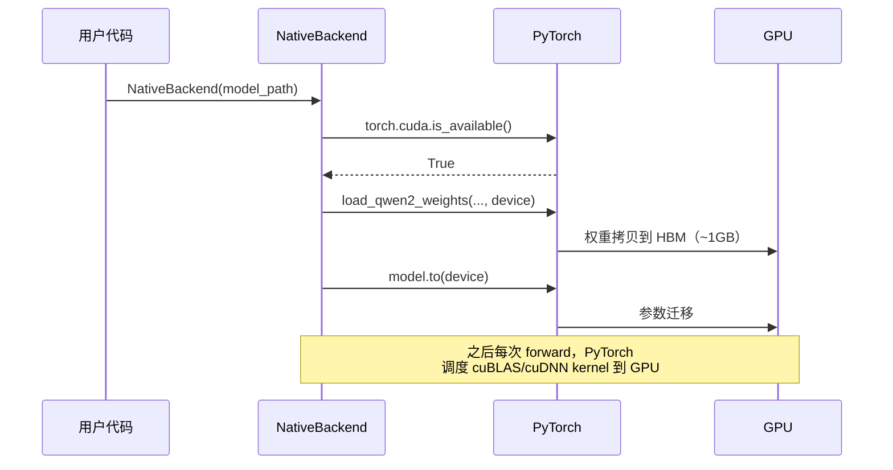
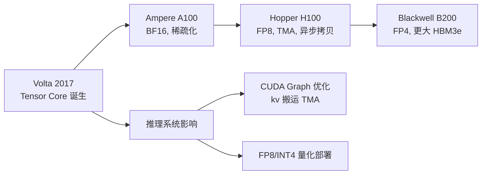

<!--
chapter: ch02
part: part1_fundamentals
title: GPU 架构：性能瓶颈的物理根源
status: done
-->

# 第 2 章 GPU 架构：性能瓶颈的物理根源

!!! abstract "本章内容"
    第 1 章回答了"优化什么"，本章回答"**为什么 GPU 是这样、瓶颈在哪里**"。
    我们从 SM、Tensor Core、HBM 的硬件结构出发，推导 GPU 的算力与带宽模型，
    解释为什么 LLM 推理的 prefill/decode 呈现截然不同的性能特征，并给出
    mini-runtime 中与 GPU 交互的全部代码位置。

---

## 1. Motivation 动机

任何推理系统的性能数字最终都由硬件决定。**不理解 GPU 的物理结构，就无法解释
为什么某个优化有效（或无效）**：

- 为什么 decode 阶段增加 batch 能线性提升吞吐？—— 因为权重读取被分摊。
- 为什么矩阵乘法要"切块"？—— 因为数据要从 HBM 搬到 shared memory。
- 为什么 kernel launch 也有成本？—— 因为 CPU 与 GPU 是异步的主从关系。
- 为什么量化（fp16 → int8）在 decode 阶段收益巨大？—— 因为访存瓶颈下，
  减小数据体积直接缩短时间。

!!! example "直观的差距"
    CPU（如 Xeon）内存带宽约 0.2–0.5 TB/s，A100 的 HBM2e 带宽约 2 TB/s，
    但 CPU 的访存延迟更低、分支处理更强。GPU 是用**延迟换吞吐**的极端设计：
    用数千个并发线程掩盖访存延迟，而不是像 CPU 那样用大缓存降低延迟。

## 2. Theory 理论

### 2.1 GPU 的宏观结构



关键结论：**HBM 带宽是所有 GPU 优化的第一约束**。以 A100 为例，
L2 到 SM 的带宽远高于 HBM 到 L2，因此数据复用（cache locality）是 kernel
优化的核心手段（[第 34 章 Kernel 优化](../part7_performance_engineering/ch34_kernel_optimization.md)）。

### 2.2 SM：GPU 的基本计算单元

每个 **SM（Streaming Multiprocessor）** 包含：

- **CUDA Core**：通用浮点/整数单元（A100 每 SM 64 个 fp32 core）；
- **Tensor Core**：专为矩阵乘加设计的单元，fp16 输入下吞吐约为 CUDA Core 的 8–16 倍；
- **Shared Memory**：SM 内共享的高速存储（A100 每 SM 192 KB，可配置为 L1）；
- **寄存器堆**：256 KB / SM，线程私有；
- **Warp 调度器**：每 SM 4 个，负责指令发射。

Tensor Core 是 Transformer 推理的计算主力：Attention 的 QKV 投影、MLP 的
三段线性层全部是 GEMM（通用矩阵乘），由 Tensor Core 执行。
以 A100 为例，Tensor Core 提供的 fp16 算力（312 TFLOPS）是 CUDA Core 算力
（19.5 TFLOPS）的 **16 倍**。

### 2.3 执行模型：SIMT 与 Warp

GPU 采用 **SIMT（单指令多线程）** 模型：



- 32 个线程组成一个 **warp**，warp 是调度和执行的基本单位——同一 warp 内
  所有线程在同一时钟执行同一指令（有分支时串行化，称为 divergence）。
- **Occupancy（占用率）** = 活跃 warp 数 / SM 最大 warp 数。占用率不足时，
  无法用并发掩盖访存延迟，kernel 性能急剧下降。
- **延迟掩盖**：GPU 靠大量 resident warp 的指令级并行来掩盖 HBM 延迟
  （约 400–800 cycles）。这是"以吞吐换延迟"的根本机制。

### 2.4 内存层次与带宽

| 层次 | 容量（A100） | 带宽/延迟 | 归属 |
|------|------------|-----------|------|
| 寄存器 | 256 KB/SM | 最高 | 线程私有 |
| Shared Memory / L1 | 192 KB/SM | ~19 TB/s（聚合） | Block 内共享 |
| L2 | 40 MB | ~5.5 TB/s | GPU 全局 |
| HBM2e | 80 GB | 2.0 TB/s，~500 cycles | 全局 |

**第一性原理结论**：Transformer 推理的绝大部分数据（权重、KV Cache、激活）位于
HBM。因此推理性能的上限由**从 HBM 搬运数据的速度**决定，而不是由 Tensor Core
的峰值算力决定——除非数据能被复用（如 batch 内共享权重读取）。

### 2.5 算力-带宽平衡点（Roofline 前奏）

定义算术强度 $I = \mathrm{FLOPs}/\mathrm{Bytes}$。GPU 的平衡点：

$$
I^* = \frac{\mathrm{峰值算力}}{\mathrm{内存带宽}}
\tag{1}
$$

| GPU | fp16 算力（dense） | 带宽 | $I^*$ |
|-----|-------------------|------|-------|
| A100 80GB | 312 TFLOPS | 2.0 TB/s | $\approx 156$ |
| H100 SXM | 989 TFLOPS | 3.35 TB/s | $\approx 295$ |
| B200 | 2250 TFLOPS | 8.0 TB/s | $\approx 281$ |

结合 [第 1 章](ch01_transformer.md) 的结论：

- **Prefill**（$L$ 较大时）：$I \approx L d_k / d \gg I^*$，计算瓶颈，Tensor Core 满载；
- **Decode**（batch=1）：$I \approx 1 \ll I^*$，带宽瓶颈，Tensor Core 空转。

!!! note "算力-带宽剪刀差"
    注意 H100 相比 A100：算力提升 3.2 倍，带宽仅提升 1.7 倍——平衡点从 156 升到
    295。**算力增长远快于带宽增长**，意味着访存密集的 decode 阶段越来越成为
    相对瓶颈，这正是推理系统大量创新（KV Cache 压缩、量化、投机解码）的物理原因。

### 2.6 为什么 GPU 适合 Transformer

1. **GEMM 主导**：QKV 投影、MLP 均为 GEMM，Tensor Core 天然匹配；
2. **数据并行**：batch 内的请求互不依赖，可在数千个 SM 上并行；
3. **容忍高延迟**：推理没有数据依赖链（无反向传播），可用占用率掩盖访存延迟。

### 2.7 设计权衡（Trade-off）

| 方向 | 收益 | 代价 | 适用场景 |
|------|------|------|---------|
| 更多 CUDA Core（无 Tensor Core） | 通用性强 | 算力远低于 Tensor Core | 早期 GPU |
| 更大 HBM | 可容纳更大模型/更长上下文 | 成本、功耗 | 训练/长上下文推理 |
| 更大 L2 | 提升权重复用 | 芯片面积、延迟 | 大 batch 推理 |
| 更高带宽（HBM3e） | 缓解访存瓶颈 | 成本、散热 | 推理卡 |

## 3. Industrial Implementations 工业实现

### 3.1 不同 GPU 的代际差异如何影响框架设计

| 特性 | A100 (Ampere) | H100 (Hopper) | B200 (Blackwell) |
|------|--------------|---------------|------------------|
| Tensor Core 特性 | fp16/BF16 | + FP8、TMA、异步拷贝 | + FP4、第二代 TMA |
| 对框架的意义 | cuBLAS/cuDNN 成熟 | FP8 量化部署、CUDA Graph 收益大 | 更低精度部署 |
| KV 规模（同预算） | baseline | 同显存下 KV 翻倍 | 4 倍 |

框架层面：

- **vLLM / SGLang**：通过 **CUDA Graph**（[第 21 章](../part4_cuda_kernels/ch21_cuda_graph.md)）
  消除 eager 模式的 kernel launch 开销——这在 H100 上收益尤其明显（每步节省
  数十微秒的 CPU 调度）；
- **TensorRT-LLM**：针对每张卡做 kernel 自动调优（tactic selection），
  并利用 Hopper 的 TMA 单元优化 KV Cache 搬运；
- **llama.cpp**：面向消费级 GPU/CPU，优先考虑带宽利用而非 Tensor Core，
  大量使用 int8/int4 量化（[第 40 章 llama.cpp](../part8_industrial_systems/ch41_llamacpp.md)）。

**为什么不同框架采用不同方案？** 因为目标硬件与场景不同：数据中心卡（H100）算力
过剩、带宽稀缺 → 优化访存与 launch 开销；消费卡（RTX）显存小、带宽低 → 优化
精度与占用。同一技术（如 CUDA Graph）在不同硬件上收益不同，这是理解工业实现
差异的关键视角。

## 4. mini-runtime Implementation

### 4.1 架构设计

mini-runtime **不直接写 CUDA**，而是通过 PyTorch 间接使用 GPU。它在两个层面与
GPU 交互：

```mermaid
flowchart TD
    subgraph mini_runtime
        NB[NativeBackend] -->|DEVICE 检测| D[torch.device]
        NB -->|model.to(device)| M[Qwen2Model]
        P[Profiler] -->|显存快照| MC[torch.cuda.memory_allocated]
        P -->|设备信息| MR[torch.cuda.memory_reserved]
    end
    D --> T[PyTorch]
    M --> T
    MC --> T
    T -->|cuBLAS/cuDNN/SDPA| G[GPU]
```

### 4.2 模块与职责

| 功能 | 代码位置 | 说明 |
|------|---------|------|
| 设备检测 | `native.py:14` | `torch.device("cuda" if torch.cuda.is_available() else "cpu")` |
| 模型上卡 | `native.py:56` | `self.model.to(device)`，权重迁移到目标设备 |
| 禁用 autograd | `native.py:59` | `torch.set_grad_enabled(False)`，避免计算图积累 |
| 显存快照 | `profiler.py:216-237` | `memory_allocated`（实际占用）与 `memory_reserved`（缓存池） |
| 显存监控脚本 | `benchmarks/scenarios/a800.py:46-99` | 每步打印 allocated/reserved |

!!! note "memory_allocated vs memory_reserved"
    PyTorch 的缓存分配器（Caching Allocator）会向 CUDA 预申请大块显存
    （`memory_reserved`），再按需切分给张量（`memory_allocated`）。
    两者之差是分配器的缓存空闲块——这也是 [第 15 章 CUDA 内存管理](../part3_memory_system/ch15_cuda_memory_management.md)
    讨论碎片化的起点。

### 4.3 生命周期与数据流



### 4.4 Theory → Code 对应表

| 理论机制（§2） | 代码实现 | 验证要点 |
|----------------|----------|---------|
| 设备抽象（§2.1） | `native.py:14` | cuda/cpu 统一为 `torch.device` |
| 权重驻留 HBM（§2.4） | `native.py:56` | 一次 `to(device)` 完成驻留 |
| 带宽瓶颈度量（§2.5） | `profiler.py:235-237` | allocated/reserved 差值即分配器缓存 |
| 显存增长追踪 | `benchmarks/scenarios/a800.py:87-89` | 每步 allocated/reserved 日志 |

## 5. Performance Analysis 性能分析

### 5.1 关键度量维度

| 维度 | 度量方法 | 与推理的关系 |
|------|---------|-------------|
| GPU 利用率 | `nvidia-smi` / Nsight（[第 32 章](../part7_performance_engineering/ch32_nsight.md)） | 低利用率 ≈ 调度/访存瓶颈 |
| 带宽利用率 | 实测 bandwidth / 峰值带宽 | decode 阶段的核心指标 |
| Occupancy | 活跃 warp / 最大 warp | 反映延迟掩盖能力 |
| Kernel Launch 开销 | Nsight 的 kernel 时间线 | eager 模式下每算子 ~5–10µs |
| 显存碎片 | allocated/reserved 曲线 | 影响长连接服务稳定性 |

### 5.2 Benchmark 方法

mini-runtime 提供两层观测：

```bash
# 1) 粗粒度：benchmark 脚本打印每步显存与耗时
PYTHONPATH=. python benchmarks/scenarios/baseline.py

# 2) 细粒度：ModuleProfiler 记录 embedding/attention/mlp/norm 分段耗时
#    （配合 torch.cuda.synchronize 保证计时准确）
```

!!! warning "计时陷阱"
    PyTorch 的 kernel 是异步发射的，`time.perf_counter()` 只能测 CPU 侧耗时。
    如需 GPU 侧精确时间，必须在计时点之间调用 `torch.cuda.synchronize()`。
    mini-runtime 的 ModuleProfiler 在 eager 模式下测量的是近似值——这本身也是
    第 7 部分引入 Nsight 等专业工具的理由。

### 5.3 结果解读

- 若 prefill 阶段 GPU 利用率高（>50%）而 decode 低（<10%）：符合 §2.5 的
  算力/带宽模型，说明系统处于"正常状态"，优化方向是批处理与访存压缩；
- 若 prefill 阶段利用率也低：通常是 batch 太小或 kernel launch 开销主导，
  需要 CUDA Graph 或算子融合（[第 21 章](../part4_cuda_kernels/ch21_cuda_graph.md)）。

## 6. Evolution 演进



每次代际跃迁都在改变推理系统的设计约束：

- Tensor Core（Volta）→ GEMM 不再是瓶颈，注意力（非 GEMM 部分）成为优化点 → FlashAttention；
- FP8/FP4（Hopper/Blackwell）→ 量化部署成为带宽瓶颈的第一解药；
- TMA/异步拷贝（Hopper）→ KV Cache 的块搬运可以绕过寄存器，Page 粒度管理更高效。

## 7. Summary 总结

| 维度 | 结论 |
|------|------|
| 解决的问题 | 解释推理性能的物理上限：算力（Tensor Core）与带宽（HBM）的剪刀差 |
| 在 AI Infra 中的位置 | 一切性能数字的最终裁决者；Roofline 模型的横轴 |
| 依赖 | 半导体工艺、HBM 技术、PCIe/NVLink 互联 |
| 影响 | 决定调度策略（批处理）、缓存策略（KV 压缩）、kernel 策略（融合/量化） |

### 思考题

1. 用本章的算力-带宽模型解释：为什么 int8 量化在 decode 阶段比 prefill 阶段收益更大？
2. A100 上 occupancy 从 25% 提到 100%，对带宽密集 kernel 与计算密集 kernel
   的影响为何不同？
3. mini-runtime 的 `memory_reserved` 远大于 `memory_allocated` 时，说明什么？
   对长连接服务有什么风险？

### 延伸阅读

- NVIDIA, *A100 Tensor Core GPU Architecture*, 2020
- NVIDIA, *H100 Tensor Core GPU Architecture*, 2022
- 栗显欢等, *CUDA 编程：基础与实践*（中文入门）
- mini-runtime 源码：`mini_runtime/backend/native.py:14,56,59`、`mini_runtime/profiler.py:216-237`
