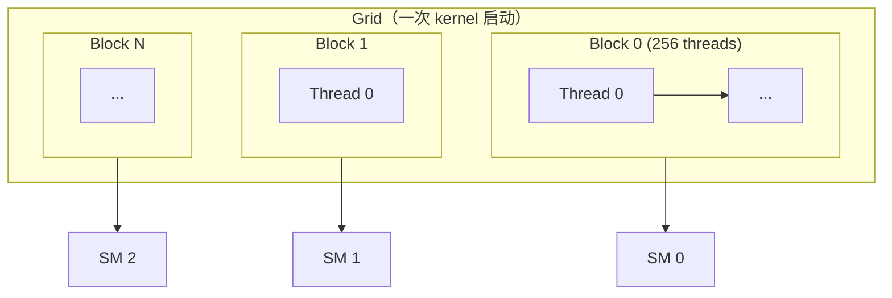
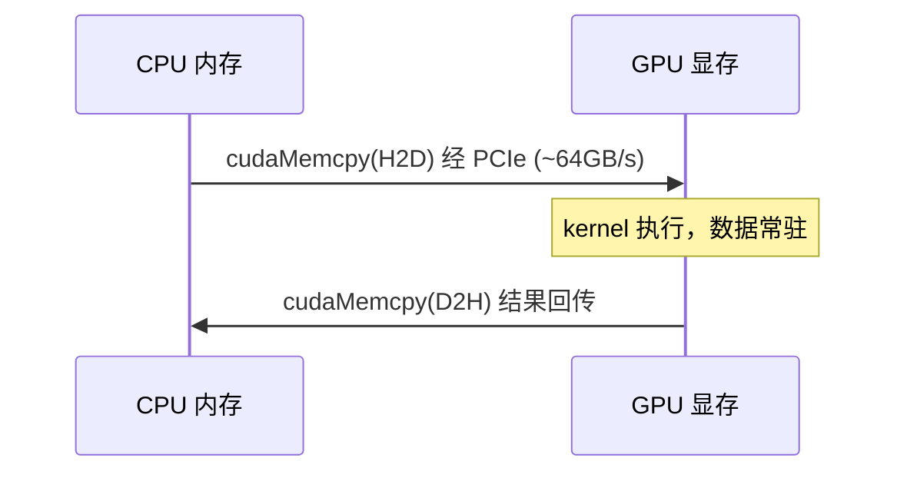
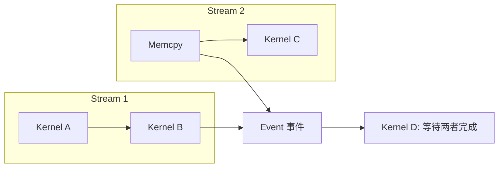
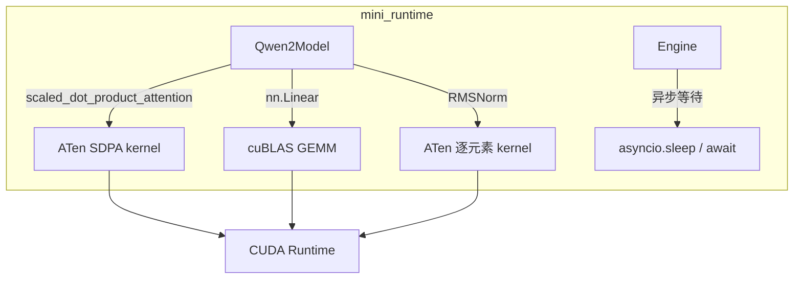
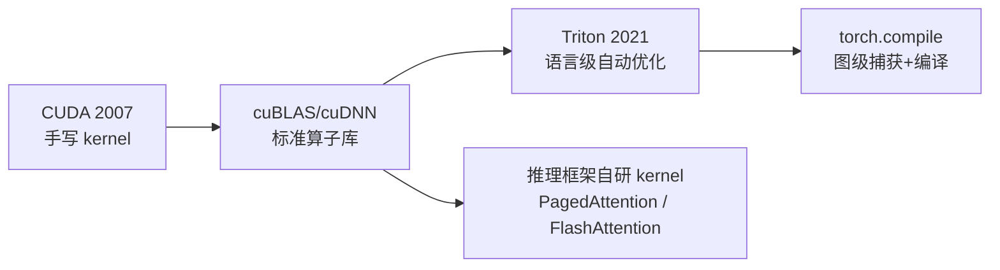

<!--
chapter: ch03
part: part1_fundamentals
title: CUDA 基础：表达并行
status: done
-->

# 第 3 章 CUDA 基础：表达并行

!!! abstract "本章内容"
    第 2 章告诉我们 GPU 是一台"用数千并发线程掩盖访存延迟"的机器。本章推导
    **程序员如何表达这种并行**：从线程组织（grid/block/thread）到访存优化
    （合并访问、shared memory），再到异步执行（stream）。每一节都由上一节
    留下的问题自然引出。读完本章，读者应能看懂 kernel 代码，并理解
    [第 4 部分](../part4_cuda_kernels/index.md) 所有 kernel 优化的动机。

---

## 1. Motivation 动机

第 2 章画出了 GPU 的物理结构：SM、Tensor Core、HBM。但**硬件本身不会自己工作**——
需要一个编程接口让程序员告诉 GPU"做什么、数据在哪、并行度多大"。没有这个接口，
我们只能依赖封闭的库（cuBLAS 等），而无法为 Attention、KV Cache 搬运等
**非标准算子**定制 kernel——而这恰恰是推理系统性能差异的最大来源。

!!! example "为什么推理框架需要自己写 kernel"
    标准 GEMM 可以用 cuBLAS；但 FlashAttention 的"分块注意力 + 在线 softmax"、
    PagedAttention 的"非连续块读取"都不是标准算子。vLLM 与 TensorRT-LLM
    的核心竞争力之一，就是为这些算子手写 CUDA kernel
    （[第 20 章](../part4_cuda_kernels/ch20_flash_attention.md)、
    [第 12 章](../part3_memory_system/ch12_paged_kv_cache.md)）。

CUDA（Compute Unified Device Architecture）是 NVIDIA 提供的编程模型。本章推导其
三个核心设计：**线程如何组织、数据如何流动、执行如何异步**。

## 2. Theory 理论

### 2.1 从"表达并行"推导线程组织

第 2 章的约束：GPU 有 100 多个 SM，每个 SM 需要数百个活跃线程来掩盖延迟。
**程序员面对的第一个问题**：如何把"一个并行任务"映射到这么多线程上？

CUDA 的答案是一个三层线程层次：



- **Grid**：一次 kernel 启动的全部线程集合，由 block 组成；
- **Block**：一个 block 只会被调度到**一个** SM 上（不会跨 SM），block 内的线程
  可通过 shared memory 通信；
- **Thread**：最小执行单元，32 个线程组成一个 warp（第 2 章 §2.3）。

!!! note "推导：为什么 block 不能跨 SM？"
    若 block 可跨 SM，则 block 内线程的 shared memory 通信就需要跨芯片的同步——
    成本接近全局同步，违背"共享内存快"的设计初衷。**把通信限制在 SM 内**
    是 CUDA 性能模型的地基：通信距离 = 延迟 = 成本。

内核通过 `blockIdx` / `threadIdx` 计算每个线程负责的数据。典型模式是
**grid-stride loop**：线程 `t` 处理下标 `t, t+stride, t+2*stride, ...`，
其中 `stride = gridDim * blockDim`。当数据量大于线程数时，这个循环让
kernel 与数据规模解耦——这是后续所有 kernel 的骨架。

### 2.2 从"分支代价"推导 SIMT 规则

block 被分配到 SM 后，线程如何执行？第 2 章已指出 warp 是执行单位。
**程序员面临的第二个问题**：如果 warp 内 32 个线程走不同分支会怎样？

答案是 **divergence（分支发散）**：warp 内分支串行执行，被跳过的线程空转。

```
if (tid % 2 == 0) { A } else { B }
→ warp 先执行 A（一半线程活跃），再执行 B（另一半活跃）
→ 总耗时 = A + B，而不是 max(A, B)
```

!!! tip "推导结论"
    - 分支是否昂贵，取决于**分支是否跨越 warp 边界**：`if (tid % 32 == 0)`
      比 `if (tid < 16)` 昂贵得多——前者每次只有 1/32 线程活跃。
    - 因此 kernel 设计的第一原则：**让同一 warp 内的线程访问连续数据**，
      分支尽量按 warp 对齐。这个原则与下一节的合并访问要求完全一致——
      不是巧合，而是 SIMT 硬件模型的必然结果。

### 2.3 从"带宽稀缺"推导访存优化

第 2 章最硬的约束是 HBM 带宽（A100 约 2 TB/s，平衡点 $I^* \approx 156$）。
**程序员面临的第三个问题**：如何让有限的带宽不被浪费？

**结论一：合并访问（Coalescing）**。HBM 以 32 字节的扇区（sector）为单位传输。
如果 warp 的 32 个线程访问**连续**的 128 字节（32 × 4B），只需 1 次扇区传输；
如果访问随机地址，则需最多 32 次传输——有效带宽下降一个数量级。

```cuda
// 高效：线程 tid 访问 data[tid] —— 合并
float v = data[threadIdx.x];
// 低效：线程 tid 访问 data[tid * 32] —— 32 次传输
float v = data[threadIdx.x * 32];
```

!!! note "对推理系统的意义"
    PagedAttention 之所以难以高效实现，正是因为它要读取**物理上不连续**
    的 KV 块（[第 12 章](../part3_memory_system/ch12_paged_kv_cache.md)）。
    TensorRT-LLM 用 TMA 硬件单元专门解决这类非连续读取——一切回到带宽约束。

**结论二：Shared Memory 复用**。数据从 HBM 读到寄存器，路径是
HBM → L2 → shared memory → 寄存器。若一个数据块被 warp 内多次使用（如
GEMM 的分块），应先加载到 shared memory 再复用，避免重复走 HBM 路径。
Shared memory 的代价是 **bank conflict**：shared memory 被分为 32 个 bank，
同一 warp 若同时访问同一 bank 的不同地址，访问被串行化。

**结论三：算术强度定律**（回顾第 1 章 §2.5）。kernel 的性能由
$\min(\text{算力}, \text{带宽} \times I)$ 决定。提升性能只有两条路：
提高 $I$（数据复用）或减少 Bytes（量化、压缩）——这两条路贯穿全书。

### 2.4 从"显存生命周期"推导显存管理

kernel 需要数据在显存中，但数据最初在 CPU 内存。**程序员面临的第四个问题**：
数据如何进入 GPU？



- **显式分配**：`cudaMalloc` / `cudaFree`。程序员完全控制，但碎片化与
  分配开销由自己承担（[第 15 章](../part3_memory_system/ch15_cuda_memory_management.md)）；
- **统一内存（Unified Memory）**：`cudaMallocManaged`，由驱动按需迁移页面。
  简化编程，但缺页迁移可能引发长延迟——不适合延迟敏感路径；
- **页锁定内存（Pinned Memory）**：H2D 拷贝可用 DMA 直传，速度更快，
  代价是挤占系统内存。

!!! tip "推导结论"
    显存管理的本质是**分配策略与生命周期控制**的权衡：显式分配最可控但最繁琐，
    统一内存最省心但延迟不可控。工业推理系统全部选择显式分配 + 内存池
    （[第 14 章](../part3_memory_system/ch14_memory_pool.md)），因为
    推理路径上的每一次隐式缺页都是不可接受的延迟抖动。

### 2.5 从"主从异步"推导流与事件

第 2 章说 GPU 用并发掩盖延迟，但 CPU 与 GPU 是**主从异步**关系：CPU 发射
kernel 后不等待其完成。**程序员面临的第五个问题**：多个 kernel、多次拷贝之间
如何组织顺序与并发？

CUDA 用 **Stream（流）** 回答：



- 同一 stream 内的操作**保序**执行；
- 不同 stream 的操作**可并发**（若资源允许）——这是数据搬运与计算重叠的手段；
- **Event** 提供跨 stream 的同步点，`cudaDeviceSynchronize()` 则是全局屏障。

!!! warning "推理系统的两个后果"
    1. 计时必须显式同步：`torch.cuda.synchronize()`，否则测的是 CPU 发射时间
       （[第 2 章 §5.2](../part1_fundamentals/ch02_gpu_architecture.md) 已提及）；
    2. CUDA Graph 捕获的正是"一个 stream 上的 kernel 序列"，把数百次 launch
       合并为一次（[第 21 章](../part4_cuda_kernels/ch21_cuda_graph.md)）。

### 2.6 设计权衡（Trade-off）

| 维度 | 选择 | 收益 | 代价 |
|------|------|------|------|
| 数据加载 | 合并访问 | 带宽利用率高 | 要求数据布局连续 |
| 数据复用 | Shared Memory | 减少 HBM 流量 | bank conflict、代码复杂 |
| 显存管理 | 显式分配 | 延迟可控、无缺页 | 需自建内存池 |
| 执行方式 | 多 Stream 并发 | 拷贝/计算重叠 | 同步与依赖管理复杂 |
| 同步策略 | 事件驱动 | 精细控制 | 易死锁、调试困难 |

## 3. Industrial Implementations 工业实现

### 3.1 三层生态：库 → 编译器 → 手写 kernel

| 层次 | 代表 | 权衡 |
|------|------|------|
| 算子库 | cuBLAS / cuDNN | 性能最优、但只覆盖标准算子 |
| 编译器 | Triton / torch.compile | 半自动优化，覆盖自定义算子 |
| 手写 kernel | vLLM/TensorRT-LLM 自研 | 完全控制、开发成本最高 |

**为什么不同框架选择不同层次？** vLLM 早期全用 PyTorch 内置算子（靠库），
性能受限后才引入自定义 kernel（PagedAttention）；TensorRT-LLM 则从第一天就
以手写 kernel + 编译期为设计中心。**选择取决于"非标准算子的比例"**：
KV Cache 与 Attention 越定制，越需要手写层。

### 3.2 具体案例

- **FlashAttention（[第 20 章](../part4_cuda_kernels/ch20_flash_attention.md)）**：
  用 shared memory 分块 + 在线 softmax 消除 $O(L^2)$ 显存中间量；
- **PagedAttention（[第 12 章](../part3_memory_system/ch12_paged_kv_cache.md)）**：
  用 block 表间接寻址读取非连续 KV 块，规避合并访问限制；
- **DeepEP**：为 MoE 的 all-to-all 通信定制 kernel（[第 39 章](../part8_industrial_systems/ch39_deepep.md)）。

## 4. mini-runtime Implementation

### 4.1 架构设计

mini-runtime **不直接编写 CUDA kernel**，而是通过 PyTorch 的 ATen 算子间接
使用 CUDA。这本身就是一个重要的设计决策，值得分析其权衡：



### 4.2 关键决策与权衡

| mini-runtime 决策 | 利用的 CUDA 机制 | 权衡 |
|------------------|-----------------|------|
| 用 `scaled_dot_product_attention`（`attention.py:47`） | cuDNN/FlashAttention kernel | 免手写 attention，但无法定制 KV 块读取 |
| `model.to(device)`（`native.py:56`） | 显式 H2D 拷贝 | 一次性迁移，推理期无拷贝 |
| `torch.set_grad_enabled(False)`（`native.py:59`） | 无梯度 kernel | 省去反向 kernel，避免计算图 |
| profiler 用 `memory_allocated/reserved`（`profiler.py:235-237`） | 分配器统计 | 可观测 PyTorch 缓存池状态 |

!!! note "一个值得注意的架构事实"
    mini-runtime 的注意力路径（`attention.py:47`）把"KV 从 block 中读出、
    拼成连续张量、再送入 SDPA"交给了 PyTorch——这意味着每次 decode 都要
    做一次 KV 的 gather（非连续读）。这正是 PagedAttention 要消灭的中间步
    （[第 12 章](../part3_memory_system/ch12_paged_kv_cache.md)）。
    对学习而言这是优点：读者可以**亲手测量**这个 gather 的开销。

### 4.3 Theory → Code 对应表

| 理论机制（§2） | mini-runtime 证据 | 验证要点 |
|----------------|------------------|---------|
| kernel 异步执行（§2.5） | `engine.py:251` 的 `asyncio.sleep(0.001)` | 显式让出，避免忙等 GPU |
| 分配器缓存（§2.4） | `profiler.py:235-237` | allocated 与 reserved 的差值 |
| 显式数据迁移（§2.4） | `native.py:54-56` | load 时一次性 `to(device)` |
| H2D 拷贝瓶颈 | `benchmarks/scenarios/a800.py:46-47` | 每步监控 allocated 增长 |

## 5. Performance Analysis 性能分析

### 5.1 维度拆解

| 维度 | 度量 | mini-runtime 中的体现 |
|------|------|---------------------|
| Kernel Launch 开销 | 每算子 5–10µs（eager） | 每层 block 多个算子 → 24 层累计数百 µs |
| 合并访问 | 有效带宽 / 峰值带宽 | KV gather 为非连续读，带宽利用率低 |
| 异步重叠 | Nsight 时间线 | 单 stream，无重叠（PyTorch 默认） |
| 分配开销 | cudaMalloc 频率 | 依赖 PyTorch Caching Allocator |

### 5.2 一个可复现的量化实验

读者可在本机验证 kernel launch 开销的累积效应：

```python
# 对比：单次大 kernel vs 多次小 kernel
import torch
x = torch.randn(1024, 1024, device="cuda")
# eager：逐个算子执行（每次 launch 一次）
for _ in range(100):
    y = x @ x
torch.cuda.synchronize()
```

测量结果通常显示：小算子的**启动开销占比**远大于大算子——这就是
[第 21 章 CUDA Graph](../part4_cuda_kernels/ch21_cuda_graph.md) 与
[第 35 章 算子融合](../part7_performance_engineering/ch35_operator_fusion.md)
存在的理由。

## 6. Evolution 演进



趋势是**抽象层次上移**：从手写 kernel 到算子库，再到编译器。但推理框架反而
在**局部下移**（自研 kernel）——因为推理的定制算子（attention、KV 搬运）
恰好落在库与编译器都不擅长的区间。

## 7. Summary 总结

| 维度 | 结论 |
|------|------|
| 解决的问题 | 为程序员提供表达并行的模型：线程层次、访存规则、异步执行 |
| 在 AI Infra 中的位置 | CUDA 之上的所有层（PyTorch、框架、kernel）的地基 |
| 依赖 | GPU 硬件（第 2 章）、驱动与运行时 |
| 影响 | 决定 kernel 优化空间（第 4 部分）与性能工程手段（第 7 部分） |

### 思考题

1. 为什么"warp 内分支按 32 对齐"与"合并访问要求连续地址"是同一原则的两面？
2. 若 `cudaMemcpy` 是同步的，H2D 拷贝（~64GB/s 经 PCIe）期间 GPU 能否计算？
   这如何影响双缓冲设计？
3. mini-runtime 的 KV gather 是非连续读。估算：单次 decode 中这个 gather
   占带宽的比例（提示：参考第 1 章 §2.5 的算术强度）。

### 延伸阅读

- NVIDIA, *CUDA C++ Programming Guide*（官方手册，重点读 Memory/Stream 章节）
- 栗显欢等, *CUDA 编程：基础与实践*
- Kirk & Hwu, *Programming Massively Parallel Processors*（经典教材）
