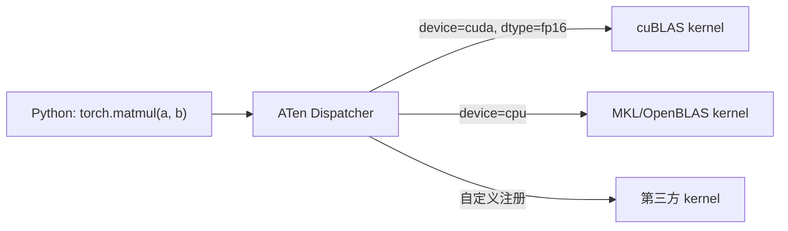
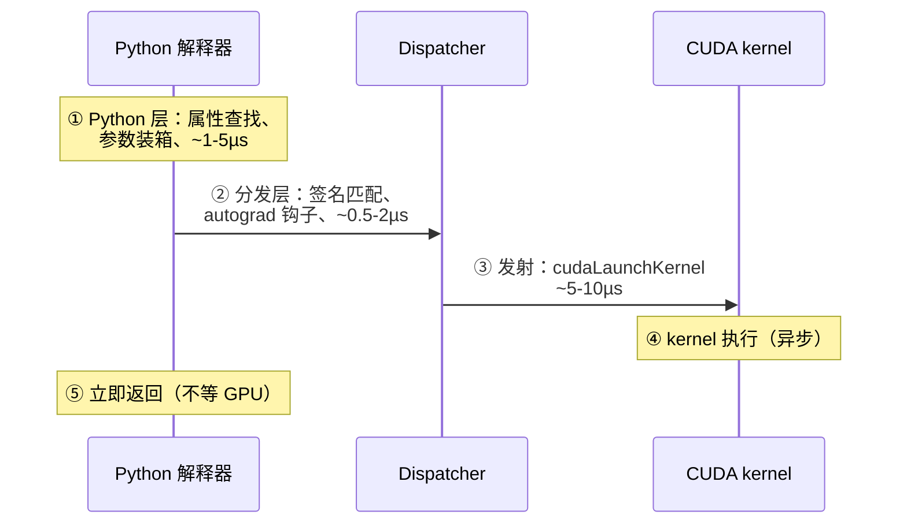
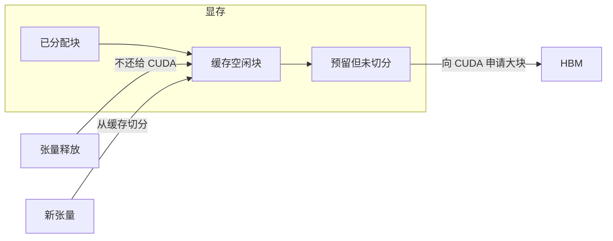
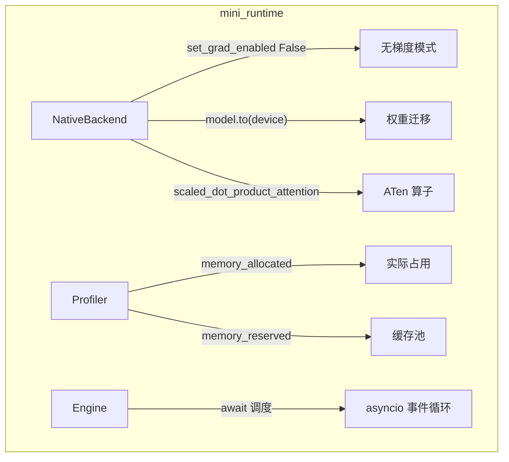
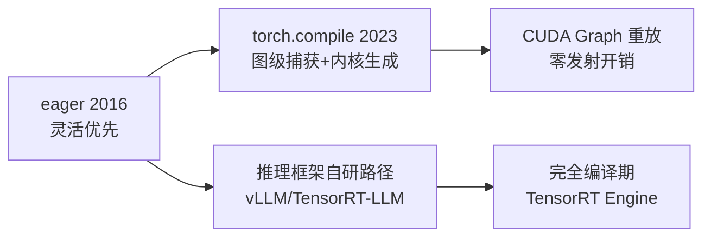

<!--
chapter: ch04
part: part1_fundamentals
title: PyTorch Runtime：eager 的代价与缓存分配器
status: done
-->

# 第 4 章 PyTorch Runtime：eager 的代价与缓存分配器

!!! abstract "本章内容"
    第 3 章展示了手写 CUDA 的表达力与成本。本章推导 PyTorch 如何在这两者之间
    取得平衡：**张量抽象**统一了数据表示，**eager 执行**牺牲性能换取灵活性，
    **缓存分配器**隐藏了 cudaMalloc 的昂贵。我们特别分析 eager 模式的
    三层开销（Python、分发、launch）与同步陷阱——这正是 mini-runtime
    与工业框架（vLLM、TensorRT-LLM）一切性能差异的起点。

---

## 1. Motivation 动机

第 3 章的结论：CUDA 表达力强，但开发成本高——手写一个 Transformer 的
全部 kernel 需要数月。**于是出现一个问题**：能否用 Python 描述计算、由框架
自动生成/调度 kernel？

PyTorch 的回答是：**张量（Tensor）+ eager 执行**。程序员写
`y = torch.matmul(x, w)`，框架负责把它变成 CUDA kernel 调用。mini-runtime
正是建立在这个抽象之上（`native.py:14` 起的全部代码）。

但这引出一个必须直面的矛盾：**抽象每高一层，就多一层开销**。eager 模式的
性能损耗在哪里？如何量化？这就是本章推导的主线。

## 2. Theory 理论

### 2.1 从"数据表示"推导张量抽象

**程序员的问题**：CUDA kernel 中数据是裸指针 + 长度；如何在高层表示
"形状、精度、所在设备、内存布局"这些信息？

PyTorch 的答案：**Tensor = 数据（存储）+ 元数据（shape/strides/dtype/device）**。

```python
x = torch.randn(2, 3)          # shape=(2,3), dtype=float32, device=cpu
x = x.to("cuda")               # device 迁移，元数据变化、数据搬移
y = x.transpose(0, 1)          # shape=(3,2)，但 strides 交换，数据未动！
```

!!! note "推导：strides 的威力与陷阱"
    `transpose` 只交换 strides 元数据，**不拷贝数据**——这是"视图（view）"
    机制。但它产生**非连续张量**：访问 `y[i][j]` 对应的实际内存偏移是
    `i*stride0 + j*stride1`，不再是顺序的。kernel 对非连续张量通常无法
    合并访问（第 3 章 §2.3），需要 `.contiguous()` 触发一次拷贝。
    推理代码里每一处 `.contiguous()` 都是一次显存搬运——优化时值得逐处审视。

### 2.2 从"多后端"推导算子分发（Dispatcher）

**程序员的问题**：同一个 `matmul`，在 CPU、CUDA、MPS 上要执行不同 kernel。
如果每个算子在 Python 里写 `if device == ...`，代码会爆炸。

PyTorch 的答案：**Dispatcher（分发器）**。算子名 + 参数签名（device/dtype）
→ 查找并调用对应后端 kernel。这一层是 PyTorch 架构的中枢：`torch.compile`、
`vmap`、`autograd` 都挂在 dispatcher 上。



### 2.3 从"一次算子调用"推导 eager 的三层开销

**程序员的问题**：eager 模式下一个算子调用到底花多长时间？拆解：



对一次 `nn.Linear` 前向，Python 层还要加上 Module 的 `__call__` 开销。
**结论**：小算子的"发射成本"（①②③）可能超过 kernel 本身执行时间
（④）。一个 Transformer Block 有约 10 个算子，24 层就是 240 次发射——
仅发射开销就达毫秒级。**这正是 [第 21 章 CUDA Graph](../part4_cuda_kernels/ch21_cuda_graph.md)
与算子融合的动机**。

### 2.4 从"cudaMalloc 昂贵"推导缓存分配器

**程序员的问题**：每个张量都 `cudaMalloc`/`cudaFree` 一次？cudaMalloc
是同步的、与驱动交互、可能触发设备同步——每次开销可达数十微秒，且产生
碎片（[第 15 章](../part3_memory_system/ch15_cuda_memory_management.md)）。

PyTorch 的答案：**Caching Allocator（缓存分配器）**。



- `torch.cuda.memory_allocated()`：张量实际占用的显存；
- `torch.cuda.memory_reserved()`：分配器从 CUDA 申请的总量（含缓存空闲块）。

!!! warning "推导结论：allocated 与 reserved 之差"
    两者的差值 = 分配器持有的空闲缓存。**差值大**说明存在"申请大块后释放"
    的模式（如长序列请求退出），是碎片化的信号。推理服务中
    `reserved` 居高不下是正常现象（分配器不主动归还），但若 `allocated`
    波动剧烈，则暗示内存峰值与碎片风险
    （mini-runtime 的 `profiler.py:235-237` 正是监控这两个指标）。

### 2.5 从"主从异步"推导同步陷阱

第 3 章 §2.5 的结论：kernel 异步发射。**程序员的问题**：何时必须等待 GPU？

PyTorch 的同步点清单：

| 操作 | 是否同步 | 推理中的后果 |
|------|---------|-------------|
| `tensor.item()` / `.tolist()` | **是**（D2H + 等待） | decode 循环中每步调用会打爆性能 |
| `.cpu()` / `.numpy()` | 是 | 仅在指标收集时使用 |
| `torch.cuda.synchronize()` | 是（全局屏障） | 计时用 |
| `print(tensor)` | 是（隐式 .item()） | 调试代码残留 = 性能灾难 |

!!! example "mini-runtime 中的教训"
    早期版本曾在 decode 循环里调用 `asyncio.to_thread` 包住 `batch_decode`
    （显存诊断期）。最终 `batch_decode` 被改为同步调用（提交 `2950465`：
    "将 backend.prefill 方法调用改为同步，以避免 asyncio.to_thread 导致的
    显存泄漏"）——多一层线程池 + 同步，既引入等待又打乱 GPU 队列。
    **推理主路径上任何多余的同步/线程切换都是性能敌人**。

### 2.6 从"推理不需要梯度"推导无梯度模式

训练需要反向传播，推理只需要前向。**结论**：

- `torch.set_grad_enabled(False)`：全局禁用 autograd，省去计算图构建、
  梯度缓冲与内存预留（`native.py:57`）；
- `model.eval()`：切换 dropout/batchnorm 行为（`native.py:55`）；
- 权重用 `torch.no_grad()` 或 eval 模式加载，避免 `requires_grad` 的
  传播开销。

### 2.7 设计权衡（Trade-off）

| 维度 | 选择 | 收益 | 代价 |
|------|------|------|------|
| 执行模型 | eager | 灵活、可调试、动态形状 | 三层发射开销 |
| 显存分配 | Caching Allocator | 分配快、复用 | reserved 膨胀、碎片 |
| 数据表示 | view + strides | 零拷贝视图 | 非连续张量性能陷阱 |
| 同步策略 | 异步 + 隐式同步点 | 简单 | 同步点隐蔽、难发现 |
| 与 Python 交互 | 每算子解释执行 | 开发效率 | Python 层开销 |

## 3. Industrial Implementations 工业实现

### 3.1 框架对 PyTorch 的三类态度

| 框架 | 对 PyTorch 的态度 | 理由 |
|------|------------------|------|
| HF Transformers | **全盘依赖** eager | 灵活优先，性能靠外围优化 |
| vLLM | **eager + CUDA Graph** | 保留动态性，用 Graph 消除发射开销 |
| TensorRT-LLM | **弃用 eager**（编译期） | 极致延迟，牺牲灵活性 |
| llama.cpp | **不用 PyTorch**（纯 C++） | 摆脱 Python 栈，面向边缘设备 |

!!! note "推导：为什么 vLLM 保留 PyTorch 却要 CUDA Graph？"
    vLLM 需要动态 batch（请求随时进出），eager 的灵活性不可放弃；但
    decode 每步只发射一次完整前向（约 240 个 kernel），发射开销占比极高。
    CUDA Graph 把"kernel 序列"固化，一次捕获、重复执行——
    **同时得到 eager 的动态性与 Graph 的零发射开销**。这是
    [第 21 章](../part4_cuda_kernels/ch21_cuda_graph.md) 的核心动机。

### 3.2 与 mini-runtime 的对照

mini-runtime 走的是"HF 路线"：纯 eager。它因此**天然继承了本章的所有开销**，
但也因此成为测量这些开销的理想实验台——这正是本书选择它的原因。

## 4. mini-runtime Implementation

### 4.1 架构设计

mini-runtime 与 PyTorch 的接触面集中在 `native.py` 与 `profiler.py`：



### 4.2 关键决策与权衡

| mini-runtime 决策 | 代码位置 | 权衡分析 |
|------------------|---------|---------|
| 全局禁用 autograd | `native.py:57` | 推理无需反向；防止计算图积累占显存 |
| 权重加载上卡 | `native.py:54` | `load_qwen2_weights` 内 fp16+迁移，推理期零迁移 |
| 用 SDPA 而非手写 attention | `attention.py:47` | 免维护 kernel，但固定 kernel 策略 |
| asyncio + 单线程事件循环 | `engine.py:55` | 调度开销小；kernel 发射本身异步 |
| profiler 双指标监控 | `profiler.py:235-237` | allocated/reserved 差值 = 碎片信号 |

!!! note "一个反直觉的设计：asyncio 与 GPU 天然契合"
    GPU kernel 是异步的：发射后 CPU 立即返回。asyncio 事件循环恰好利用
    这一点——`await` 的间隙不阻塞其他请求的调度，而 GPU 一直在忙。
    `engine.py:251` 的 `await asyncio.sleep(0.001)` 是显式让出
    事件循环给其他协程。**单线程调度 + 异步 GPU = 推理引擎的典型架构**
    （[第 6 章](../part2_runtime_architecture/ch06_engine.md)）。

### 4.3 Theory → Code 对应表

| 理论机制（§2） | mini-runtime 证据 | 验证要点 |
|----------------|------------------|---------|
| 无梯度模式（§2.6） | `native.py:57` | 无计算图积累 |
| 分配器双指标（§2.4） | `profiler.py:235-237` | allocated < reserved 恒成立 |
| 隐式同步陷阱（§2.5） | 调试期曾引入 `to_thread`（已移除） | 同步/线程切换的代价 |
| 异步发射（§2.5） | `engine.py` 单线程事件循环 | await 间隙 GPU 持续工作 |

## 5. Performance Analysis 性能分析

### 5.1 eager 开销分解实验

```python
# 实验：测量一层 TransformerBlock 的发射开销占比
import torch, time
from mini_runtime.model.config import Qwen2Config
from mini_runtime.model.transformer_block import TransformerBlock

cfg = Qwen2Config()
block = TransformerBlock(cfg).to("cuda").eval()
x = torch.randn(1, 16, cfg.hidden_size, device="cuda")
pos = torch.arange(16, device="cuda").unsqueeze(0)

# 预热后计时（含 Python + 分发 + launch + kernel）
torch.cuda.synchronize(); t0 = time.perf_counter()
for _ in range(100):
    block(x, pos, None, None)
torch.cuda.synchronize(); t1 = time.perf_counter()
print(f"eager 单层耗时: {(t1-t0)/100*1e6:.1f} µs")
```

对比：`torch.cuda.graph` 捕获同一前向后重放，可观察到发射开销的消失
（差异即 ①②③ 层开销）。此实验是 [第 21 章](../part4_cuda_kernels/ch21_cuda_graph.md)
的预备实验。

### 5.2 维度拆解

| 维度 | eager 模式典型值 | 优化方向 |
|------|-----------------|---------|
| Python 层 | 1–5 µs/算子 | 算子融合（减少算子数） |
| 分发层 | 0.5–2 µs/算子 | torch.compile 图捕获 |
| Kernel launch | 5–10 µs/算子 | CUDA Graph |
| 分配 | 缓存池命中 <1 µs | 预分配、内存池 |
| 同步 | 每处隐式同步 10–100 µs | 消除 .item()/.cpu() |

## 6. Evolution 演进



演进主线是**在灵活性损失可控的前提下消灭发射开销**：eager 什么都不损失但
开销最大；torch.compile 图捕获后发射一次；TensorRT 编译期直接生成最优 kernel
序列。推理框架的选择取决于对动态性（batch 变化、前缀命中）的需求强度。

## 7. Summary 总结

| 维度 | 结论 |
|------|------|
| 解决的问题 | 以可接受的性能代价提供张量级编程抽象 |
| 在 AI Infra 中的位置 | mini-runtime 的宿主运行时；工业框架的参考基线 |
| 依赖 | CUDA Runtime（第 3 章）、GPU 硬件（第 2 章） |
| 影响 | eager 开销催生 CUDA Graph/编译/融合（第 4、7 部分）；分配器影响显存策略（第 3 部分） |

### 思考题

1. 为什么 `transpose` 后的张量直接送入 `nn.Linear` 可能性能骤降？
   用合并访问（第 3 章 §2.3）解释。
2. `memory_reserved` 远大于 `memory_allocated` 是否一定是问题？什么场景下是？
3. 若把 `engine.py:251` 的 `asyncio.sleep(0.001)` 删除，会发生什么？
   （提示：思考事件循环与 GPU 的关系）

### 延伸阅读

- PyTorch 官方文档：*CUDA semantics*、*torch.cuda.memory* 
- tal paananen 的 PyTorch 内部系列博客（Dispatcher/Caching Allocator 深入）
- mini-runtime 源码：`mini_runtime/backend/native.py`、`mini_runtime/profiler.py`
