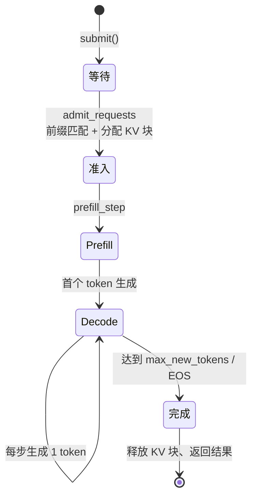
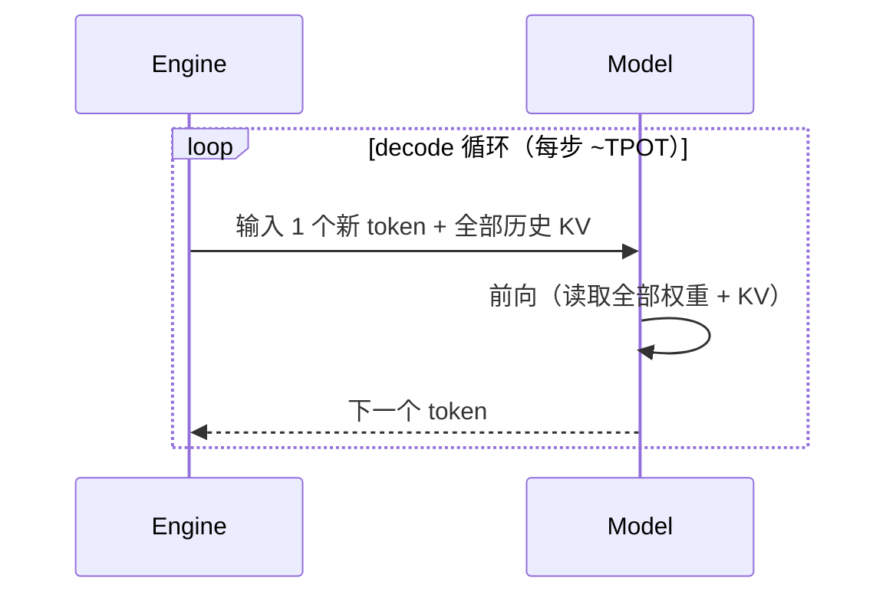
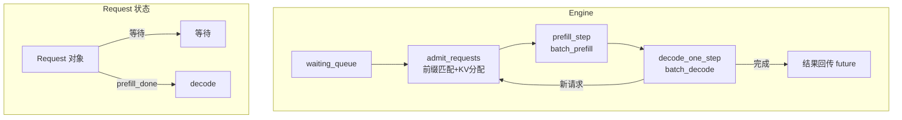
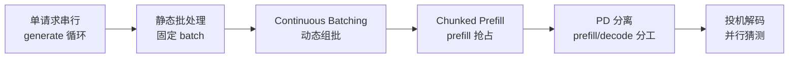

<!--
chapter: ch05
part: part1_fundamentals
title: LLM 推理管线：一次请求的完整旅程
status: done
-->

# 第 5 章 LLM 推理管线：一次请求的完整旅程

!!! abstract "本章内容"
    前四章分别给出了**计算对象**（Transformer）、**物理约束**（GPU）、
    **编程接口**（CUDA）与**宿主运行时**（PyTorch）。本章把它们组装成
    **一次推理请求的完整旅程**：从提交到完成，请求经历哪些阶段、每个阶段
    的延迟如何构成。旅程的终点自然引出一个问题——单请求太慢，多个请求
    如何共处？——这正是 [第 2 部分](../part2_runtime_architecture/index.md)
    全部设计的出发点。

---

## 1. Motivation 动机

如果只跑一个请求、且不在乎延迟，推理"管线"就不存在——一次前向 + 循环
就够了。但真实服务的约束是：**并发请求、有限显存、可感知的延迟**。
于是"一次推理"必须被拆解为有明确状态的阶段，每个阶段可以被调度、测量、
优化。

!!! example "一个 0.5B 模型的具体旅程"
    用户提交提示词 `"What is 1+1? Answer:"`（约 8 token），模型生成
    32 token 的回答：
    - **Prefill**：一次前向处理 8 个 token，输出第一个 token → 决定 **TTFT**；
    - **Decode**：循环 31 次，每次前向 1 个 token → 决定 **TPOT**；
    - 总延迟 $\approx \text{TTFT} + 31 \times \text{TPOT}$。

本章推导这个旅程的每个阶段，并给出延迟的**组成公式**与**量化直觉**。

## 2. Theory 理论

### 2.1 从"用户输入"推导请求生命周期

**问题**：一个请求从进入到完成，系统必须处理哪些步骤？



每一步都对应系统的一个功能模块：

| 阶段 | 系统职责 | 涉及机制 |
|------|---------|---------|
| 等待 | 请求入队 | 队列、超时 |
| 准入 | 前缀匹配、KV 块分配、容量检查 | Prefix Cache、Paged KV Cache（[第 3 部分](../part3_memory_system/index.md)） |
| Prefill | 一次前向处理 prompt | batch prefill、chunked prefill（[第 9 章](../part2_runtime_architecture/ch09_chunked_prefill.md)） |
| Decode | 逐 token 自回归 | continuous batching（[第 8 章](../part2_runtime_architecture/ch08_continuous_batching.md)） |
| 完成 | 终止判定、资源释放、指标统计 | 停止条件、Metrics |

### 2.2 Prefill：从"并行度"推导一次前向

第 1 章 §2.4 的结论：prefill 一次处理 $L$ 个 token，计算密集。**问题**：
这 $L$ 个 token 是否必须一起算？

- 一起算（完整 prefill）：GPU 利用率高，但 $L$ 很大时单次前向阻塞调度
  （响应其他请求的延迟被拉长）→ 引出 chunked prefill
  （[第 9 章](../part2_runtime_architecture/ch09_chunked_prefill.md)）；
- 拆开算（chunked）：响应及时，但每块之间要保存中间状态。

mini-runtime 的答案（`runtime_config.py:6-7`）：`MAX_TOKENS_PER_PREFILL_CHUNK = 1024`、
`MAX_TOKENS_PER_PREFILL_STEP = 8192`——单请求单块上限 1024，单步总预算 8192。

!!! note "TTFT 的组成"
    $\text{TTFT} = \text{排队延迟} + \text{准入延迟} + \text{prefill 前向时间}$。
    排队延迟由调度策略决定（[第 7 章](../part2_runtime_architecture/ch07_scheduler.md)），
    prefill 时间由序列长度与并行度决定。

### 2.3 Decode：从"自回归"推导逐 token 循环

第 1 章 §2.4 的另一结论：decode 每步只处理 1 个 token，访存密集。
**问题**：为什么不能一次生成多个 token？

因为自回归的**因果依赖**：token $t+1$ 的分布依赖 token $1..t$ 的输出。
数学上无法并行（除非投机解码，见 6.2 节）。



**终止条件**（mini-runtime 在 `engine.py:302-309` 附近处理）：达到
`max_new_tokens`、生成 EOS 或触发停止词。每步 $TPOT$ 是生成节奏的核心指标。

### 2.4 端到端延迟模型

设 prompt 长 $L$，生成 $M$ 个 token：

$$
T_{\text{total}} = T_{\text{queue}} + T_{\text{prefill}}(L) + M \cdot T_{\text{decode}}
\tag{1}
$$

其中：

- $T_{\text{prefill}}(L) \propto L$（投影部分）与 $L^2$（注意力部分）的混合——
  见第 1 章 §2.5 的复杂度分析；
- $T_{\text{decode}}$ 对单请求 ≈ 权重读取时间（第 1 章 §2.5，batch=1 时
  $I \approx 1$）。

!!! example "量化的直觉（A100，0.5B，fp16）"
    $L=1024, M=32$：$T_{\text{prefill}} \approx 1$–3 ms（计算密集，Tensor Core 满载），
    $T_{\text{decode}} \approx 0.5$–1 ms（带宽瓶颈）。总延迟约 20–35 ms。
    如果 $M=512$：decode 部分膨胀到 300+ ms——**生成长度决定延迟，
    prompt 长度决定首 token 时间**。

### 2.5 从"单请求"推导"批处理"的必要性

**问题**：单请求 decode 的算术强度 $I \approx 1$，GPU 利用率 <10%
（第 2 章 §2.5）。如何提升？

**推导**：decode 瓶颈是读取权重（$2N$ bytes）。若同时处理 $B$ 个请求，
权重只读一次，全部请求共享——算术强度变为 $I \approx B$，
吞吐近似线性提升（前提：KV 读取不成为新瓶颈）：

| 批大小 $B$ | decode 算术强度 | 理论吞吐（相对） |
|-----------|----------------|-----------------|
| 1 | $\approx 1$ | 1× |
| 8 | $\approx 8$ | ~8× |
| 32 | $\approx 32$ | ~32×（受 KV 带宽限制） |

**但朴素批处理（静态批）有致命问题**：批次内最慢的请求拖住所有人
（队头阻塞）；请求完成后的空槽位要等整批结束才能复用。

!!! note "引出 Continuous Batching"
    静态批的缺陷（队头阻塞、槽位浪费）正是 **Continuous Batching（连续批处理）**
    要解决的：每个 decode 步动态决定哪些请求参与、哪些请求退出、哪些新请求
    进入。这是 [第 8 章](../part2_runtime_architecture/ch08_continuous_batching.md)
    的主题，也是 mini-runtime 调度器（`engine.py:55` 的 `scheduler_loop`）
    的核心逻辑。

### 2.6 设计权衡（Trade-off）

| 维度 | 选择 | 收益 | 代价 |
|------|------|------|------|
| Prefill 粒度 | 完整 vs 分块 | 利用率 vs 响应性 | 见第 9 章详细分析 |
| Decode 并行 | 批处理 | 吞吐线性增长 | 单请求延迟被共享 |
| 终止判定 | max_new_tokens 上限 | 资源可控 | 可能截断 |
| 延迟目标 | TTFT 优先 vs TPOT 优先 | 两种产品形态 | 调度策略差异 |

## 3. Industrial Implementations 工业实现

### 3.1 HF Transformers 的 pipeline

`generate()` 是**阻塞式单请求循环**：先完整 prefill，再逐 token decode。
简单清晰，但没有批处理、没有调度——适合研究与单请求场景。
mini-runtime 的 `tests/test_e2e.py` 最初就是对照它的行为。

### 3.2 vLLM / TGI：异步引擎

- 请求经 HTTP/gRPC 进入 **AsyncLLMEngine**，立即返回 future；
- 后台调度循环持续执行 admit → prefill → decode（与 mini-runtime 的
  `scheduler_loop` 同构，只是规模与并发粒度不同）；
- decode 每步动态组批（continuous batching）。

### 3.3 TensorRT-LLM：批处理与显存静态化

编译期生成 engine，运行期 batch 形状受限于构建时配置（默认动态形状支持
有限）。换取的是每步零解释开销——与 vLLM 的"动态 + 重放"路线形成
[第 4 章 §3.1](../part1_fundamentals/ch04_pytorch_runtime.md) 讨论过的
经典权衡。

## 4. mini-runtime Implementation

### 4.1 架构设计

mini-runtime 用一个 `scheduler_loop` 协程驱动全部请求：



### 4.2 模块与职责

| 模块 | 职责 | 关键代码 |
|------|------|---------|
| `Request` | 请求状态机（输入/状态/输出三组字段） | `request.py:5-49` |
| `Engine.scheduler_loop` | 三步循环：admit → prefill → decode | `engine.py:55-90` |
| `Engine.admit_requests` | 前缀匹配 + KV 块分配 + 容量控制 | `engine.py:118-170` |
| `Engine.prefill_step` | 收集 prefill 输入 → 一次 batch 前向 → 迁移状态 | `engine.py:172-245` |
| `Engine.decode_one_step` | 全部运行请求一次 batch 前向 | `engine.py:247-309` |
| `Metrics` | TTFT/TPOT/吞吐聚合 | `metrics.py:3-21` |

### 4.3 关键设计：Request 的三个字段组

`request.py` 用三个注释块划分字段，对应生命周期的三个阶段：

```python
# request.py:7-13  输入（调用时传入）: request_id, prompt, token_ids, max_new_tokens, future
# request.py:15-34 状态（运行时变化）: block_table, prefill_progress, generated_tokens, ...
# request.py:36-39 输出（完成后填充）: finish_time, ttft, tpot
```

!!! note "推导：为什么 future 放在 Request 里？"
    异步引擎需要"提交即返回、完成即通知"的语义。`asyncio.Future` 作为
    Request 字段，使 `engine.submit()` 能立即返回 awaitable，而调度循环
    在完成时 `future.set_result(...)`——**事件驱动 + 状态外置**是
    异步推理引擎的基本骨架。

### 4.4 Theory → Code 对应表

| 理论机制（§2） | mini-runtime 证据 | 验证要点 |
|----------------|------------------|---------|
| 生命周期五阶段（§2.1） | `engine.py:55-90` | admit → prefill → decode 循环 |
| Prefill 预算（§2.2） | `engine.py:176-177` | `MAX_TOKENS_PER_PREFILL_STEP` 步预算 |
| 终止判定（§2.3） | `engine.py:302-309` | max_new_tokens / EOS 检查 |
| 批处理（§2.5） | `engine.py:218,300` | 一次 `batch_prefill`/`batch_decode` 处理多请求 |
| 指标统计（§2.4） | `request.py:38-39` + `metrics.py:19-20` | ttft/tpot 记录与聚合 |

## 5. Performance Analysis 性能分析

### 5.1 延迟 vs 吞吐：Little's Law

服务系统的吞吐、并发与延迟满足 **Little's Law**：
$\text{并发} = \text{吞吐} \times \text{延迟}$（稳态下）。

- 单请求串行：延迟低但吞吐 = 1/延迟，极低；
- 大 batch：吞吐高但每请求延迟上升（共享带宽与算力）；
- 推理服务的目标是**在延迟 SLO（如 TPOT < 50ms）约束下最大化吞吐**。

### 5.2 Benchmark 方法

```bash
# mini-runtime 的端到端基准（可配置并发/批大小）
PYTHONPATH=. python benchmarks/scenarios/baseline.py
# 输出：TTFT、TPOT、throughput、GPU 利用率、显存占用
```

关键指标口径：

| 指标 | 定义 | 测量位置 |
|------|------|---------|
| TTFT | 提交到首个 token | `request.py:34` `first_token_time` |
| TPOT | 相邻输出 token 间隔 | `request.py:39` `tpot` |
| Throughput | tokens/s（含 prefill） | `metrics.py:21` `total_output_tokens` |

### 5.3 结果解读

- 若吞吐随并发线性增长：处于带宽受限的"甜蜜区"，可继续加并发；
- 若增长放缓：KV 带宽或显存成为新瓶颈（[第 3 部分](../part3_memory_system/index.md)）；
- 若 TTFT 随并发恶化：准入/排队策略需要调整（[第 7 章](../part2_runtime_architecture/ch07_scheduler.md)）。

## 6. Evolution 演进

### 6.1 推理管线的演进路线



### 6.2 从单请求到分布式

单机管线的终点是**多机协同**：当单卡显存放不下 KV Cache 或模型时，
管线被切分为跨卡/跨机阶段（[第 5、6 部分](../part5_parallelism/index.md)）。
届时"一次请求的旅程"会跨越多个设备——每一跳都是新的延迟来源。

## 7. Summary 总结

| 维度 | 结论 |
|------|------|
| 解决的问题 | 把"一次推理"拆解为可调度、可测量、可优化的阶段化管线 |
| 在 AI Infra 中的位置 | 从模型（Part 1）通往运行时（Part 2）的桥梁 |
| 依赖 | Transformer 计算结构、GPU 硬件、PyTorch 运行时 |
| 影响 | 定义 TTFT/TPOT/吞吐三指标；引出批处理、调度、缓存全部后续主题 |

### 思考题

1. 用式 (1) 推导：prompt 从 1K 变 8K、生成长度不变，总延迟如何变化？
   TTFT 与 TPOT 各自贡献多少？
2. 静态批（batch=8，全部请求同进同出）相比 continuous batching，
   在"请求长度差异大"的场景下吞吐损失来自哪里？
3. 为什么 `future` 要放在 Request 里而不是由 Engine 单独维护？
   如果用回调函数替代 future，架构会有什么变化？

### 延伸阅读

- vLLM 论文：*Efficient Memory Management for Large Language Model Serving with PagedAttention*（§3 系统设计）
- mini-runtime 源码：`mini_runtime/engine.py`、`mini_runtime/request.py`、`mini_runtime/metrics.py`
- 本仓库 `tests/test_e2e.py`：端到端请求的完整调用示例
