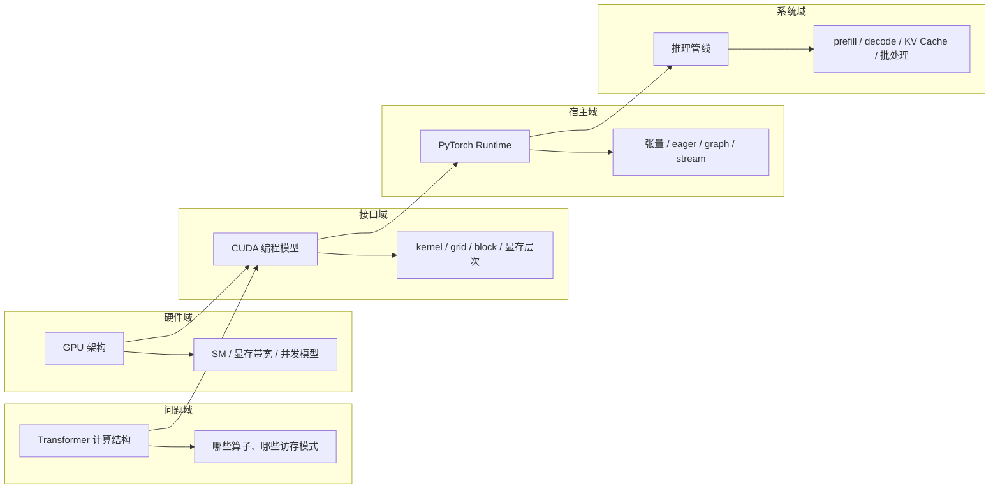

# 第 1 部分 · 基础（Fundamentals）

!!! abstract "本部分内容"
    第 1 部分建立全书的地基：**Transformer 的计算结构**决定了推理系统要面对的所有性能瓶颈；
    **GPU 架构**决定了这些瓶颈的物理根源；**CUDA** 是程序员与硬件之间的接口；
    **PyTorch Runtime** 是 mini-runtime 的宿主环境；**推理管线**把模型计算拆解为系统设计的基本单元。

## 章节地图

| 章节 | 核心问题 | 对后续部分的意义 |
|------|---------|-----------------|
| [第 1 章 Transformer](ch01_transformer.md) | 模型计算的本质是什么？哪些操作占主导？ | 一切性能优化的对象 |
| [第 2 章 GPU 架构](ch02_gpu_architecture.md) | GPU 为何快？瓶颈在哪里？ | 解释"为什么慢"的物理根源 |
| [第 3 章 CUDA 基础](ch03_cuda_basics.md) | 程序员如何驾驭 GPU？ | 第 4 部分 CUDA Kernel 的前提 |
| [第 4 章 PyTorch Runtime](ch04_pytorch_runtime.md) | mini-runtime 的宿主如何工作？ | 理解 eager 模式的开销与 CUDA Graph 的动机 |
| [第 5 章 LLM 推理管线](ch05_inference_pipeline.md) | 一次推理请求经历什么？ | 第 2 部分 Engine/Scheduler 的设计输入 |

## 阅读建议

- **有深度学习背景**：可快速略过第 1 章前半部分，但务必理解 1.3 节"计算与访存特征"。
- **无 CUDA 经验**：第 2、3 章务必精读，它们是第 4、7 部分的直接前置。
- 本部分以 mini-runtime 的 `mini_runtime/model/` 目录为实践载体。
