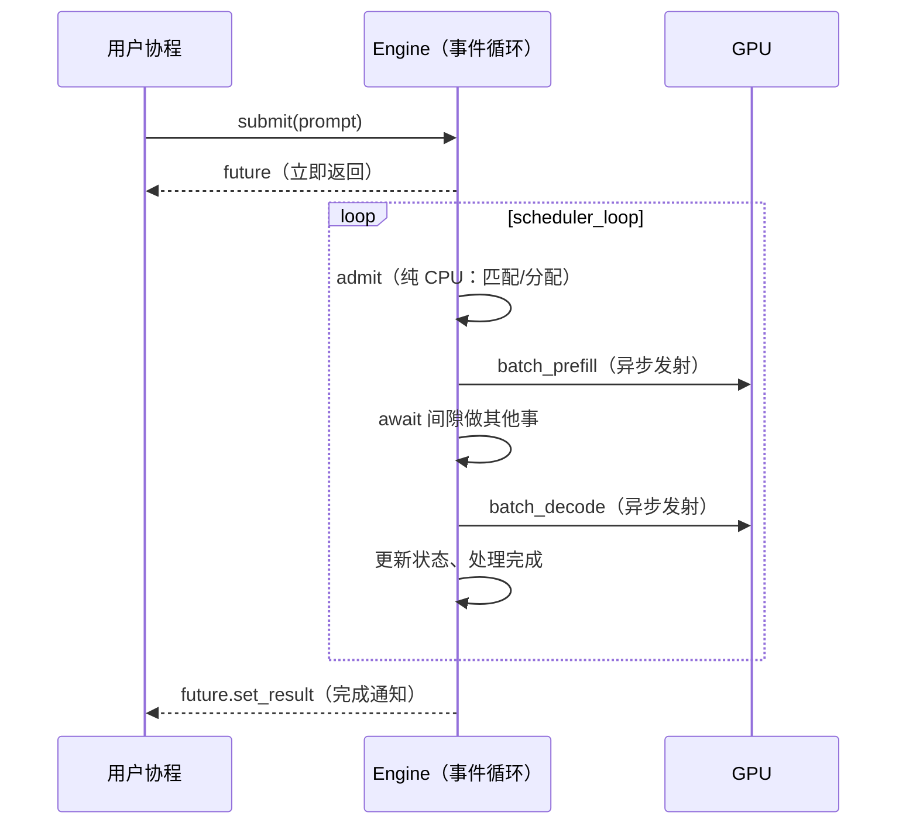
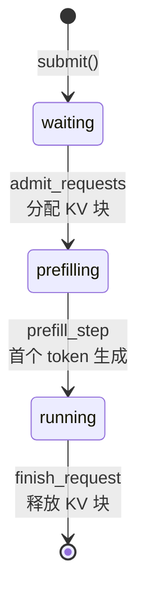
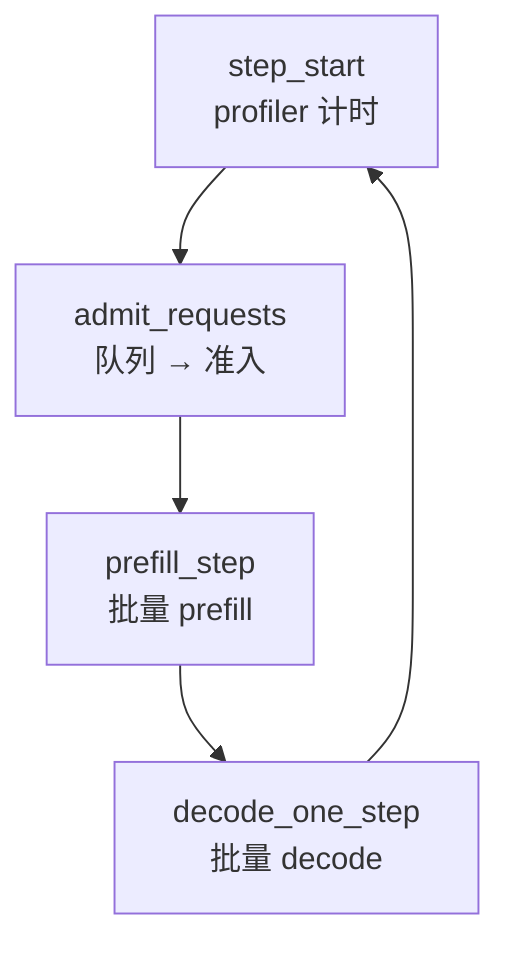
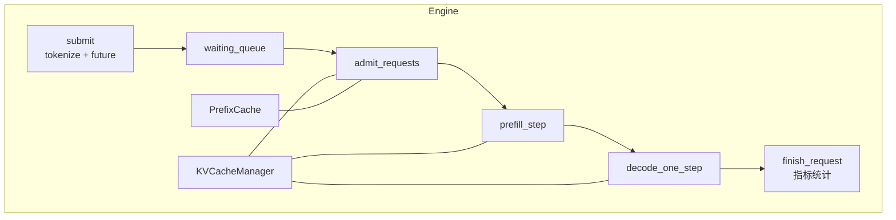
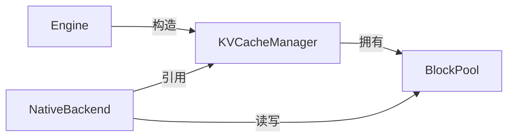
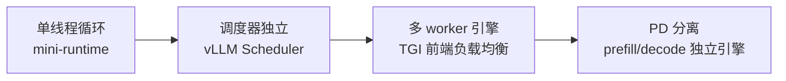

<!--
chapter: ch06
part: part2_runtime_architecture
title: Engine：事件循环与三个请求集合
status: done
-->

# 第 6 章 Engine：事件循环与三个请求集合

!!! abstract "本章内容"
    第 5 章画出了请求的旅程，但没说**谁来驱动**。本章推导 Engine 的骨架设计：
    为什么推理引擎天然适合**单线程事件循环**？为什么请求被分为三个集合管理？
    为什么失败路径（OOM/超时）必须显式设计？读完本章，读者应能独立画出
    一个推理引擎的架构图，并理解 [第 7 章 Scheduler](ch07_scheduler.md)
    在骨架上的位置。

---

## 1. Motivation 动机

第 5 章结束时我们得到两个结论：

1. 推理 = admit → prefill → decode 循环；
2. decode 需要批处理（否则 GPU 空转）。

**但"循环"需要一个载体**：谁来驱动每一步？谁来协调多个请求的并发？
谁来处理 GPU 报错（OOM）？这引出一个基础架构问题——**推理引擎的骨架长什么样**？

一个错误答案：为每个请求开一个线程，各跑各的循环。后果是：批处理无法统一
（每个线程都想独占 GPU）、调度无法全局决策（显存/算力分配没有协调者）、
状态难以追踪（请求散落在线程间）。

!!! example "正确的出发点"
    GPU 是**单设备、异步执行**的（第 3、4 章）：一次 `batch_decode` 已经
    处理了多个请求。因此引擎不需要多线程——它需要一个**中心化的循环**，
    每步重新审视所有请求并组批。

## 2. Theory 理论

### 2.1 从"单设备异步"推导事件循环

**问题**：GPU kernel 异步发射后 CPU 立即返回。这段时间 CPU 该做什么？

答案是**事件循环**：CPU 在等待 GPU 期间，可以处理队列、做调度决策、
更新状态。PyTorch 之上最自然的载体是 **asyncio 单线程事件循环**
（第 4 章 §4.2 已论证 asyncio 与异步 GPU 的契合）：

!!! note "推导：为什么不用多线程？"
    - GPU 是单设备，多个 CPU 线程发射 kernel 只会造成**调度串扰**
      （stream 竞争），无法并行执行；
    - 推理请求的状态共享（KV block、batch 组成）需要**全局一致视图**，
      多线程需要加锁，而单线程无锁；
    - 调度的决策频率是"每步一次"（毫秒级），远低于线程切换成本能
      带来的收益。

### 2.2 从"请求状态差异"推导三个集合

**问题**：多个请求同时存在，它们的阶段不同（有的排队、有的 prefill、
有的 decode）。如何管理？

mini-runtime 的答案（`engine.py:25-27`）：三个集合 + 一个队列：

| 集合 | 含义 | 关键不变量 |
|------|------|-----------|
| `waiting_queue` | 已提交、未准入 | 不持有任何 KV block |
| `prefilling_requests` | 已准入、prefill 未完成 | **持有 blocks** |
| `running_requests` | prefill 完成、正在 decode | 持有 blocks |

!!! tip "推导：集合划分的判据是"是否持有资源""
    waiting 不持有显存资源（可无限堆积、可超时丢弃）；
    prefilling/running 持有 KV block（显存稀缺，必须受 `max_batch_size` 约束）。
    这个判据是 [第 3 部分](../part3_memory_system/index.md) 显存管理的前提：
    **资源持有者才需要被调度**。

### 2.3 从"每步三件事"推导 scheduler_loop

**问题**：事件循环每步做什么？

`engine.py:55-90` 的 `scheduler_loop` 是三步固定节奏：

每步的三次调用对应三个不同的 GPU 任务形态：

| 步骤 | GPU 任务 | 决策内容 |
|------|---------|---------|
| admit | 无（纯 CPU） | 哪些请求准入、分配多少 block |
| prefill | 一次 batch 前向（长序列） | 每请求分多少 token 预算（[第 9 章](ch09_chunked_prefill.md)） |
| decode | 一次 batch 前向（短序列） | 哪些请求继续、哪些完成 |

!!! warning "为什么 prefill 与 decode 分开两个前向？"
    prefill 的输入是"多 token 序列"（$L \gg 1$），decode 的输入是"每请求
    1 token"。两者形状不同：prefill 的注意力矩阵是 $L \times L$，decode
    是 $1 \times L$。强行合批需要把 prefill 拆成 token 级——那是
    [第 9 章](ch09_chunked_prefill.md) 的进阶话题。mini-runtime 选择
    "先全量 prefill 一批，再 decode 一批"的简单分离（§2.6 权衡）。

### 2.4 从"GPU 会失败"推导异常路径

**问题**：kernel 执行时显存不足（OOM）怎么办？请求超时怎么办？

`scheduler_loop` 的 try/except（`engine.py:81-90`）把失败分为两类：

1. **OOM**（`torch.OutOfMemoryError`）：打印 allocated/reserved 后
   `_fail_all_requests("OOM")` 并终止循环——**引擎级失败**，因为显存
   碎片化后无法安全恢复；
2. **其他异常**：同样 fail-all——推理引擎的哲学是**fail fast**：
   状态损坏比停机更可怕。

请求级超时由 `submit()` 的 `asyncio.wait_for` 处理（`engine.py:394`）：
超时只取消该请求的 future，不影响其他请求——**引擎级失败与请求级失败分离**。

### 2.5 复杂度分析

设每步 $B$ 个活跃请求：

- 每步 CPU 工作量：准入扫描 $O(B)$ + 状态更新 $O(B)$；
- 每步 GPU 前向：一次 prefill batch + 一次 decode batch；
- 每步总耗时 $\approx T_{\text{prefill}}(L) + T_{\text{decode}}$，
  其中 $T_{\text{prefill}}$ 受预算约束（第 9 章）。

**结论**：Engine 的 CPU 开销与活跃请求数线性，远小于 GPU 前向时间——
引擎不会成为瓶颈，瓶颈始终在 GPU 侧（除非请求数上万）。

### 2.6 设计权衡（Trade-off）

| 维度 | mini-runtime 选择 | 收益 | 代价 |
|------|------------------|------|------|
| 并发模型 | 单线程 asyncio | 无锁、简单 | CPU 多核闲置（单核已够） |
| prefill/decode | 每步分离执行 | 实现简单 | 长 prefill 阻塞 decode（第 9 章解决） |
| 失败策略 | fail-fast | 状态安全 | 一个请求 OOM 拖垮全部 |
| 请求管理 | 三集合 + 队列 | 状态清晰 | 迁移逻辑分散（第 10 章汇总） |

## 3. Industrial Implementations 工业实现

### 3.1 vLLM 的 AsyncLLMEngine

与 mini-runtime 同构：`AsyncLLMEngine` 用事件循环驱动 `engine_core`，
请求经 `LLMEngine.add_request` 进入 `Scheduler`。差异在于：
- **Scheduler 独立成类**，决策逻辑与 Engine 解耦（mini-runtime 内嵌在 Engine）；
- 每个请求有独立的 `SequenceGroup`，支持**抢占（preemption）**（显存不足时
  换出 running 请求到 CPU，而非 OOM fail-fast）。

### 3.2 TensorRT-LLM / TGI

- TensorRT-LLM：`Executor` + 请求池，批处理由 `BatchManager` 决定；
- TGI：`InferenceClient` + 后端 worker，多 worker 各自跑事件循环，
  前端负载均衡。

**共性**：全部是"事件循环 + 全局请求视图 + 每步组批"的架构。
差异只在**决策策略**（谁准入、谁先跑）与**失败处理**（fail-fast vs 抢占）。

## 4. mini-runtime Implementation

### 4.1 架构设计

`Engine` 类承担三个职责（`engine.py:13-51`）：

### 4.2 模块与职责

| 职责 | 代码位置 | 说明 |
|------|---------|------|
| 请求入口 | `engine.py:362-401` | tokenize + 建 future + 入队 |
| 事件循环 | `engine.py:55-90` | 三步循环 + 异常处理 |
| 请求集合 | `engine.py:25-27` | waiting/prefilling/running |
| 资源归属 | `engine.py:36-47` | KVCacheManager/PrefixCache 注入 |
| 完成处理 | `engine.py:324-360` | 释放 block + 统计 TTFT/TPOT |
| 优雅关闭 | `engine.py:447-491` | 取消全部请求 + release_all |

### 4.3 关键设计：资源归属在构造期确定

`engine.py:36-47`：KVCacheManager 由 Engine 构造，但 block 的**数据存储**
（`BlockPool`）在 `native.py` 中由 backend 使用——两者通过
`self.backend.kv_manager = self.kv_manager`（`engine.py:46`）建立引用。

!!! note "推导：为什么 backend 也要持有 kv_manager？"
    调度（Engine）负责**分配/回收** block，计算（Backend）负责**读写** block
    数据。两者操作同一份状态，因此共享同一个 KVCacheManager 引用。
    这个"调度与计算共享资源视图"的设计是推理引擎的核心架构约束。

### 4.4 Theory → Code 对应表

| 理论机制（§2） | mini-runtime 证据 | 验证要点 |
|----------------|------------------|---------|
| 事件循环（§2.1） | `engine.py:53,55` | `create_task(scheduler_loop())` |
| 三集合划分（§2.2） | `engine.py:25-27` | 不变量：waiting 无 block |
| 三步节奏（§2.3） | `engine.py:62-72` | admit → prefill → decode |
| 失败路径（§2.4） | `engine.py:81-90` | OOM fail-fast + fail-all |
| 资源共享（§2.2） | `engine.py:46` | backend.kv_manager = kv_manager |

## 5. Performance Analysis 性能分析

### 5.1 维度拆解

| 维度 | 分析 | 结论 |
|------|------|------|
| CPU 开销 | 每步 $O(B)$ 扫描 | 非瓶颈（除非请求上万） |
| GPU 利用率 | 由批大小与预算决定 | 见第 8、9 章 |
| 调度延迟 | 每步 <1ms（CPU） | 远小于前向时间 |
| 失败恢复 | fail-fast | 无恢复成本，但整体停机 |

### 5.2 一个可观察的指标

`metrics.py` 的 `decode_steps` 与 `prefill_batches`：引擎每步的 CPU
时间可以由 `engine_profiler` 输出（`engine.py:60` 的 `step_start`）。
若 step 间隔远大于 GPU 前向时间，说明 CPU 侧成为瓶颈——此时需要
审视调度决策的复杂度（第 7 章）。

## 6. Evolution 演进

演进主线：**决策逻辑从 Engine 中剥离**（Scheduler 独立成类）、**引擎实例
从单机走向分布式**（[第 6 部分](../part6_distributed_runtime/index.md)）。

## 7. Summary 总结

| 维度 | 结论 |
|------|------|
| 解决的问题 | 为推理提供"单设备异步"下的中心化驱动骨架 |
| 在 AI Infra 中的位置 | 运行时架构的骨架，Scheduler/内存/请求管理的宿主 |
| 依赖 | asyncio、PyTorch（第 4 章）、KVCacheManager（第 3 部分） |
| 影响 | 决定可扩展性（单机）与架构演进方向（分布式） |

### 思考题

1. 为什么 waiting 队列可以无限长，而 prefilling/running 必须受 `max_batch_size`
   限制？如果 waiting 也持有 block 会发生什么？
2. 若把 `scheduler_loop` 改为每步先 decode 再 prefill，对 TTFT 和 TPOT
   分别有什么影响？
3. vLLM 用"抢占"替代 fail-fast 处理显存不足。抢占需要什么前提条件？
   （提示：思考请求状态的保存与恢复）

### 延伸阅读

- vLLM 论文 §3.1 *LLM Engine*（架构图对比）
- mini-runtime 源码：`mini_runtime/engine.py`（全文 491 行，建议通读）
