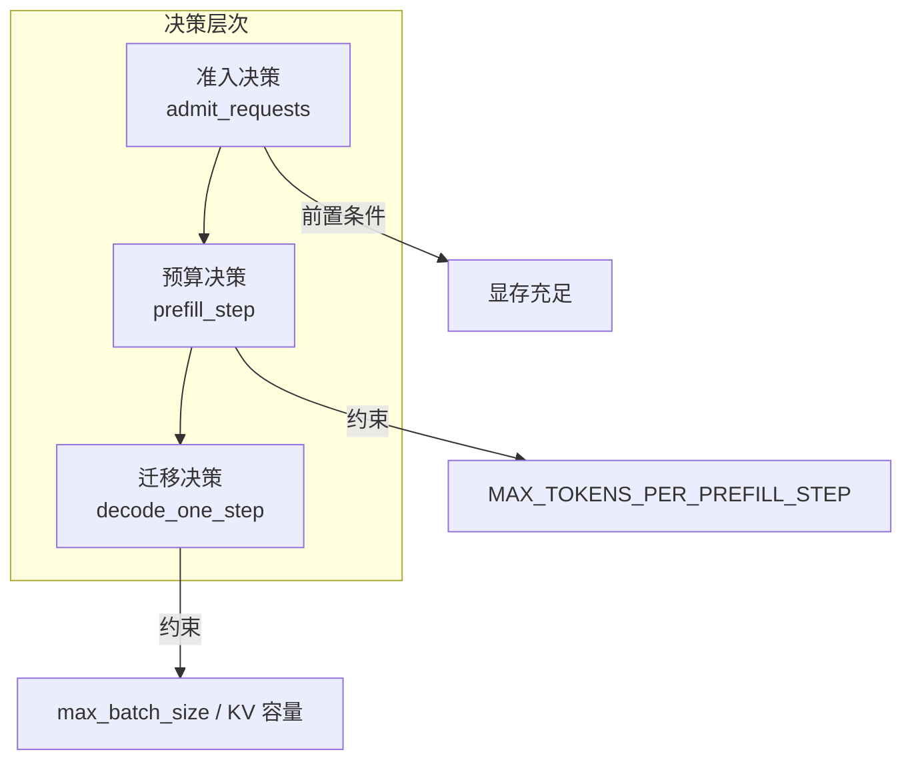
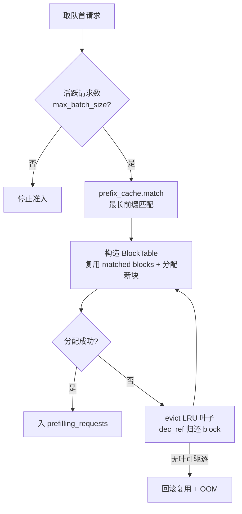
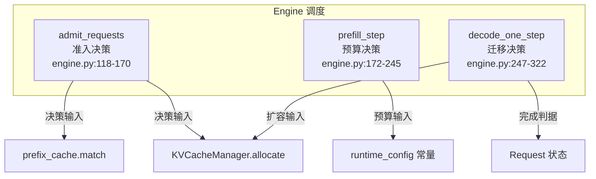

<!--
chapter: ch07
part: part2_runtime_architecture
title: Scheduler：准入、预算与迁移
status: done
-->

# 第 7 章 Scheduler：准入、预算与迁移

!!! abstract "本章内容"
    第 6 章搭好了 Engine 骨架，但**骨架本身不做决策**——每步"谁进、谁跑、
    谁退"必须由调度策略回答。本章推导调度器的三个决策层次：**准入**（显存
    允许谁进来）、**预算**（算力分给谁多少）、**迁移**（状态何时转换），
    并分析这些决策的代价。mini-runtime 的调度逻辑内嵌在 Engine 的三个方法中，
    我们将逐层拆解，并与 vLLM 的独立 Scheduler 对比。

---

## 1. Motivation 动机

假设 Engine 骨架已就绪（第 6 章），请求涌入 `waiting_queue`。**问题**：
每步 GPU 只能处理有限的请求——先处理谁？

- 先来先服务（FCFS）：实现简单，但一个长 prompt 请求会堵住后面所有短请求；
- 短作业优先（SJF）：短请求体验好，但长请求可能饿死；
- 完全公平：所有请求平均分——但平均分给"只需 1 步就完成"的请求是浪费。

更根本的约束是**显存**：每个进入 prefill 的请求都要分配 KV block
（[第 3 部分](../part3_memory_system/index.md)）。显存不够时，是拒绝、
排队，还是驱逐已缓存的块？

!!! example "调度器的三个基本问题"
    1. **准入**：`waiting_queue` 的请求何时、以什么条件进入 prefill？
    2. **预算**：prefill 的 token 预算如何分配（一个请求独占还是多个共享）？
    3. **迁移**：prefill → decode、decode → 完成，状态转换的判据是什么？

## 2. Theory 理论

### 2.1 从"每步三个 GPU 任务"推导决策层次

第 6 章 §2.3：每步有 admit / prefill / decode 三个动作。对应三类决策：



**决策频率**：每步一次（毫秒级）。因此调度器必须是**增量式**的——
每步只做局部调整，不能全量重排（全量排序成本 $O(B \log B)$ × 每步
不可接受）。

### 2.2 准入决策：从"显存有限"推导准入条件

**问题**：`waiting_queue` 队首请求何时可以进入 prefill？

mini-runtime 的准入流程（`engine.py:118-170`）：



关键不变量：**只有持有完整 KV block 的请求才允许进入 prefill**。
准入的判据是资源（显存）而非时间（排队时长）——排队时长只影响
`queue_wait` 指标，不影响准入资格。

!!! note "推导：为什么准入时就要做前缀匹配？"
    前缀匹配的结果（`matched_blocks`、`num_matched_tokens`）决定了：
    1) 需要**新分配**多少 block（= 总 token 数 - 命中 token 数）；
    2) prefill 时跳过多少 token 的计算。
    因此匹配必须发生在**分配之前**——先知道省多少，再决定要多少。
    这正是 [第 13 章 Prefix Cache](../part3_memory_system/ch13_prefix_cache.md)
    与调度器耦合的位置。

### 2.3 预算决策：从"一步的算力上限"推导预算分配

**问题**：多个 prefill 请求竞争 GPU 时，一步内处理多少 token？

mini-runtime 用两个常量约束（`runtime_config.py:6-7`）：

- `MAX_TOKENS_PER_PREFILL_CHUNK = 1024`：单请求单块上限；
- `MAX_TOKENS_PER_PREFILL_STEP = 8192`：一步总预算。

`prefill_step`（`engine.py:183-212`）按顺序扫描 `prefilling_requests`，
每个请求分得 `min(budget, max_chunk, prompt_len - progress)` 的 token 数：

```python
# engine.py:191 预算分配的核心逻辑
chunk_len = min(budget, max_chunk, prompt_len - start)
budget -= chunk_len
```

!!! tip "推导：预算分配是"公平性"与"吞吐"的权衡旋钮"
    - 预算 = 8192、只有一个长请求：它独占一步（吞吐高，但 decode 被阻塞）；
    - 预算分摊给多个请求：每个请求分到小 chunk（响应好，但每步 batch 变大、
      计算形状更碎）。
    [第 9 章](ch09_chunked_prefill.md) 会详细推导这个权衡。

### 2.4 迁移决策：从"状态完成判据"推导迁移规则

**问题**：请求何时从 prefilling 迁到 running？何时从 running 迁出？

三个迁移点（`engine.py:224-243, 313-320`）：

| 迁移 | 判据 | 动作 |
|------|------|------|
| prefilling → running | `is_last_chunk`（本步 chunk 覆盖完 prompt） | 记首 token 时间、加入 running |
| running → 完成 | `generated_tokens >= max_new_tokens` 或 EOS | `finish_request`：释放 block |
| running → 扩容失败 | decode 时 block 不够且 evict 失败 | OOM 失败路径 |

!!! warning "一个隐蔽的决策点：decode 前的扩容"
    `decode_one_step`（`engine.py:267-279`）每步检查
    `total > block_table.capacity`，不足时**先扩容再 decode**。
    这个"隐式准入"说明：running 请求也可能因显存不足被驱逐——调度
    决策不只发生在进入时，也发生在运行中。

### 2.5 复杂度分析

设活跃请求 $B$，等待队列长度 $W$：

- 准入：每步最多扫描 $O(\min(W, \text{max\_batch\_size}))$ 次（有容量上限）；
- 预算分配：$O(B)$；
- 迁移判定：$O(B)$；
- 前缀匹配：单次 $O(L \cdot d_{\text{tree}})$（树深 × 序列长，见第 13 章）。

**结论**：调度器每步 CPU 开销 $O(B + W_{\text{cap}})$，毫秒级以下——
调度决策**永远不应该是瓶颈**。若出现瓶颈，说明决策粒度太粗（如全量排序）。

### 2.6 设计权衡（Trade-off）

| 维度 | 选择 | 收益 | 代价 |
|------|------|------|------|
| 准入顺序 | 队列 FCFS | 公平、无饿死 | 无优先级（VIP 请求同等待遇） |
| 预算分配 | 顺序均摊 | 简单 | 长请求可能挤占多步 |
| 显存不足 | evict prefix cache | 复用已计算 KV | 缓存命中率下降 |
| 运行中扩容 | 每步检查 | 及时 | 每步多一次 capacity 判断 |

## 3. Industrial Implementations 工业实现

### 3.1 vLLM 的 Scheduler（独立类）

vLLM 将调度器**独立成 `Scheduler` 类**，决策更丰富：

| 决策 | vLLM 做法 | 与 mini-runtime 对比 |
|------|----------|---------------------|
| 准入 | 按 SequenceGroup 优先级 + 显存预算 | mini-runtime 仅 FCFS |
| 抢占 | 显存不足时**抢占**（swap 到 CPU）而非 OOM | mini-runtime fail-fast |
| 预算 | `max_num_batched_tokens`（等价物） | 同思路，参数不同 |
| 优先级 | 支持用户自定义调度策略 | 无 |

### 3.2 SGLang：调度与 Radix Cache 深度融合

SGLang 的 `RadixAttention` 把前缀匹配纳入调度器内部，命中前缀的请求
**直接跳过 prefill**（类似 mini-runtime 的"全命中"路径
`native.py:82-97`），并在调度时优先选择与现有 batch 共享前缀的请求——
**调度策略影响缓存命中率**，这是 mini-runtime 尚未涉及的优化维度
（[第 38 章](../part8_industrial_systems/ch38_sglang.md)）。

### 3.3 为什么不同框架调度策略不同？

| 框架 | 场景假设 | 调度倾向 |
|------|---------|---------|
| mini-runtime | 学习/单机小规模 | 简单 FCFS，机制完整 |
| vLLM | 高吞吐生产 | 抢占 + 优先级，最大化吞吐 |
| SGLang | 高并发共享前缀 | 前缀感知调度 |
| TensorRT-LLM | 低延迟部署 | 静态 batch 计划 |

**根本原因**：调度器是"策略"与"机制"的分离点。机制（决策何时做、怎么做）
各框架几乎一致；策略（谁优先、怎么抢）由**业务目标**决定。

## 4. mini-runtime Implementation

### 4.1 架构设计

mini-runtime 的调度逻辑分布在 Engine 的三个方法中：



### 4.2 决策点与代码映射

| 决策 | 位置 | 输入 → 输出 |
|------|------|------------|
| 准入上限 | `engine.py:120` | `len(running)+len(prefilling) < max_batch_size` |
| 前缀匹配 | `engine.py:127` | `token_ids → match_result` |
| 分配 + evict 重试 | `engine.py:140-148` | `allocate → 失败 → evict → 重试` |
| 预算切分 | `engine.py:191` | `budget, max_chunk, progress → chunk_len` |
| prefill 完成迁移 | `engine.py:225-237` | `is_last_chunk → running` |
| decode 扩容 | `engine.py:267-279` | `total > capacity → allocate` |
| 完成判定 | `engine.py:313` | `max_new_tokens / EOS → finish` |

### 4.3 Theory → Code 对应表

| 理论机制（§2） | mini-runtime 证据 | 验证要点 |
|----------------|------------------|---------|
| 准入判据 = 资源（§2.2） | `engine.py:120` | 容量检查在匹配之前 |
| 匹配先于分配（§2.2） | `engine.py:127-141` | match → 复用 → 分配剩余 |
| evict 兜底（§2.2） | `engine.py:142-148` | 分配失败 → LRU 驱逐 |
| 预算切分（§2.3） | `engine.py:191` | 三步 min 取 chunk |
| 隐式扩容（§2.4） | `engine.py:267-279` | decode 前 capacity 检查 |

## 5. Performance Analysis 性能分析

### 5.1 调度决策对性能的影响路径

| 决策 | 影响的指标 | 传导路径 |
|------|-----------|---------|
| 准入顺序 | TTFT（排队延迟） | FCFS 下长请求在队首 → 短请求 TTFT 恶化 |
| 预算大小 | TPOT / 批大小 | 预算大 → prefill 占 GPU → decode 每步延迟 |
| evict 频率 | 缓存命中率 | 频繁 evict → 前缀复用率下降 |
| 扩容失败 | OOM 率 | 显存紧张时扩容失败 → 请求失败 |

### 5.2 观察方法

`metrics.py` 的 `avg_queue_wait`（`engine.py:422-425`）直接反映准入
决策的效果：queue_wait 突增说明准入被卡（容量或显存），需检查
`kv_cache.utilization`（`kv_cache.py:96-97`）。

## 6. Evolution 演进


演进主线：**调度从"凑批"走向"实时决策"**，决策维度从"时间"扩展到
"显存 + 前缀 + 优先级"，最终走向多机协同（[第 29 章 Ray](../part6_distributed_runtime/ch29_ray.md)）。

## 7. Summary 总结

| 维度 | 结论 |
|------|------|
| 解决的问题 | 每步回答"谁进、谁跑、谁退"，把有限显存/算力映射到请求 |
| 在 AI Infra 中的位置 | Engine 的决策中枢；吞吐/延迟指标的直接决定者 |
| 依赖 | 前缀缓存（匹配）、KV 管理器（分配/evict）、请求状态 |
| 影响 | 决定 TTFT 分布、缓存命中率、OOM 率 |

### 思考题

1. 若 `max_batch_size` 从 4 提到 32，TTFT 与吞吐分别如何变化？
   结合 [第 5 章](../part1_fundamentals/ch05_inference_pipeline.md) 的
   延迟模型推导。
2. evict 策略（第 13 章）用 LRU，但如果请求有优先级，evict 应如何调整？
3. vLLM 的抢占把 running 请求 swap 到 CPU 显存。mini-runtime 的
   fail-fast 相比抢占，在"显存抖动"场景下各有什么后果？

### 延伸阅读

- vLLM 论文 §3.2 *Scheduler*（抢占/交换机制详解）
- SGLang 论文：*Efficiently Programming Large Language Models using SGLang*（§4 调度）
- mini-runtime 源码：`mini_runtime/engine.py:118-322`
