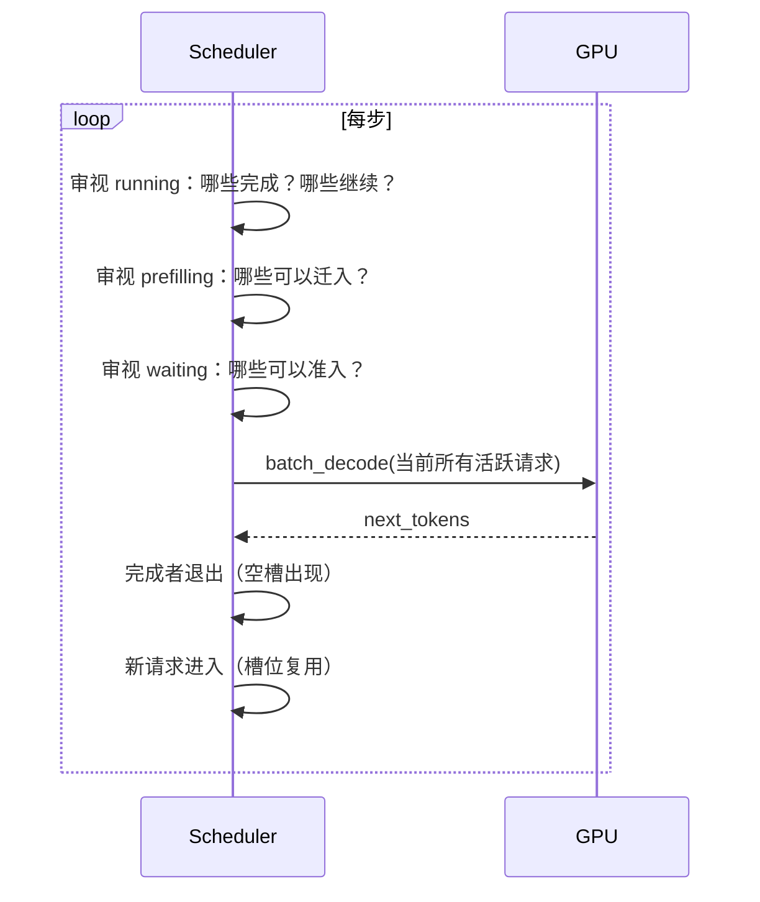
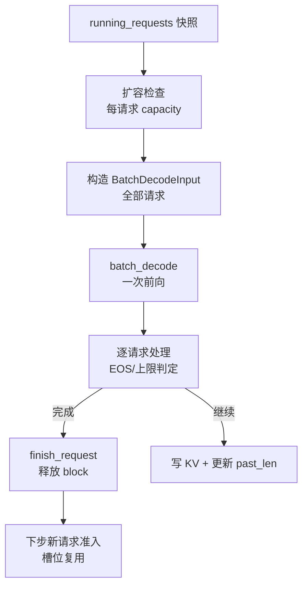
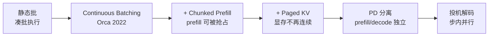

<!--
chapter: ch08
part: part2_runtime_architecture
title: Continuous Batching：每步动态组批
status: done
-->

# 第 8 章 Continuous Batching：每步动态组批

!!! abstract "本章内容"
    第 7 章建立了调度决策的框架，但还没回答一个根本问题：**decode 到底如何
    组批**？本章从静态批处理的三个致命缺陷（队头阻塞、槽位浪费、长度耦合）
    出发，推导 Continuous Batching（连续批处理）的核心思想——**每步动态决定
    批的组成**，并建立吞吐模型解释"为什么有效"。mini-runtime 的
    `decode_one_step` 是本思想的直接体现（`engine.py:247-322`）。

---

## 1. Motivation 动机

第 5 章 §2.5 的结论：decode 必须批处理（否则 $I \approx 1$，GPU 空转）。
第 7 章建立了调度器。**但"批"本身如何组织？**

最简单的答案是**静态批**：把请求凑成固定大小的 batch，同进同出。
让我们先推导静态批为什么在真实负载下失效——这正是 Continuous Batching
的诞生动机（Orca 论文 2022 首次系统提出）。

!!! example "三个静态批的失败场景"
    1. **队头阻塞**：batch 里有 1 个长生成（512 token）+ 3 个短生成（8 token），
       短的必须等长的全部生成完才能退出；
    2. **槽位浪费**：batch 运行中途有请求完成，空出的 GPU 算力无法被
       新请求利用（要等整批结束）；
    3. **长度耦合**：批内请求的生成速度被最慢者拖累，平均 TPOT 恶化。

## 2. Theory 理论

### 2.1 从"同进同出"推导静态批的缺陷

**问题**：静态批为什么低效？

设 batch $B$，批内请求生成长度 $\{n_1, ..., n_B\}$。静态批的完成时间：

$$
T_{\text{static}} = \max_i n_i \cdot T_{\text{step}}
\tag{1}
$$

而理想（完全独立）的总工作量是 $\sum_i n_i \cdot T_{\text{step}}$。
**比值 $\sum n_i / \max n_i$ 称为批内浪费系数**：当长度差异大时（如
$n = \{512, 8, 8, 8\}$），浪费系数 $\approx 536/512 \approx 1.05$，
看似不高——但 GPU 每步按最大 batch 计算，短的请求实际"陪跑"了
$512-8=504$ 步，**它们占用的算力本可用于服务新请求**。

### 2.2 从"每步重审视"推导连续批处理

**问题**：如何消除浪费？答案是把"批"从**静态集合**变成**每步动态决策**：



**Continuous Batching = 每步重新计算 batch 的组成**。完成即退出、
新请求即进入——GPU 每步都工作在"当前最值得做"的请求集合上。

!!! note "推导：连续批处理消除了什么"
    - 消除了**队头阻塞**：完成者立即退出，不再被他人拖累；
    - 消除了**槽位浪费**：空出的算力下步即可被新请求利用；
    - 消除了**长度耦合**：每步的 batch 由"当时还活着"的请求组成。
    代价只有一个：**每步都要做组批决策**（第 7 章已证明该决策
    $O(B)$，毫秒级，可接受）。

### 2.3 从"批大小由什么决定"推导批的边界

**问题**：batch 能无限大吗？不能。三个约束：

| 约束 | 来源 | mini-runtime 对应 |
|------|------|------------------|
| 显存 | 每请求的 KV block 占用 | `NUM_BLOCKS` + 分配失败 → 拒绝准入 |
| 算力预算 | prefill 的 token 预算 | `MAX_TOKENS_PER_PREFILL_STEP` |
| 延迟 SLO | batch 越大，单请求 TPOT 越差 | `max_batch_size` 上限 |

$$B_{\max} = \min\left(B_{\text{显存}},\; B_{\text{算力}},\; B_{\text{SLO}}\right)
\tag{2}$$

!!! warning "推导：连续批处理并不免费"
    每步动态组批意味着**每步的 batch 形状可能不同**。PyTorch eager 模式下
    动态形状每次都要重新 dispatch（第 4 章开销模型）；CUDA Graph 下则要
    为每种形状捕获图（第 21 章）。**动态性是有代价的**——这是推理引擎
    复杂度的来源之一，也是 vLLM 引入"capture 多个 shape"的原因。

### 2.4 吞吐模型：权重分摊的量化

decode 步的 GPU 时间可近似为：

$$
T_{\text{decode}}(B) \approx \max\left(
\frac{2N \cdot B}{\text{FLOPs}},\;
\frac{2N + \text{KV}(B)}{BW}
\right)
\tag{3}
$$

其中 $2N$ 是权重字节数（fp16），$\text{KV}(B)$ 是 $B$ 个请求的 KV 读取。
**关键结论**：权重读取 $2N$ 与 batch 无关（只读一次），因此当
$2N \gg \text{KV}(B)$ 时，吞吐近似线性增长：

$$
\text{Throughput}(B) \approx \frac{B}{T_{\text{decode}}(B)} \propto B
\tag{4}
$$

直到 KV 读取（$B$ 个不同请求的 KV 不共享）追上权重读取，增长放缓。

!!! example "数字直觉（0.5B 模型，A100）"
    权重 1 GB（fp16）；每请求 KV（$L=1024$）$\approx 2\times 1024\times
    2\times 64\times 2\text{B} \approx 0.5$ MB。权重/单请求 KV
    $\approx 2000$——**batch 到 ~1000 之前，权重读取始终主导**。
    这解释了为什么 decode 的吞吐几乎随 batch 线性增长
    （实际受 SLO 与显存限制，达不到 1000）。

### 2.5 复杂度分析

- 每步组批：$O(B)$（遍历 running + 迁移判定）；
- 每步前向：一次 batch_decode，batch $= B$；
- 内存：$O(\text{KV cache 总量})$，与活跃请求的序列长度成正比。

### 2.6 设计权衡（Trade-off）

| 维度 | 选择 | 收益 | 代价 |
|------|------|------|------|
| 批的组织 | 每步动态 | 无队头阻塞、无槽位浪费 | 动态形状开销 |
| 批的上限 | `max_batch_size` | 延迟可控 | 峰值吞吐受限 |
| prefill 与 decode | 分离执行 | 形状简单 | 见第 9 章的抢占问题 |
| 完成策略 | 立即退出 | 槽位即时复用 | 每步多一次判定 |

## 3. Industrial Implementations 工业实现

### 3.1 Orca：continuous batching 的提出

Orca（2022）首次指出迭代级调度（iteration-level scheduling）优于
请求级调度，并给出批内请求数不固定时的吞吐收益测量。**vLLM 的
调度器本质上就是 Orca 思想的工程化**，附加了分页显存与抢占。

### 3.2 vLLM：连续批 + 分页 + 抢占

- 每步由 `Scheduler` 决定：可继续的（running）、可抢入的（waiting）、
  需抢占的（显存不足时 swap out）；
- 与 mini-runtime 的差异：vLLM 的 decode 与 prefill **可以混批**
  （通过 chunked prefill + `max_num_batched_tokens`），而 mini-runtime
  每步严格分离。

### 3.3 TGI：动态批的经典实现

TGI 的 `ContinuousBatchingScheduler` 是社区最早的生产实现之一，其
"每步动态生成 batch 计划"的思路与 Orca/vLLM 一致，代码结构更简单，
适合作为第二阅读材料。

### 3.4 为什么实现细节不同？

| 框架 | 混批方式 | 显存机制 | 抢占 |
|------|---------|---------|------|
| mini-runtime | prefill/decode 分离 | BlockTable | 无（fail-fast） |
| vLLM | 可混批（chunked） | PagedAttention | swap |
| TGI | 分离为主 | 传统缓存 | 无 |

**差异根源**：混批需要 attention 支持"不同请求不同 past_len"的 mask——
mini-runtime 的 `batch_decode` 已经支持（`native.py:356-360`），但
调度层面仍选择分离以保持简单。

## 4. mini-runtime Implementation

### 4.1 架构设计

连续批处理在 mini-runtime 中体现为 `decode_one_step` 的**每步全量组批**：



### 4.2 关键代码路径

| 步骤 | 代码位置 | 说明 |
|------|---------|------|
| 扩容检查 | `engine.py:267-279` | 每请求 `total > capacity → allocate` |
| 组批 | `engine.py:293-298` | 全部 running 构造 `BatchDecodeInput` |
| 一次前向 | `engine.py:300` | `self.backend.batch_decode(batched)` |
| 完成判定 | `engine.py:313` | `>= max_new_tokens` 或 `None`（EOS） |
| 退出与释放 | `engine.py:318-320` | `finish_request` + 移除 |

### 4.3 一个值得注意的细节：EOS 的处理

`batch_decode` 返回 `None` 表示 EOS（`native.py:375-377`），Engine
据此判定完成（`engine.py:313` 的 `r._last_token is None`）。
**EOS 由 backend 判定而非 engine**——backend 拥有 tokenizer，知道
EOS id；Engine 只消费"是否结束"这个布尔信号。关注点分离的又一例。

### 4.4 Theory → Code 对应表

| 理论机制（§2） | mini-runtime 证据 | 验证要点 |
|----------------|------------------|---------|
| 每步动态组批（§2.2） | `engine.py:293-298` | batch 来自当前 running 快照 |
| 完成即退出（§2.2） | `engine.py:318-320` | 下步自动不包含完成者 |
| 隐式扩容（§2.3） | `engine.py:267-279` | 显存不足先扩容 |
| 权重分摊（§2.4） | `engine.py:300` | 一次前向处理全部请求 |

## 5. Performance Analysis 性能分析

### 5.1 吞吐提升的量化路径

| 指标 | 静态批 | 连续批 | 来源 |
|------|--------|--------|------|
| 批内浪费 | $\sum n_i / \max n_i$ | 无（每步动态） | §2.1 |
| GPU 空转（槽位） | 完成者陪跑 | 无 | §2.2 |
| 平均 TPOT | 被最长者拖累 | 只受当前 batch 影响 | §2.2 |
| 吞吐 | $\propto$ 平均批利用率 | $\propto B$（权重分摊） | §2.4 |

### 5.2 Benchmark 方法

```bash
# 用混合负载（不同长度）观察批内浪费
PYTHONPATH=. python benchmarks/scenarios/baseline.py
# 对比指标：decode_steps（总步数）与 avg_tpot
```

**解读**：若 `decode_steps` 接近"最长请求的生成长度"，说明批组织
接近静态批；若明显更小，说明连续批生效。mini-runtime 的
`metrics.decode_steps`（`metrics.py:12`）正是这个信号。

## 6. Evolution 演进



Continuous Batching 解决的是"批的组成"；后续演进解决"批内部更细的问题"
——prefill 与 decode 的**资源竞争**（第 9 章）、显存**碎片化**
（第 12 章）、prefill/decode **异构部署**（第 9 章演进部分）。

## 7. Summary 总结

| 维度 | 结论 |
|------|------|
| 解决的问题 | 消除静态批的队头阻塞与槽位浪费，让 GPU 每步都满负荷 |
| 在 AI Infra 中的位置 | 推理吞吐的基石；几乎所有生产推理框架的核心机制 |
| 依赖 | 调度器（第 7 章）、动态形状支持（第 4 章）、KV 管理（第 3 部分） |
| 影响 | 使吞吐 $\propto$ batch；催生 chunked prefill、PD 分离等后续演进 |

### 思考题

1. 用式 (3) 推导：batch 从 1 到 100，decode 时间如何变化？KV 读取在
   何时开始主导？（0.5B 模型、$L=2048$）
2. 若请求生成长度全部相同（$n_i$ 相等），静态批与连续批的吞吐差异
   还大吗？为什么？
3. mini-runtime 的 prefill 与 decode 分离执行（每步先全量 prefill 再
   decode）。若某步 prefill 预算 8192 全被一个请求吃满，decode 的
   延迟会怎样？（引出第 9 章）

### 延伸阅读

- Yu et al., *Orca: A Distributed Serving System for Transformer-Based Generative Models*, 2022
- vLLM 论文 §2 *LLM Serving*（continuous batching 的工程化描述）
- mini-runtime 源码：`mini_runtime/engine.py:247-322`
