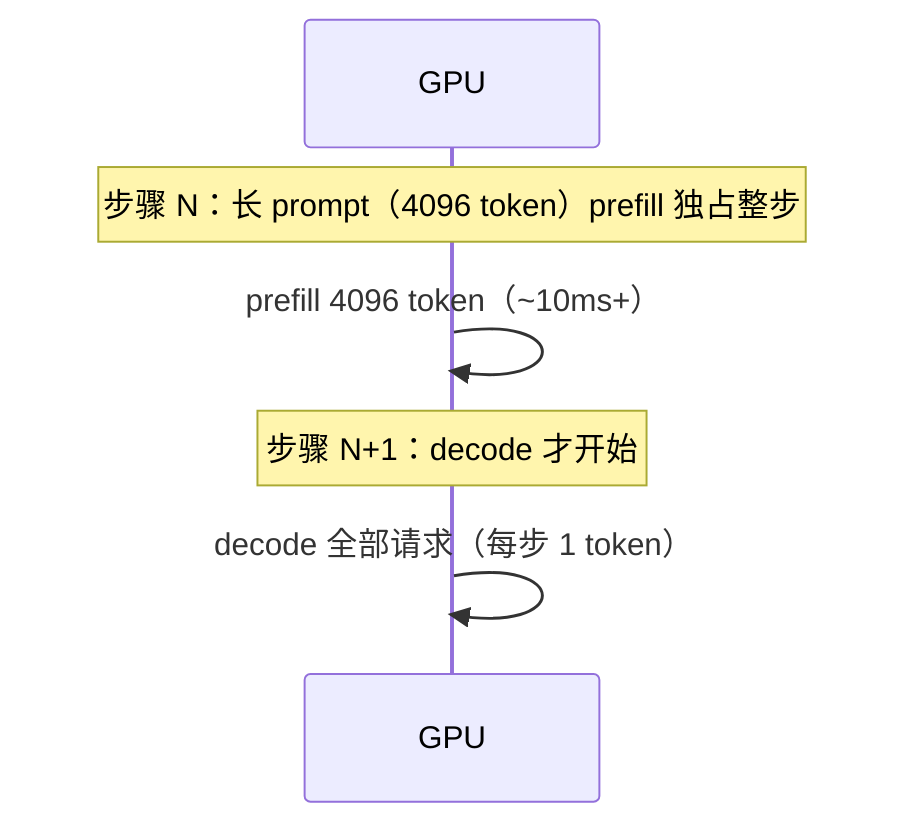
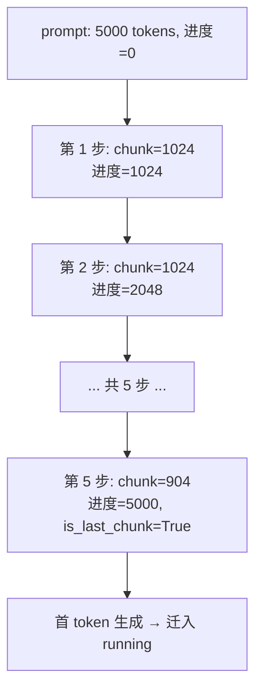
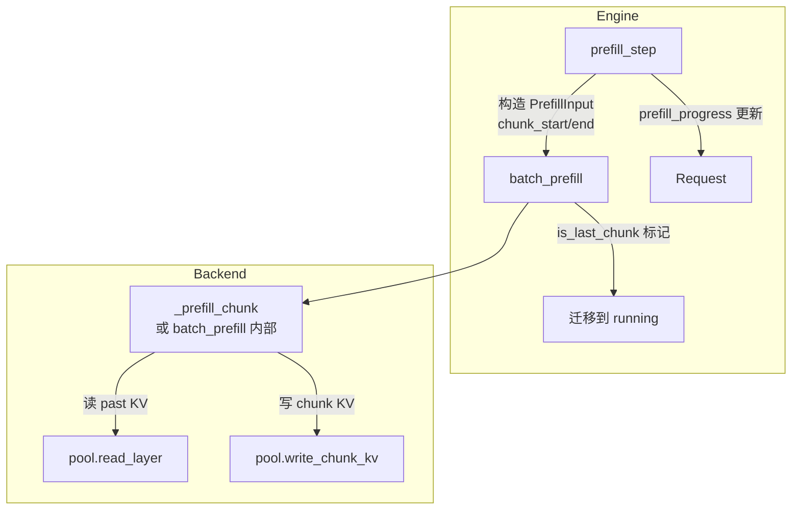
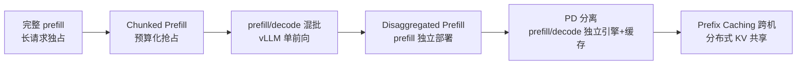

<!--
chapter: ch09
part: part2_runtime_architecture
title: Chunked Prefill：让长 prompt 不再霸占 GPU
status: done
-->

# 第 9 章 Chunked Prefill：让长 prompt 不再霸占 GPU

!!! abstract "本章内容"
    第 8 章解决了"批的组成"，但留下一个尾巴：`MAX_TOKENS_PER_PREFILL_STEP`
    的预算被**单个长 prompt**吃满时，decode 被整步阻塞（TTFT/TPOT 恶化）。
    本章推导 Chunked Prefill：把长 prefill 切成有界 chunk，配合"每步预算"
    实现 **prefill 与 decode 的抢占式共存**。mini-runtime 的
    `prefill_progress` 字段与 `_prefill_chunk` 路径是完整实现
    （`engine.py:172-245`, `native.py:137-213`）。

---

## 1. Motivation 动机

第 8 章思考题 3 指出了 mini-runtime 的一个结构性问题：

> 每步先执行 `prefill_step` 再执行 `decode_one_step`。若某步的 prefill
> 预算（8192 token）被一个长 prompt 请求吃满，这步的 **decode 全部
> 被阻塞**——正在运行的请求多等了整整一个 prefill 的时间。



**后果**：长 prompt 请求造成**周期性延迟尖峰**——所有请求的 TPOT
都被拉长。这是交互式服务（聊天、Agent）不可接受的。

## 2. Theory 理论

### 2.1 从"一个长前向"推导分块的动机

**问题**：为什么长 prefill 不能拆开？

其实**可以拆**，只要满足两个条件：

1. **状态可保存**：第 $i$ 块 prefill 产生的 KV 必须可写回 KV Cache，
   下块从缓存续算（而不是重新计算前 $i$ 块）；
2. **位置连续**：第 $i+1$ 块的 `position_ids` 从第 $i$ 块末尾继续
   （RoPE 依赖绝对位置，第 19 章）。

mini-runtime 用 `prefill_progress`（`request.py:28`）记录"已 prefill 的
token 数"，每步从该位置续算——**分块的本质是把"一个长前向"变成
"多个短前向 + 状态累积"**。

### 2.2 从"预算"推导 chunk 的切分规则

**问题**：一块多大？

mini-runtime 的切分（`engine.py:191`）：

$$
\text{chunk\_len} = \min(\text{budget},\; \text{max\_chunk},\; \text{prompt\_len} - \text{progress})
\tag{1}
$$

| 常量 | 值 | 作用 |
|------|----|----|
| `MAX_TOKENS_PER_PREFILL_CHUNK` | 1024 | 单请求单块上限（防止独占） |
| `MAX_TOKENS_PER_PREFILL_STEP` | 8192 | 全步总预算（防止整步被占） |



!!! note "推导：chunk 大小与"抢占粒度"的关系"
    chunk 越小，prefill 让出 GPU 的频率越高（decode 等待越短），但
    前向次数越多（每块多一次 kernel 启动 + 状态读写）。**chunk 大小
    是"抢占粒度"与"前向效率"的权衡**——这正是 vLLM 中
    `max_num_batched_tokens` 参数存在的意义。

### 2.3 从"一步预算"推导 prefill 与 decode 的共存

**问题**：预算内多个请求的 chunk 如何排布？

`prefill_step`（`engine.py:183-212`）按顺序切分多个 prefilling 请求，
**预算用尽即止**（`budget <= 0` 跳出循环）：

```python
for r in self.prefilling_requests:      # 顺序扫描
    if budget <= 0: break               # 预算用尽
    chunk_len = min(budget, max_chunk, prompt_len - start)
    budget -= chunk_len
```

**关键性质**：预算保证"单步 prefill 的工作量有上界"（8192 token），
因此 decode 的等待有界——**这是抢占式调度的预算化实现**。对比
vLLM 的显式抢占（swap 请求），mini-runtime 用预算隐式实现了
"prefill 让位于 decode"的效果。

!!! warning "mini-runtime 的局限：仍未真正混批"
    每步仍是"先 prefill 一批、再 decode 一批"两段式。理想情况下
    （vLLM）prefill chunk 与 decode 应**在同一前向中混合**（通过
    attention mask 区分），进一步消除"段"的概念。mini-runtime 的
    `batch_prefill` 与 `batch_decode` 已各自支持多请求，但未合并——
    这是学习路径上可以动手扩展的点。

### 2.4 复杂度分析

设 prompt 长 $L$，块大小 $C$：

- 分块数：$\lceil L/C \rceil$；
- 每块前向：$O(C \cdot d^2 + C \cdot \text{past\_len} \cdot d)$
  （past_len 逐步增长，注意力成本累计）；
- 总前向成本与完整 prefill **相同**（$O(L \cdot d^2 + L^2 \cdot d)$），
  多出的只是 kernel 启动与状态读写（每块 ~数十 µs）。

**结论**：chunked prefill 不改变总计算量，只改变**时间分布**
（把一个大延迟块拆成多个小延迟块）——这是它与"优化算法"的本质区别。

### 2.5 设计权衡（Trade-off）

| 维度 | 小 chunk | 大 chunk |
|------|---------|---------|
| decode 等待 | 短（抢占粒度细） | 长（可能整步被占） |
| 前向效率 | 低（启动开销占比高） | 高（大 GEMM 更高效） |
| TTFT | 略增（多块串行） | 略减 |
| 适用场景 | 交互式、多用户 | 离线批量、单用户 |

## 3. Industrial Implementations 工业实现

### 3.1 vLLM：chunked prefill 与 decode 混批

vLLM 的 `max_num_batched_tokens` 让 prefill chunk 与 decode token
**在同一 batch 前向中混合**（`prefill` 与 `decode` 请求共享一次
forward，用 mask 区分）。这消除了"段"的概念，GPU 每步都是
"若干 decode token + 若干 prefill token"的混合负载。

### 3.2 TensorRT-LLM：静态 chunk 计划

构建期把 prefill 计划编译进 engine，运行时按固定 chunk 执行——
无动态抢占，但每步开销最低。适合预知的、稳定的负载。

### 3.3 SGLang：Radix Cache 与 chunked 协同

前缀命中（第 13 章）天然缩短了"需要 prefill 的 token 数"，与
chunked prefill 叠加：命中部分跳过、未命中部分分块。**两者解决
不同的问题**：前缀缓存减少工作量，chunked 平滑时间分布。

## 4. mini-runtime Implementation

### 4.1 架构设计



### 4.2 关键代码路径

| 步骤 | 代码位置 | 说明 |
|------|---------|------|
| 切分 chunk | `engine.py:187-212` | 预算/块上限/进度三者取 min |
| 状态字段 | `request.py:28` | `prefill_progress` 跨步保存进度 |
| 最后一块判定 | `engine.py:197` | `is_last = (end == prompt_len)` |
| 全命中路径 | `native.py:82-97` | 无需 prefill，直接 decode 取首 token |
| chunk 前向 | `native.py:137-213` | `_prefill_chunk`：读 past + 前向 + 写 KV |
| 批量版 | `native.py:214-323` | `batch_prefill`：多请求一次前向 |

### 4.3 一个关键细节：`position_ids` 的连续性

`native.py:175`：`position_ids = torch.arange(past_len, chunk_end)`——
chunk 的绝对位置从 `past_len`（= 已 prefill 数）继续。**这保证了
RoPE 的位置语义正确**（第 19 章），是"分块可续算"的数学前提。

### 4.4 Theory → Code 对应表

| 理论机制（§2） | mini-runtime 证据 | 验证要点 |
|----------------|------------------|---------|
| 状态可保存（§2.1） | `request.py:28` | `prefill_progress` 跨步持久 |
| 切分规则（§2.2） | `engine.py:191` | 三者 min |
| 预算上界（§2.3） | `engine.py:184` | `budget <= 0` 停止 |
| 末块判定（§2.2） | `engine.py:197` | `is_last_chunk` 决定迁移 |
| 位置连续（§2.1） | `native.py:175` | arange 从 past_len 起 |
| 批量前向（§2.3） | `native.py:214-323` | 多请求一次 forward |

## 5. Performance Analysis 性能分析

### 5.1 性能影响的两面

| 指标 | 完整 prefill（长 prompt） | chunked prefill |
|------|--------------------------|-----------------|
| 单请求 TTFT | 低（一次算完） | 略高（多块串行） |
| 其他请求 TPOT | 被整步阻塞（尖峰） | 每块后有 decode 机会（平滑） |
| GPU 利用率 | 单次大 GEMM 高效 | 每块小 GEMM 略低 |
| 长尾延迟（P99） | 高 | 显著改善 |

**核心结论**：chunked prefill 用少量 TTFT 牺牲 + 少量利用率损失，
换取**延迟尖峰的消除**——对多用户交互场景，P99 的改善远大于
平均值的损失。

### 5.2 Benchmark 方法

```bash
# 混合负载：1 个 8K prompt + 多个短请求
# 对比：MAX_TOKENS_PER_PREFILL_CHUNK=8192（等效完整） vs 1024
# 观察指标：avg_tpot、P99 TTFT、decode_steps
```

可修改 `runtime_config.py:6` 观察 chunk 大小对 `avg_tpot` 的影响。

## 6. Evolution 演进



Chunked Prefill 开启了"**prefill 是可抢占的**"这一认知，后续演进
沿着两条线：**同机混批**（vLLM）与**异构部署**（PD 分离：
prefill 引擎用大 batch 吃长 prompt，decode 引擎专注低延迟，
见[第 30 章](../part6_distributed_runtime/ch30_multi_node_serving.md)）。

## 7. Summary 总结

| 维度 | 结论 |
|------|------|
| 解决的问题 | 消除长 prompt 对 decode 的整步阻塞，平滑延迟分布 |
| 在 AI Infra 中的位置 | Continuous Batching 的补充：解决批内资源竞争 |
| 依赖 | KV Cache 的按位置写入（第 3 部分）、position 连续语义 |
| 影响 | 催生 PD 分离与混批调度；TTFT/TPOT 权衡的核心旋钮 |

### 思考题

1. 用 §2.4 的复杂度结论说明：为什么 chunked prefill 不减少总计算量，
   却改善了 P99 延迟？
2. mini-runtime 的 `is_last_chunk` 为何要单独标记？如果末块前向返回
   的 token 被当作"decode 首 token"，与 `prefill_step` 的迁移逻辑
   如何衔接？
3. 若把 `MAX_TOKENS_PER_PREFILL_CHUNK` 设为 64，预期 TPOT 与 TTFT
   如何变化？在什么负载下这个设置合理？

### 延伸阅读

- vLLM 文档：*Chunked Prefill*（`max_num_batched_tokens` 的设计讨论）
- Agrawal et al., *Sarathi: Efficient LLM Inference by Piggybacking Decodes on Chunked Prefills*, 2024
- mini-runtime 源码：`mini_runtime/engine.py:172-245`、`mini_runtime/backend/native.py:137-323`
