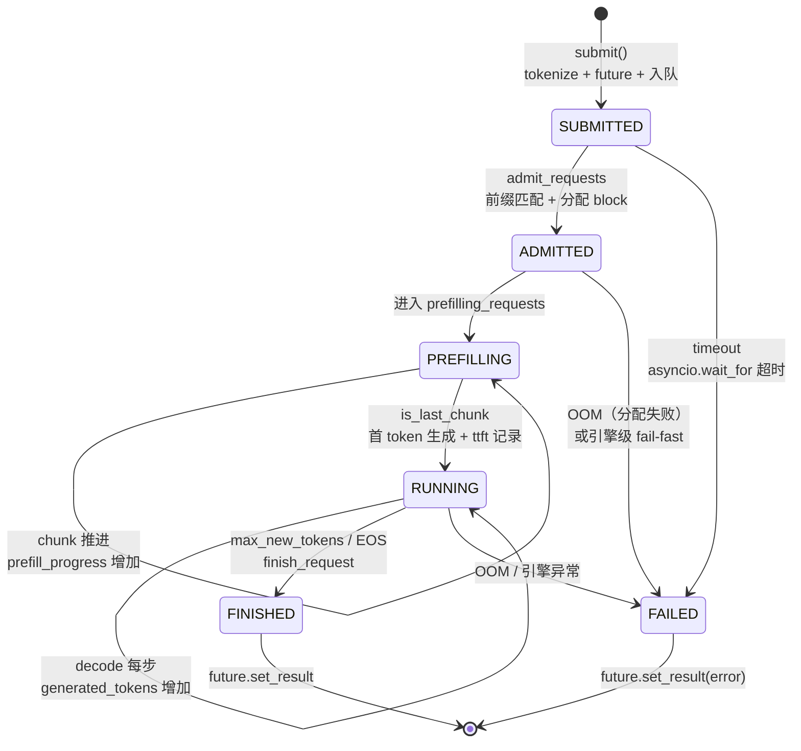
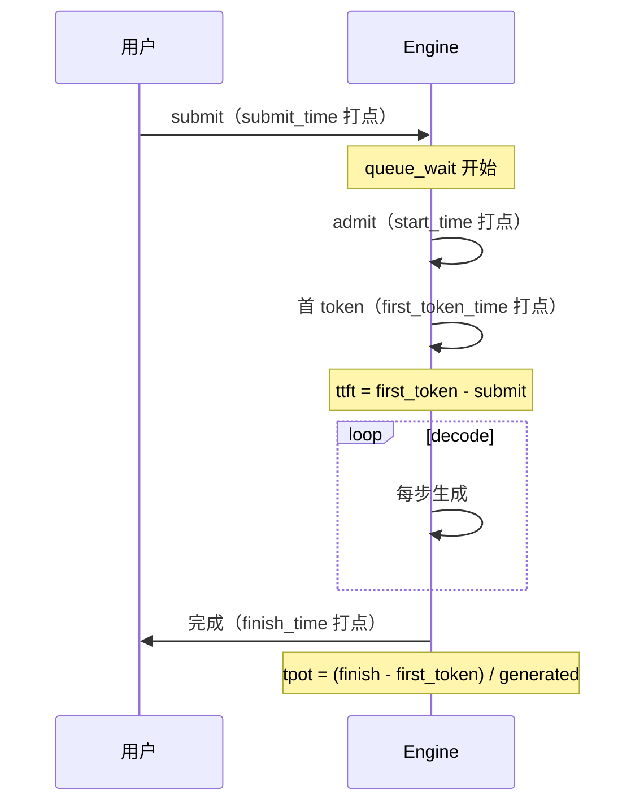
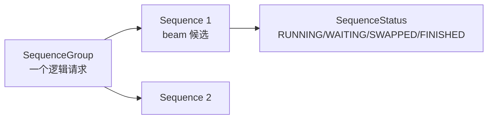
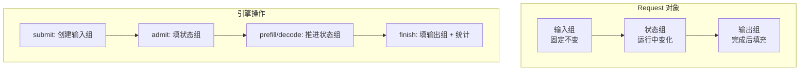
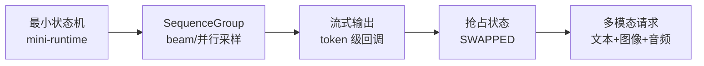

<!--
chapter: ch10
part: part2_runtime_architecture
title: Request Lifecycle：从生到死的状态机
status: done
-->

# 第 10 章 Request Lifecycle：从生到死的状态机

!!! abstract "本章内容"
    第 6–9 章分别拆解了 Engine、Scheduler、Batching 与 Prefill。本章把全部
    机制**串回请求本身**：一个 `Request` 对象从创建到销毁，经历哪些状态、
    在每个状态点记录什么指标、异常路径如何兜底。读完本章，读者将得到
    一张完整的生命周期地图，可用于调试任何推理引擎的请求流程
    （`request.py` 全文 49 行 + `engine.py:324-401`）。

---

## 1. Motivation 动机

前面四章从"系统"视角看运行时；本章换一个视角：**从"请求"本身看系统**。
一个请求在系统中停留期间，它的字段不断变化（分配了 block、进度推进、
时间被记录），每个字段都是系统某处决策的**结果沉淀**。

理解 Request 生命周期有三个实际价值：

1. **调试**：请求卡住时，看它的状态字段就知道卡在哪一步；
2. **指标**：TTFT/TPOT 的精确含义取决于"在哪个时间点记录"；
3. **扩展**：工业框架的 SequenceGroup、抢占等概念都是在这个状态机
   上做加法。

## 2. Theory 理论

### 2.1 从"请求是啥"推导三组字段

**问题**：一个请求对象需要承载哪些信息？

mini-runtime 的 `Request`（`request.py:5-49`）用三个注释块划分：

| 分组 | 字段 | 生命周期 | 说明 |
|------|------|---------|------|
| 输入 | `request_id, prompt, token_ids, max_new_tokens, submit_time, future` | 创建时固定 | 调用方提供 |
| 状态 | `block_table, matched_*, prefill_progress, generated_tokens, prefill_done, _last_token` | 运行中变化 | 系统决策的沉淀 |
| 输出 | `finish_time, ttft, tpot` | 完成后填充 | 指标计算 |

!!! note "推导：为什么 future 是输入而非状态？"
    `future` 在创建时确定（`engine.py:375`），由调用方 await——它是
    **回调通道**而非系统状态。系统只负责在完成/失败时 `set_result`。
    这个分离使 Request 既是"数据对象"又是"控制通道"。

### 2.2 从"状态迁移"推导完整生命周期



**关键状态判据**：

| 迁移 | 判据 | 代码 |
|------|------|------|
| SUBMITTED → ADMITTED | 容量 + 显存充足 | `engine.py:120-141` |
| ADMITTED → PREFILLING | 分配成功（含 evict 重试） | `engine.py:157-163` |
| PREFILLING → RUNNING | 末块 prefill 完成 | `engine.py:225-237` |
| RUNNING → FINISHED | `generated_tokens >= max_new_tokens` 或 EOS | `engine.py:313` |
| 任意 → FAILED | OOM / 异常 / 超时 | `engine.py:81-90, 394-401` |

### 2.3 从"指标口径"推导计时点

**问题**：TTFT/TPOT 的精确计算依赖"在哪个时间点打点"。

`finish_request`（`engine.py:332-340`）的四个时间量：

| 指标 | 公式 | 语义 | 打点位置 |
|------|------|------|---------|
| `queue_wait` | `start_time - submit_time` | 排队时间 | `engine.py:126` 记录 start_time |
| `ttft` | `first_token_time - submit_time` | 首 token 延迟 | `engine.py:234,303` 记录 first_token_time |
| `service_time` | `finish_time - start_time` | 服务时间 | `engine.py:324` 传入 |
| `tpot` | `(finish - first_token) / generated_tokens` | 每 token 间隔 | `engine.py:337-340` |



!!! warning "TTFT 的两种口径"
    mini-runtime 的 `ttft` 从 `submit_time` 起算（含排队），而
    `first_token_time` 本身从 admitt 起算。工业界两种口径都有：
    **端到端 TTFT**（用户体验，含排队）与 **引擎 TTFT**（引擎性能，
    不含排队）。比较框架时必须对齐口径——`metrics.py:19` 的
    `total_ttft` 是端到端口径。

### 2.4 从"系统会失败"推导异常路径

**问题**：请求失败的三种方式，如何兜底？

| 路径 | 触发 | 处理 | 指标 |
|------|------|------|------|
| 超时 | `asyncio.wait_for`（`engine.py:394`） | future.cancel + 返回 timeout | `metrics.timeout` |
| OOM | 分配失败 / 引擎异常 | fail-all（`engine.py:92-117`） | `metrics.oom` |
| 取消 | `shutdown()`（`engine.py:447-491`） | 逐请求 set_result(cancelled) | `metrics.cancelled` |

**关键设计**：`finish_request`（`engine.py:328-330`）首先检查
`future.done()`——防止"超时后引擎又完成"的**双重结算**。这是一个
隐蔽但重要的正确性细节。

### 2.5 复杂度分析

- 每请求状态字段 $O(1)$ 更新（创建/迁移/完成各一次）；
- 每步遍历 $O(B)$ 请求做状态判定；
- 完成时释放 block：$O(\text{该请求的 block 数})$。

### 2.6 设计权衡（Trade-off）

| 维度 | 选择 | 收益 | 代价 |
|------|------|------|------|
| 状态存储 | 全部字段在 Request 对象 | 单一视图、易调试 | 无持久化（崩溃即失） |
| 超时处理 | wait_for 包装 | 简单 | 超时后 GPU 状态可能残留 |
| 失败粒度 | 引擎级 fail-fast | 状态安全 | 单点 OOM 全挂 |
| 指标口径 | 端到端 TTFT | 反映用户体验 | 与引擎指标不可直接比 |

## 3. Industrial Implementations 工业实现

### 3.1 vLLM：SequenceGroup 与 SequenceStatus

vLLM 的请求模型更丰富：



- **SequenceGroup**：支持 beam search / 并行采样（一个请求多个序列）；
- **SequenceStatus**：显式枚举状态（含 `SWAPPED`——抢占换出的状态，
  mini-runtime 没有）；
- 指标（`metrics`）分层：request 级、engine 级。

### 3.2 TGI / TensorRT-LLM

- TGI：`Request` + `Generation` 状态，支持流式输出（token 分批返回）；
- TensorRT-LLM：`Request` 生命周期与 engine 的 `RequestState` 绑定。

**共性**：状态机的骨架（排队 → 运行 → 完成）一致；差异在**附加状态**
（beam、swap、流式）——都建立在 mini-runtime 这版"最小状态机"之上。

## 4. mini-runtime Implementation

### 4.1 架构设计



### 4.2 字段级代码映射

| 字段 | 写入位置 | 读取位置 |
|------|---------|---------|
| `block_table` | `engine.py:133,157` | `engine.py:202-203`（prefill）、`297`（decode） |
| `prefill_progress` | `engine.py:162,239` | `engine.py:188`（切分） |
| `first_token_time` | `engine.py:234,303` | `engine.py:334`（ttft） |
| `_generated_token_ids` | `engine.py:232,310` | `engine.py:350`（decode 输出） |
| `ttft/tpot` | `engine.py:342-350` | `snapshot_metrics` |

### 4.3 Theory → Code 对应表

| 理论机制（§2） | mini-runtime 证据 | 验证要点 |
|----------------|------------------|---------|
| 三组字段（§2.1） | `request.py:7-39` | 三个注释块 |
| 状态迁移（§2.2） | `engine.py:225-243, 313-320` | 三处迁移点 |
| 计时口径（§2.3） | `engine.py:332-340` | 四个时间量公式 |
| 双重结算防护（§2.4） | `engine.py:328-330` | future.done() 检查 |
| 指标聚合（§2.3） | `engine.py:354-360` | total_ttft/tpot 累加 |

## 5. Performance Analysis 性能分析

### 5.1 用生命周期指标诊断系统

| 症状 | 指标表现 | 诊断方向 |
|------|---------|---------|
| 排队严重 | `queue_wait` 大、`ttft` 大 | 准入容量不足（第 7 章） |
| prefill 慢 | `first_token_time` 大但 queue_wait 小 | chunk 策略 / 预算（第 9 章） |
| decode 慢 | `tpot` 大 | 批大小 / 带宽（第 8 章） |
| 频繁失败 | `oom` / `timeout` 计数高 | 显存预算 / 超时设置 |

### 5.2 一个完整的端到端实验

```bash
# 观察一个请求的完整生命周期（tests/test_e2e.py 的输出字段）
PYTHONPATH=. python tests/test_e2e.py
# 输出含 request_id, ttft, generated_tokens, output 等
```

对照 `engine.py:342-350` 的返回字典，读者可以亲手验证
§2.3 的每个指标公式。

## 6. Evolution 演进



演进主线：状态机从"单序列、同步"走向"多序列、流式、可抢占、多模态"。
**每加一个功能，状态枚举加一档**——理解最小状态机是理解一切
衍生的前提。

## 7. Summary 总结

| 维度 | 结论 |
|------|------|
| 解决的问题 | 把运行时机制沉淀为请求的显式状态，使系统可调试、指标可计算 |
| 在 AI Infra 中的位置 | 系统机制与用户可观测性之间的桥梁 |
| 依赖 | 调度决策（第 7 章）、批处理（第 8 章）、prefill（第 9 章） |
| 影响 | 决定 TTFT/TPOT 口径；为流式/beam/抢占等扩展提供基础 |

### 思考题

1. `finish_request` 中 `future.done()` 检查保护了什么场景？
   如果去掉这行，超时请求会有什么表现？
2. `tpot` 用 `(finish - first_token) / generated_tokens` 计算，
   与"相邻 token 时间间隔的均值"在什么情况下不等价？
3. 若增加"流式输出"功能，Request 需要增加什么字段？状态机
   要加什么状态？

### 延伸阅读

- vLLM 源码：`vllm/sequence.py`（SequenceGroup/SequenceStatus 对比阅读）
- mini-runtime 源码：`mini_runtime/request.py`（全文）、`mini_runtime/engine.py:324-401`
- 本仓库 `tests/test_e2e.py`：请求完整周期的输出示例
