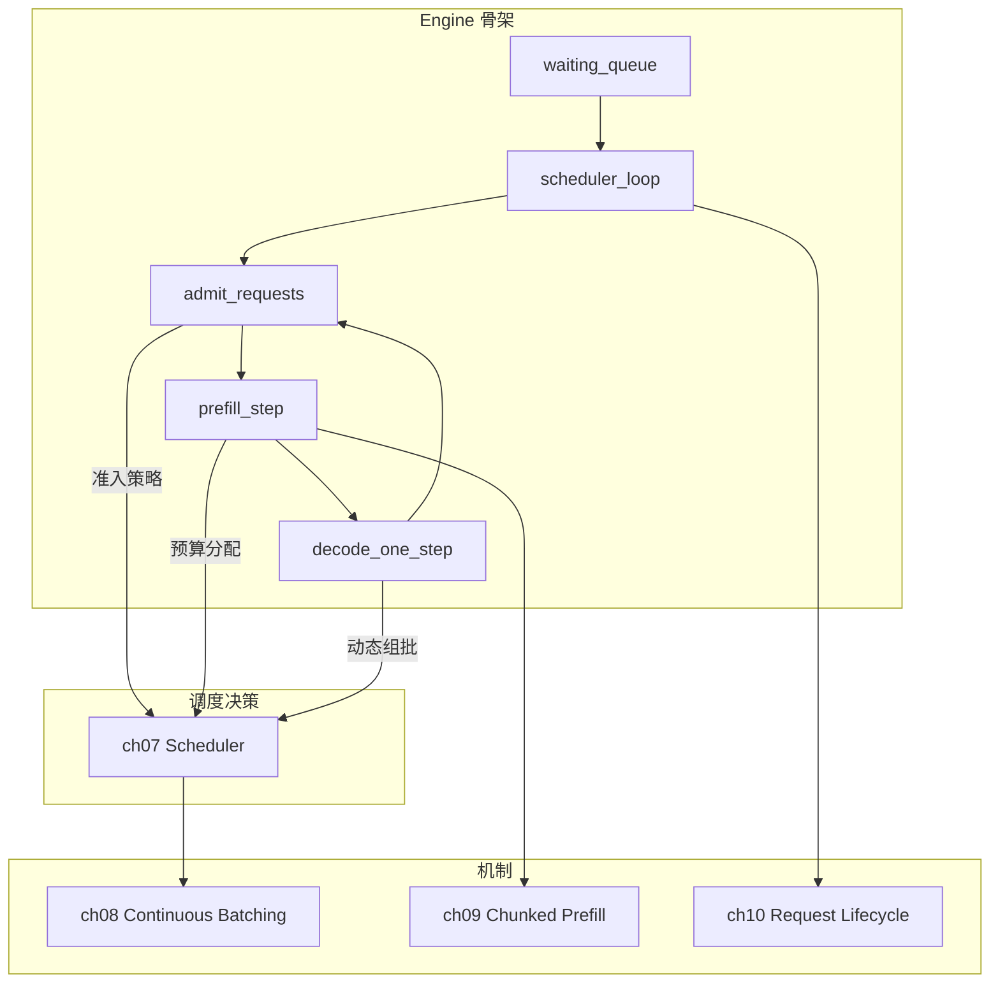

# 第 2 部分 · 运行时架构（Runtime Architecture）

!!! abstract "本部分内容"
    第 1 部分建立了"一次请求的旅程"（ch05）。本部分回答：**谁来驱动、如何调度
    这趟旅程**。Engine 是骨架（事件循环 + 三个请求集合），Scheduler 是决策者
    （准入、预算、迁移），Continuous Batching 是吞吐引擎（动态组批），
    Chunked Prefill 是延迟保障（长 prompt 抢占），Request Lifecycle 把全部
    机制串成一张状态机全景图。本部分是 mini-runtime 的精华所在。

## 章节地图

| 章节 | 核心问题 | 关键代码 |
|------|---------|---------|
| [第 6 章 Engine](ch06_engine.md) | 引擎的骨架如何搭建？为什么用 asyncio？ | `engine.py:13-90` |
| [第 7 章 Scheduler](ch07_scheduler.md) | 每步做哪些决策？决策代价多大？ | `engine.py:118-322` |
| [第 8 章 Continuous Batching](ch08_continuous_batching.md) | 动态组批为何提升吞吐？ | `engine.py:247-322` |
| [第 9 章 Chunked Prefill](ch09_chunked_prefill.md) | 长 prompt 如何不阻塞 decode？ | `engine.py:172-245` |
| [第 10 章 Request Lifecycle](ch10_request_lifecycle.md) | 请求从生到死的完整状态机 | `request.py` + `engine.py:324-401` |

## 阅读建议

- 本部分与 [第 3 部分（内存系统）](../part3_memory_system/index.md) 紧密耦合：
  Engine 的每个决策都以 KV block 的分配/释放为前提。
- 建议对照 `engine.py` 源码阅读：本章所有时序图都可以在 `scheduler_loop`
  的代码中找到一一对应。
