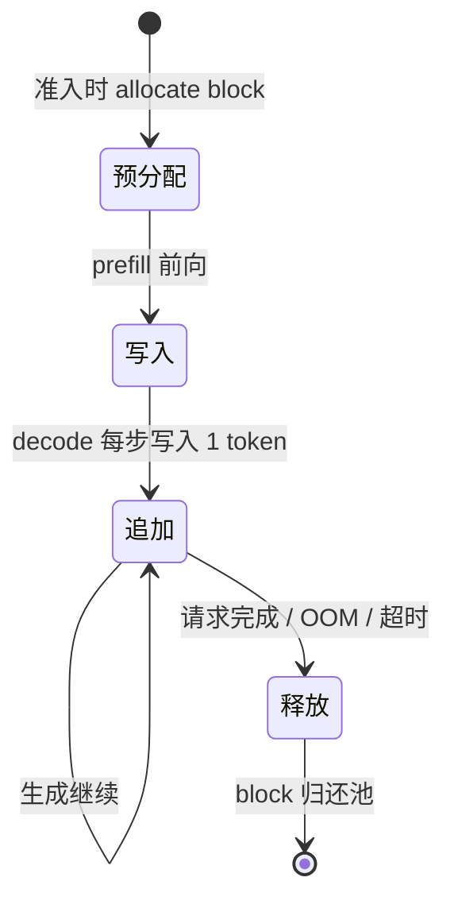
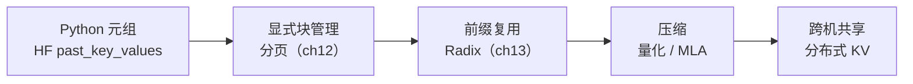

<!--
chapter: ch11
part: part3_memory_system
title: KV Cache：用显存换掉重复计算
status: done
-->

# 第 11 章 KV Cache：用显存换掉重复计算

!!! abstract "本章内容"
    第 1 章 §2.4 断言"KV Cache 是 decode 的必要条件"，但没给证明。
    本章补上这个推导：从自回归的重复计算出发，证明**缓存 K/V 是唯一
    消除二次方复算的方法**，并推导 KV Cache 的体积公式（为什么它随
    序列长度线性增长、为什么 GQA 能把体积缩小 $n_q/n_{kv}$ 倍）。
    mini-runtime 中 `attention.py:40-41` 的 `K_cache/V_cache` 返回
    是最简实现。

---

## 1. Motivation 动机

第 1 章 §2.5 的算术强度分析：decode 每步只算 1 个 token，却要与全部
历史 token 做注意力。**如果不缓存历史 K/V，会发生什么？**

每步 decode 都必须重新计算所有历史 token 的 K、V。设序列长 $L$，
每层每 token 的 K/V 计算量是 $O(d^2)$（投影），则每步复算成本
$O(L \cdot d^2)$，累计 $O(L^2 \cdot d^2)$——**生成 $L$ 个 token 的
总成本与 $L^2$ 成正比**。

!!! example "量化的灾难（0.5B 模型，$L=2048$）"
    若每步重算历史：总计算量 $\approx L^2 \cdot d^2$ 量级，比缓存方案
    多出约 $L/2 \approx 1000$ 倍的前向成本。没有 KV Cache 的推理在
    长上下文下**根本不可用**——这不是优化问题，而是可行性问题。

## 2. Theory 理论

### 2.1 从"注意力公式"推导缓存的正确对象

**问题**：decode 第 $t+1$ 步到底需要历史哪些数据？

回顾注意力公式（第 1 章式 (4)）：当前 query 的输出依赖
$\mathbf{K}_{1..t}$ 与 $\mathbf{V}_{1..t}$。关键观察：

$$
\mathbf{K}_{1..t},\ \mathbf{V}_{1..t} \text{ 不依赖当前 query}
$$

历史 K/V 是**前 $t$ 步前向的副产品**——它们已经算过了。缓存它们，
decode 每步只算新 token 的 $\mathbf{k}_{t+1}, \mathbf{v}_{t+1}$，
注意力成本从 $O(L^2)$ 降到 $O(L)$（每步 $O(L)$，共 $L$ 步）。

!!! note "推导：为什么缓存 K/V 而非 Q？"
    Query 只服务于当前步，下一步不会再用；而 K/V 会被**后续所有步**
    的 query 使用（每次都要与全部历史比较）。缓存的选择完全由
    **数据复用模式**决定——这是"什么值得缓存"的第一性原理判据。

### 2.2 KV Cache 的体积公式

**问题**：KV Cache 到底占多少显存？

设层数 $N_l$、KV 头数 $n_{kv}$、头维度 $d_h$、精度 $s$ 字节：

$$
\text{KV bytes} = 2 \times N_l \times n_{kv} \times d_h \times L \times s
\tag{1}
$$

mini-runtime 的 Qwen2.5-0.5B 配置（fp16，$s=2$）：

| 配置项 | 值 |
|--------|----|
| $N_l$ | 24 |
| $n_{kv}$（GQA） | 2 |
| $d_h$ | 64 |
| 每 token 每层 | $2 \times 2 \times 64 \times 2 = 512$ B |
| 每 token 总计 | $512 \times 24 = 12$ KB |
| $L=2048$ 单请求 | 24 MB |
| 100 并发 × $L=2048$ | 2.4 GB |

!!! warning "推导：GQA 为何是显存解药"
    若用 MHA（$n_q = 14$ 头全量），每 token 每层
    $2 \times 14 \times 64 \times 2 = 3584$ B，总量是 GQA 的 **7 倍**。
    GQA 用"多个 query 共享 KV"的假设（第 1 章 §2.3）把 KV Cache
    与 KV 带宽同时缩小 $n_q/n_{kv}$ 倍——**模型架构决策直接决定
    推理系统的显存预算**。

### 2.3 KV Cache 的生命周期



三个关键操作（对应 [第 12 章](ch12_paged_kv_cache.md) 的存储层）：

| 阶段 | 操作 | mini-runtime 位置 |
|------|------|------------------|
| prefill | 一次写入 $L$ 个 token 的 KV | `pool.write_blocks`（`kv_cache.py:161`） |
| decode | 每步追加 1 个 token | `pool.write_token`（`kv_cache.py:182`） |
| 完成 | 全部归还 | `kv_manager.free`（`kv_cache.py:80`） |

### 2.4 与 batch 的关系：不可共享

**问题**：batch 内请求的 KV 能共享吗？

**不能**——不同请求的 token 序列不同，K/V 完全不同（除非命中前缀缓存，
第 13 章）。这意味着：

$$
\text{KV 总量} = \sum_{\text{请求}} \text{该请求的 KV}
$$

decode 步读取的 KV 总量随 batch **线性增长**（第 8 章式 (3) 中的
$\text{KV}(B)$ 项）。这是 decode 吞吐最终遇到的天花板：batch 大到
一定程度后，KV 读取带宽超过权重读取，吞吐增长放缓。

### 2.5 设计权衡（Trade-off）

| 维度 | 缓存 | 不缓存 |
|------|------|--------|
| decode 计算量 | $O(L)$/步 | $O(L^2)$ 累计 |
| 显存占用 | $O(N_l n_{kv} d_h L)$ | 无 |
| 长上下文 | 可行（受显存限制） | 不可行 |
| 优化方向 | 压缩、量化、分页（后续章） | — |

**本质权衡：显存换计算**。KV Cache 是"空间换时间"的教科书案例——
代价是显存成为推理系统的第一资源瓶颈，这正是本部分剩余章节的主题。

## 3. Industrial Implementations 工业实现

### 3.1 HuggingFace：past_key_values 元组

HF 用 Python 元组 `(K, V)` 按层存放，随 `forward` 参数传递。简单直观，
但问题明显：Python 对象传递开销（第 4 章）、无显存管理、无共享。

### 3.2 vLLM：外置 + 显式管理

vLLM 把 KV 从模型内部**剥离**到 `CacheEngine` 管理的内存块中
（[第 12 章](ch12_paged_kv_cache.md)）：模型只读写块，分配/回收/
共享由运行时控制。这是"模型与运行时解耦"在缓存层的体现。

### 3.3 GQA / MLA：架构侧削减

- GQA（Qwen/LLaMA-3）：KV 头数减为 query 的 $1/7$ 到 $1/8$；
- MLA（DeepSeek）：把 KV 压缩为潜在向量，decode 时再展开，
  KV Cache 缩减到 $1/12$ 甚至更小（[第 40 章](../part8_industrial_systems/ch40_deepspeed_inference.md)）。

**共同点**：都在回答"KV 里有什么冗余"——GQA 认为"query 多样性不需要
KV 对等"，MLA 认为"KV 存在低秩结构"。

## 4. mini-runtime Implementation

### 4.1 架构设计

mini-runtime 的 KV 缓存是"模型内产生、模型外管理"的两段式：

```mermaid
flowchart LR
    subgraph 模型内（产生）
        A[Attention.forward] -->|返回 K_cache, V_cache| Q[Qwen2Model]
    end
    subgraph 模型外（管理）
        Q -->|present_key_values| P[BlockPool<br/>写入 block]
    end
    P -->|decode 读取| A
```

### 4.2 关键代码

```python
# attention.py:40-41 —— 产生缓存的唯一位置
K_cache = K[:]   # 当前步（含拼接的 past）的完整 K
V_cache = V[:]

# qwen2_model.py:34 —— 逐层收集，返回给调用方
present_key_values.append((new_k, new_v))  # [layers, kv, heads, seq_len, head_dim]
```

!!! note "推导：为什么模型不自己存？"
    `attention.py` 的 `past_kv` 拼接逻辑（`torch.cat([past_kv[0], K])`）
    表明缓存**数据**确实经过模型，但模型只做"传入-返回"，不做"持有"。
    持有的职责在 BlockPool（`kv_cache.py:113-224`）——因为只有持有方
    才能决定分配策略（何时释放、能否共享）。**产生者与管理者的分离**
    是缓存架构的第一原则。

### 4.3 Theory → Code 对应表

| 理论机制（§2） | mini-runtime 证据 | 验证要点 |
|----------------|------------------|---------|
| 缓存 K/V 而非 Q（§2.1） | `attention.py:40-41` | 只返回 K/V |
| prefill 批量写入（§2.3） | `kv_cache.py:161` | write_blocks 一次写多块 |
| decode 追加（§2.3） | `kv_cache.py:182` | write_token 单 token |
| 按请求隔离（§2.4） | `kv_cache.py:52-64` | 每请求独立 BlockTable |
| 完成释放（§2.3） | `kv_cache.py:80-83` | free → dec_ref |

## 5. Performance Analysis 性能分析

### 5.1 显存占比的演进

随着上下文变长，KV Cache 占比迅速反超权重：

| 场景 | 权重（fp16） | KV Cache | KV/权重 |
|------|------------|----------|---------|
| $L=2048$，并发 8 | 1 GB | 192 MB | 0.19 |
| $L=8192$，并发 32 | 1 GB | 3 GB | 3.0 |
| $L=32768$，并发 64 | 1 GB | 24 GB | 24 |

**结论**：长上下文 + 高并发的场景下，KV Cache 是显存的第一消费者——
所有显存优化（分页、前缀、量化）本质上都在削减这一项。

### 5.2 Benchmark 方法

```bash
# mini-runtime 的 MemoryProfiler 直接分解显存构成
PYTHONPATH=. python benchmarks/scenarios/kv_cache.py
# 输出：weights / KV total / peak used / utilization
```

!!! warning "一个值得注意的测量偏差"
    `profiler.py:229` 用 `head_dim * block_size * 4` 计算 block 字节数
    ——硬编码 4 字节/元素。但实际 dtype 是 fp16（2 字节），因此 KV
    估算**偏大 2 倍**。这个偏差提醒我们：**性能分析必须核对 dtype 与
    单位**，测量工具本身也可能有 bug。

## 6. Evolution 演进



KV Cache 的演进主线：**从"藏在模型里"到"显式管理"，再到"压缩与共享"**。
每一步都在削减式 (1) 中的某一项因子。

## 7. Summary 总结

| 维度 | 结论 |
|------|------|
| 解决的问题 | 消除 decode 的 $O(L^2)$ 重复计算，使自回归推理可行 |
| 在 AI Infra 中的位置 | 显存预算的最大项；ch12–15 全部主题的前提 |
| 依赖 | 注意力计算结构（第 1 章）、GQA 架构决策 |
| 影响 | 决定并发上限、上下文长度上限、显存优化方向 |

### 思考题

1. 用式 (1) 计算：Llama-3-8B（$N_l=32, n_{kv}=8, d_h=128$）在
   $L=4096$、fp16 下，单请求 KV 多大？200 并发呢？
2. 为什么缓存 K/V 而不缓存 attention 输出？用"数据复用模式"推导。
3. `profiler.py:229` 的字节数硬编码 4，如果改成按实际 dtype 计算，
   应该怎么写？（提示：`kv_manager.pool.dtype`）

### 延伸阅读

- vLLM 论文 §2.2 *KV Cache Manager*（显存浪费的量化分析）
- mini-runtime 源码：`mini_runtime/model/attention.py:36-41`、`mini_runtime/cache/kv_cache.py:113-224`
