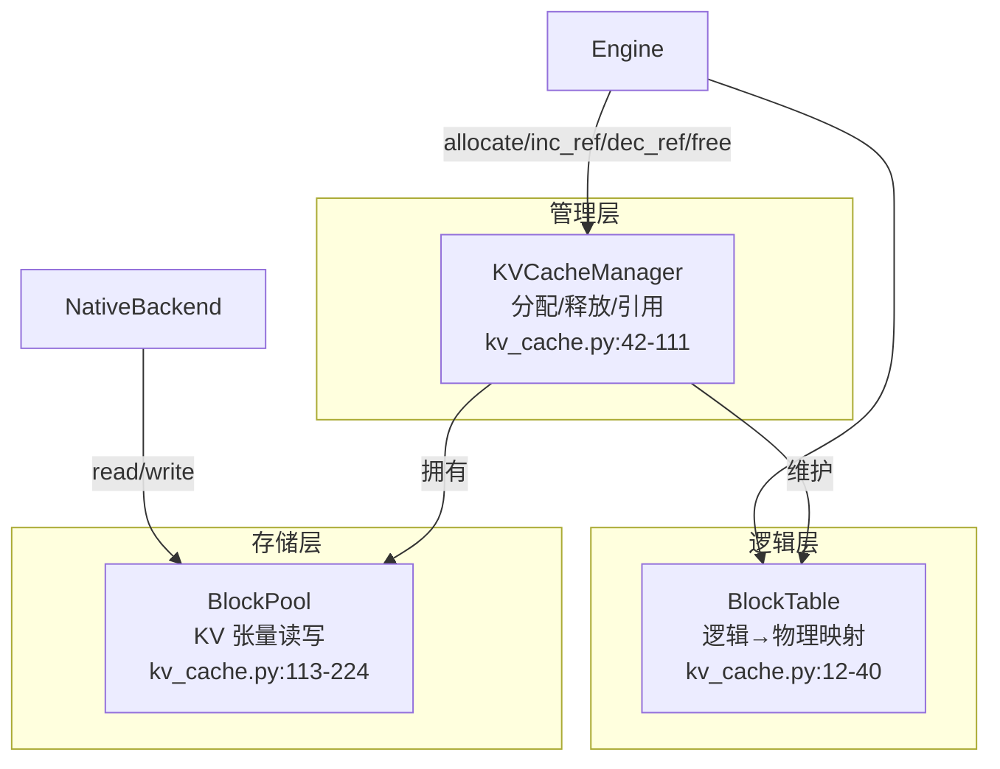
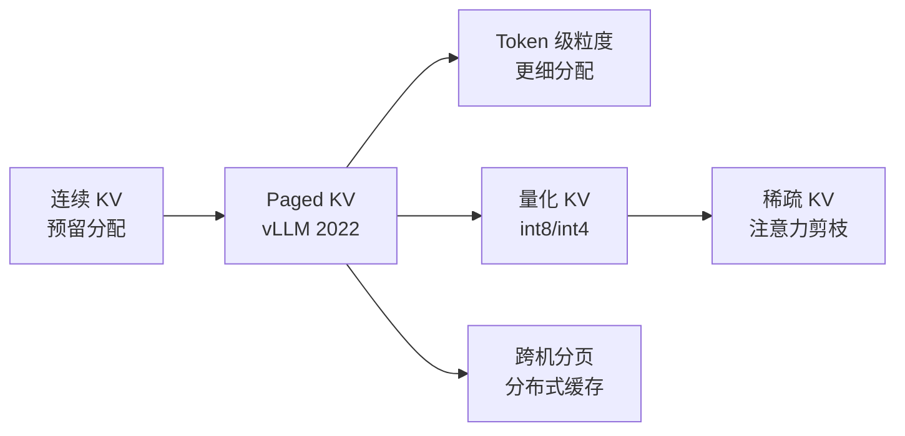

<!--
chapter: ch12
part: part3_memory_system
title: Paged KV Cache：分页消除碎片
status: done
-->

# 第 12 章 Paged KV Cache：分页消除碎片

!!! abstract "本章内容"
    第 11 章证明 KV Cache 必须存在，但没说**怎么存放**。本章推导传统
    连续分配的三个缺陷（预留浪费、外部碎片、复制成本），然后推导分页
    方案：固定大小块 + 逻辑-物理映射（BlockTable）+ 引用计数（ref_count）。
    这是 vLLM 成名之作 *PagedAttention* 的核心，也是 mini-runtime
    `kv_cache.py` 全部内容的主题。

---

## 1. Motivation 动机

假设我们按第 11 章的结论给每个请求分配连续 KV 显存。**问题**：
一个请求需要多少？——生成结束前**没人知道**（自回归长度不定）。

- 按 `max_new_tokens` 上限预留：显存利用率极低（实际生成通常远短于上限）；
- 预留不足时中途扩容：需要**搬移**已写入的 KV（拷贝成本 + 阻塞）；
- 请求完成释放后：留下大小不一的空洞（外部碎片）。

!!! example "vLLM 论文的量化证据"
    vLLM 论文测量：传统连续分配方案下，显存浪费达 **60–80%**
    （预留 vs 实际使用）。而 PagedAttention 把利用率提升到 ~90%+
    ——分页不是微优化，而是数量级差异。

## 2. Theory 理论

### 2.1 从"连续分配的浪费"推导分页的必要性

**问题**：如何让"需要多少分多少"？

借鉴 OS 的虚拟内存思想（这也是 vLLM 论文的灵感来源）：把 KV 显存切成
**固定大小块（block）**，请求按需逐块分配，逻辑上连续、物理上可离散：

```mermaid
flowchart LR
    subgraph 逻辑视图（请求视角）
        T0[token 0-15] --> T1[token 16-31] --> T2[token 32-47]
    end
    subgraph 物理视图（显存）
        B7[block 7] --> B3[block 3] --> B12[block 12]
    end
    T0 -.映射.-> B7
    T1 -.映射.-> B3
    T2 -.映射.-> B12
```

**核心不变量**：逻辑 token 连续、物理 block 任意。请求扩容时只需
追加一个块（可能在任何空闲位置），**无需搬移任何已有数据**。

### 2.2 从"映射关系"推导 BlockTable

**问题**：如何记录"逻辑 → 物理"的映射？

mini-runtime 用 `BlockTable`（`kv_cache.py:12-40`）：

| 字段 | 语义 |
|------|------|
| `_block_ids` | 按逻辑顺序排列的物理 block id |
| `_offset` | 第一个 block 的起始偏移（前缀命中时出现，见 ch13） |
| `capacity` | `num_blocks * block_size - offset`（可容纳的 token 总数） |

$$capacity = (\text{块数}) \times block\_size - offset \tag{1}$$

!!! note "推导：offset 为何存在？"
    前缀缓存命中时，请求复用的第一个 block 可能只从中间位置开始
    （[第 13 章](ch13_prefix_cache.md) 的分裂 offset）。BlockTable
    必须记录这个偏移，否则读 KV 会从 block 头开始（错位）。
    **offset 是"共享物理块"的必然产物**。

### 2.3 从"谁来分配"推导 KVCacheManager

`KVCacheManager`（`kv_cache.py:42-111`）是分配器：

| 数据结构 | 作用 |
|---------|------|
| `blocks: list[KVBlock]` | 全部块的元数据（ref_count, is_free） |
| `free_blocks_ids: deque` | 空闲块队列（FIFO 分配） |
| `used_blocks_ids: list` | 在用块集合 |
| `pool: BlockPool` | 实际 KV 张量存储（ch14） |

分配流程（`allocate`，`kv_cache.py:52-64`）：

```mermaid
flowchart TD
    A[allocate 请求<br/>num_tokens] --> B[计算需要块数<br/>ceil(num_tokens / block_size)]
    B --> C{空闲块足够?}
    C -->|是| D[逐块 popleft + 加入 BlockTable]
    C -->|否| E[返回 False<br/>调用方 evict 或 OOM]
```

### 2.4 从"共享前缀"推导 ref_count

**问题**：两个请求共享同一批前缀 block（ch13），谁释放它们？

**答案**：引用计数（`kv_cache.py:66-78`）：

| 操作 | 语义 | 调用方 |
|------|------|--------|
| `inc_ref(bid)` | 多一个持有者 | 前缀命中复用（`engine.py:137`）、cache insert（`engine.py:229`） |
| `dec_ref(bid)` | 少一个持有者 | 请求完成、cache evict |
| ref_count 归零 | 真正释放 → 归还 free 队列 | `dec_ref` 内部自动 |

!!! tip "推导：ref_count 是"缓存共享"的前提"
    若没有引用计数，前缀 block 可能在 A 请求完成时被释放，而 B 仍在用
    （use-after-free）。ref_count 保证**每个持有者都安全**：释放只在
    最后一个持有者离开时发生。这与 OS 的文件引用计数同构——
    [第 13 章](ch13_prefix_cache.md) 会展示它与 LRU 的协同。

### 2.5 复杂度分析

- 分配：$O(\text{新块数})$（deque popleft 为 $O(1)$/块）；
- 释放：$O(\text{块数})$（逐块 dec_ref）；
- 读 KV：`read_layer` 需逐块拼接（`kv_cache.py:189-224`），
  $O(\text{块数} \times block\_size)$ 的 gather——**非连续读的代价**。

### 2.6 设计权衡（Trade-off）

| 维度 | 连续分配 | 分页 |
|------|---------|------|
| 显存利用率 | 60–80% 浪费 | ~90%+ |
| 扩容 | 搬移（昂贵） | 追加块（$O(1)$） |
| 读 KV | 连续（合并访问） | 非连续（需 gather） |
| 实现复杂度 | 低 | 高（映射/引用管理） |

**核心权衡：用"读取时的非连续"换"分配时的无浪费"**。分页把浪费从
"分配期"转移到"读取期"——而读取期的代价由 kernel 承担
（PagedAttention 用专用 kernel 消除，见 §3）。

## 3. Industrial Implementations 工业实现

### 3.1 vLLM：PagedAttention

vLLM 的分页与 mini-runtime 同构（block 表 + 引用计数），差异在读取层：

| 层面 | mini-runtime | vLLM |
|------|-------------|------|
| 逻辑映射 | BlockTable | `BlockTable`（同名同构） |
| 分配 | KVCacheManager | `BlockAllocator` |
| 读取 | gather 拼接后送 SDPA | **PagedAttention kernel 直接读非连续块** |
| 共享 | ref_count | copy-on-write + ref_count |

!!! note "推导：为什么 PagedAttention 是关键 kernel"
    mini-runtime 每步 decode 都执行"逐块拼接 → 连续张量 → SDPA"
    （`native.py:349-353` 的 `read_layer`）。这个 gather 是**每步一次
    的显存搬运**。PagedAttention 把"拼接"融进 attention kernel 内部
    （通过 block 表间接寻址），省掉中间张量——这正是
    [第 3 章 §2.3](../part1_fundamentals/ch03_cuda_basics.md) 的
    合并访问问题在 KV 场景的正面解决。

### 3.2 TensorRT-LLM

用 `KVCacheType` 支持连续与分页两种模式：连续模式给低延迟场景
（无 gather 开销、静态显存），分页模式给高吞吐场景。**同一框架
双模式**说明两种方案的取舍是场景相关的。

## 4. mini-runtime Implementation

### 4.1 架构设计：三层职责分离



### 4.2 关键决策与权衡

| mini-runtime 决策 | 代码 | 权衡 |
|------------------|------|------|
| block 大小 16 token | `runtime_config.py:1` | 小块→碎片少但块数多；16 是 vLLM 常用值 |
| 块数 16384 | `runtime_config.py:2` | 容量 262K token；够单卡小模型 |
| FIFO 分配 | `kv_cache.py:48` | 简单；无优先级 |
| 懒分配张量 | `kv_cache.py:143-148` | 首次写入才建 tensor，省初始化开销 |
| 引用计数管理 | `kv_cache.py:66-78` | 支持共享；需保证 inc/dec 配对 |

### 4.3 Theory → Code 对应表

| 理论机制（§2） | mini-runtime 证据 | 验证要点 |
|----------------|------------------|---------|
| 固定块分页（§2.1） | `kv_cache.py:43-50` | 预建 num_blocks 个 KVBlock |
| 逻辑-物理映射（§2.2） | `kv_cache.py:12-40` | BlockTable.block_ids |
| capacity 公式（§2.2） | `kv_cache.py:33` | `num_blocks * block_size - offset` |
| 按需分配（§2.1） | `kv_cache.py:52-64` | ceil(num_tokens/block_size) |
| 引用计数（§2.4） | `kv_cache.py:66-78` | 归零才释放 |
| 非连续读（§2.6） | `kv_cache.py:189-224` | read_layer 逐块拼接 |

## 5. Performance Analysis 性能分析

### 5.1 分页带来的指标变化

| 指标 | 连续分配 | 分页 | 来源 |
|------|---------|------|------|
| 显存利用率 | 40–80% | ~90%+ | §2.1 |
| 扩容成本 | $O(L)$ 搬移 | $O(1)$ 追加 | §2.1 |
| 读 KV 带宽 | 连续（最优） | 非连续（gather 开销） | §2.6 |
| 并发上限 | 受预留限制 | 受实际使用限制 | §2.1 |

### 5.2 可观察实验

```bash
# 场景：小池 + 不同长度请求，观察 KV 利用率与 OOM
PYTHONPATH=. python benchmarks/scenarios/kv_cache.py
# 输出 kv_cache: peak/max_allocated、utilization、free_blocks
```

**解读**：分页下 `max_allocated/total_blocks` 接近并发请求实际需求；
若替换为连续分配（每请求按 max 预留），同样负载下利用率会显著下降。

### 5.3 一个诚实的代价测量

mini-runtime 每步 decode 的 `read_layer`（`kv_cache.py:189-224`）
是纯 Python 逐块拼接——读者可以在 `native.py:349-353` 的
`kv_head` profiling 点观察它的耗时占比。这个数字就是
PagedAttention 想要消灭的开销。

## 6. Evolution 演进



演进主线：**分配粒度从"请求级"到"块级"再到"token 级"**，配合
KV 压缩（量化）与共享（前缀）。分页本身已成为现代推理框架的
标准配置。

## 7. Summary 总结

| 维度 | 结论 |
|------|------|
| 解决的问题 | 消除连续 KV 分配的预留浪费、碎片与搬移成本 |
| 在 AI Infra 中的位置 | 显存管理的基础设施；vLLM 的核心贡献 |
| 依赖 | KV Cache 存在性（ch11）、块池（ch14）、引用语义 |
| 影响 | 使并发上限翻倍+；为前缀共享（ch13）提供物理基础 |

### 思考题

1. 若 block_size=16、请求生成 30 token，实际占用 2 块（32 槽），
   最后一块的利用率是多少？block_size 减小到 4 又如何？
   这对"块大小选择"有什么启示？
2. ref_count 为 2 的 block，若两个请求同时完成（A、B），释放顺序
   对最终状态有影响吗？为什么？
3. mini-runtime 的 `read_layer` 用 `torch.cat` 拼接非连续块。若改为
   直接让 SDPA 读 block 表（PagedAttention 思路），需要改哪些层？

### 延伸阅读

- Kwon et al., *Efficient Memory Management for Large Language Model Serving with PagedAttention*, 2023
- vLLM 源码：`vllm/core/block/`（与 mini-runtime 的 `kv_cache.py` 对照）
- mini-runtime 源码：`mini_runtime/cache/kv_cache.py`（全文）
