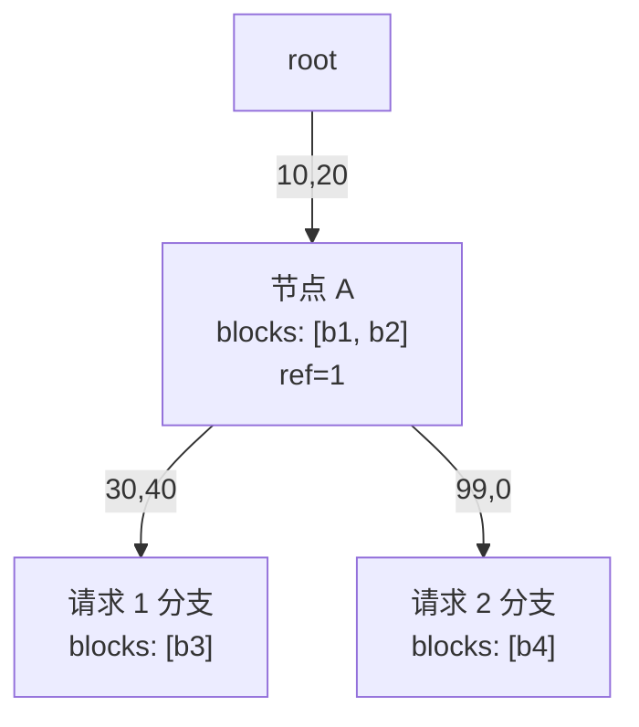
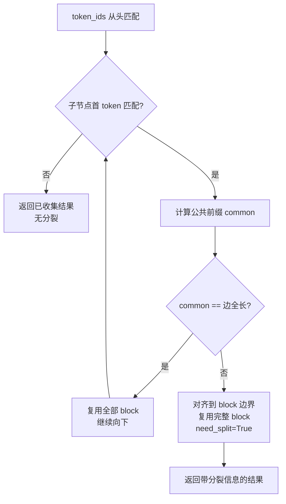
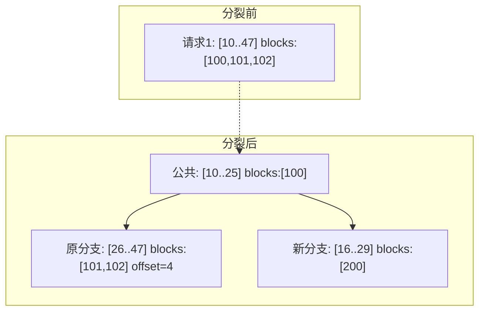
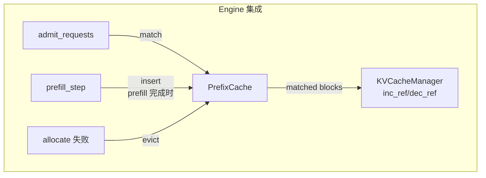

<!--
chapter: ch13
part: part3_memory_system
title: Prefix Cache：用 Radix Tree 复用重复计算
status: done
-->

# 第 13 章 Prefix Cache：用 Radix Tree 复用重复计算

!!! abstract "本章内容"
    分页解决了"显存怎么分"，但没解决"算过的能不能不重算"。真实负载中
    **大量请求共享前缀**（system prompt、few-shot 示例、RAG 上下文），
    重复 prefill 是纯浪费。本章推导基于 Radix Tree（前缀树）的缓存：
    block 级复用、节点分裂、LRU 驱逐，以及与引用计数的协同。
    mini-runtime 的 `prefix_cache.py`（283 行）是完整教学实现。

---

## 1. Motivation 动机

考虑多轮对话：每轮请求都携带**相同的 system prompt**（如
"You are a helpful assistant..."）。naive 方案下每轮都重新 prefill
这 1000+ token——**完全重复的计算**。

!!! example "复用场景的量化"
    假设 system prompt 1024 token，100 次对话轮次：
    - 不缓存：重复 prefill $1024 \times 100$ token 的计算；
    - 缓存命中：只算一次，后续每轮跳过 —— TTFT 直接减少
      （1024 token 的 prefill 时间）。
    更长前缀（RAG 文档、代码库上下文）的收益更显著。

**问题**：如何发现"两个请求共享哪些前缀"？如何存储"哪个 token 序列
对应哪些 block"？如何决定"显存不够时驱逐哪段前缀"？

## 2. Theory 理论

### 2.1 从"复用粒度"推导 block 级复用

**问题**：前缀复用以什么为最小单位？

- **token 级**：任意 token 前缀都可复用——但管理粒度太细（每个 token
  一个映射项）；
- **block 级**：只有完整 block 可复用（`block_size=16` 对齐）——
  管理粒度粗、与分页存储（ch12）天然匹配。

mini-runtime 的选择：**block 级复用 + 分裂时 offset 补偿**
（`prefix_cache.py:19-27` 的注释明确记录了这一设计决策）：

> KV cache 以 block 为最小复用单位，只复用完整 block；
> 分裂点用 token 级 common，对齐到 block 边界；
> 原分支从 common 开始，带 offset 跳过边界 block 的废位。

### 2.2 从"前缀组织"推导 Radix Tree

**问题**：如何高效存储/查找"共享前缀"？

**Radix Tree（基数树）**：每个节点代表一段共享 token 序列（边），
公共前缀只存一次。两个请求
`[10, 20, 30, 40]` 与 `[10, 20, 99, 0]` 共享 `[10, 20]`：



**查找复杂度**：$O(L \cdot \text{树深})$——从根沿 token 逐步匹配。
对比"每个请求独立存一份"的 $O(L)$ 查找（相同），但**存储**共享了
公共前缀（节省显存），且命中后**跳过 prefill**（节省计算）。

### 2.3 从"匹配语义"推导 match 算法

`match(token_ids)`（`prefix_cache.py:39-124`）沿树逐边匹配，返回：

| 字段 | 含义 |
|------|------|
| `matched_blocks` | 可复用的完整 block 列表 |
| `num_matched_tokens` | 实际复用 token 数（**总是 block_size 整数倍**） |
| `remaining_tokens` | 需重新 prefill 的 token |
| `matched_offset` | 复用部分第一个 block 的偏移 |
| `need_split / split_*` | 部分匹配时需要分裂的信息 |



!!! note "推导：为什么 num_matched_tokens 必须对齐 block？"
    只有**完整 block** 的 KV 才在缓存中（存储层以 block 为单位）。
    若复用到 block 中途（如 20 token，block_size=16 → 1.25 块），
    第 2 个块只有 4 个有效 token，无法直接作为"已算好的前缀"
    ——因此对齐到 16，剩余部分重新 prefill，且分裂分支用
    `offset` 记录废位（`prefix_cache.py:87-89`）。

### 2.4 从"新分支挂载"推导 insert 分裂

`insert`（`prefix_cache.py:126-200`）在匹配点挂载新分支。**部分匹配时
需要分裂**：原节点拆成"公共前缀节点 + 原分支剩余 + 新分支"：



（对应 `prefix_cache.py:152-184`，与文件底部测试 `tokens_diverge`
场景完全一致：公共前缀 20 token → 对齐 16 → 原分支 offset=4。）

!!! warning "分裂的边界条件"
    - 原分支 token 数 = `common % block_size` 的**废位**由 offset 表示；
    - 新分支必须从 aligned 处重新 prefill（`remaining_tokens`）；
    - 两分支**首 token 不同**（一个是原边 common 后的 token，一个是
      新 token）——保证 `children` 字典键不冲突
      （`prefix_cache.py:180-183` 的注释）。

### 2.5 从"显存回收"推导 LRU evict 与引用计数协同

**问题**：缓存前缀占用的 block 何时释放？

`evict`（`prefix_cache.py:202-212`）只驱逐**叶子节点**（无 children 的
节点）——保证不破坏树结构。选择依据是 **LRU**（`last_access` 时钟，
`prefix_cache.py:214-224`）。

**与 ref_count 的协同**（这是最精妙的部分）：

| 事件 | 操作 | 代码 |
|------|------|------|
| 请求命中前缀 | 对 matched blocks `inc_ref` | `engine.py:137` |
| 请求完成 | 释放自己的 block（dec_ref） | `engine.py:325-326` |
| cache 持有 | insert 时对新增块 `inc_ref` | `engine.py:229` |
| evict 驱逐 | 对叶子 block `dec_ref` | `engine.py:147` |

!!! tip "推导：ref_count 如何保证安全"
    cache 节点与运行请求**共同持有** block。请求完成只减自己的引用；
    block 只有"cache 引用 + 运行请求引用"全部归零才真正释放。
    因此 evict 一个被运行请求占用的叶子节点是安全的——它只会
    减少 cache 引用，物理 block 仍在（请求还在用）。

### 2.6 复杂度分析

| 操作 | 复杂度 | 说明 |
|------|--------|------|
| match | $O(L + \text{边数})$ | 逐 token 匹配 |
| insert | $O(L)$ | 分裂 + 挂载 |
| evict | $O(\text{树节点数})$ | 全树找 LRU 叶子（可优化为堆） |
| 显存节省 | 命中前缀长度 × KV/token | 线性 |

**局限**：`_find_lru_leaf` 每驱逐一次遍历整棵树（`prefix_cache.py:214-224`），
驱逐频繁时是 $O(N)$ 热点。工业实现（SGLang）用堆/链表优化——这是
教学实现留给读者的优化点。

### 2.7 设计权衡（Trade-off）

| 维度 | 选择 | 收益 | 代价 |
|------|------|------|------|
| 复用粒度 | block 级（16） | 与分页一致 | 非对齐前缀只能部分复用 |
| 驱逐策略 | LRU 叶子 | 简单、不破坏树 | 可能驱逐"即将命中"的热前缀 |
| 存储 | 每节点存完整 token_ids | 匹配简单 | 内存冗余（可优化为增量边） |
| 与运行时耦合 | engine 直接调 match/insert | 简单 | 缓存与调度未深度协同（SGLang 的做法） |

## 3. Industrial Implementations 工业实现

### 3.1 SGLang：RadixAttention

SGLang 把前缀缓存做成**运行时的一部分**（`RadixCache`）：
- 类似的分裂/合并/LRU 机制；
- 但调度器**优先选择与现有 batch 共享前缀的请求**（前缀感知调度）；
- cache 节点支持合并（两个分支同时存在时）与更细的 LRU。

### 3.2 vLLM：hash-based prefix caching

vLLM 用**内容哈希**而非树：每个 block 的 token 序列算哈希，相同哈希
的 block 视为相同前缀。优势：实现简单、支持跨请求自动共享；劣势：
需处理哈希碰撞、无法表达"部分匹配"的粒度（块边界固定）。

### 3.3 对比

| 方案 | 匹配粒度 | 动态分裂 | 调度协同 | 代表 |
|------|---------|---------|---------|------|
| Radix Tree | token 级（对齐 block） | 支持 | 可深度协同 | SGLang、mini-runtime |
| Hash | block 级 | 不支持 | 弱 | vLLM |
| 前缀表（无树） | 整块序列 | 无 | 无 | 早期实现 |

## 4. mini-runtime Implementation

### 4.1 架构设计

前缀缓存在 mini-runtime 中与 Engine 的三个决策点耦合：



### 4.2 关键代码路径

| 步骤 | 代码位置 | 说明 |
|------|---------|------|
| 准入时匹配 | `engine.py:127` | match(token_ids) 决定复用与新分配 |
| 复用 +1 | `engine.py:136-138` | matched blocks inc_ref |
| 分配失败重试 | `engine.py:142-148` | evict → dec_ref → 重试 allocate |
| prefill 后入缓存 | `engine.py:226-229` | insert + 新块 inc_ref |
| 请求完成 | `engine.py:325-326` | free（dec_ref 全部 block） |
| 树结构维护 | `prefix_cache.py:126-200` | insert/分裂/挂载 |

### 4.3 Theory → Code 对应表

| 理论机制（§2） | mini-runtime 证据 | 验证要点 |
|----------------|------------------|---------|
| block 级复用（§2.1） | `prefix_cache.py:19-27` | 注释中的设计决策 |
| 对齐语义（§2.3） | `prefix_cache.py:87-89` | `aligned = common // bs * bs` |
| 分裂（§2.4） | `prefix_cache.py:144-185` | 三节点重建 |
| LRU 叶子（§2.5） | `prefix_cache.py:202-224` | evict 只删叶子 |
| 引用协同（§2.5） | `engine.py:137,147,229` | inc_ref/dec_ref 配对 |
| 全命中路径（§2.3） | `native.py:82-96` | 无剩余 token 直接 decode |

## 5. Performance Analysis 性能分析

### 5.1 命中收益的量化

| 场景 | 未命中 prefill | 命中（省 1024 token） |
|------|---------------|---------------------|
| TTFT | $T_{\text{prefill}}(L)$ | $T_{\text{prefill}}(L - 1024) + \text{match 开销}$ |
| 显存 | 新分配全部 block | 复用（ref_count 增加，无新分配） |
| 计算 | 全部 token 前向 | 跳过命中部分 |

### 5.2 Benchmark 方法

```bash
# prefix_cache.py 自带树操作测试（分裂/命中/offset 验证）
PYTHONPATH=. python tests/test_refcount.py   # ref_count 协同测试
PYTHONPATH=. python benchmarks/scenarios/prefix_cache.py
```

**解读**：命中率 = `matched_tokens / total_tokens`。负载越"结构化"
（固定 system prompt、RAG），命中率越高——前缀缓存的收益与
**负载的前缀重复度**成正比。

### 5.3 权衡的量化

- block_size=16 时，20 token 公共前缀只能复用 16（75%）——粒度损失
  随 block_size 增大而增大；
- evict 后若请求再次命中同一前缀，需重新 prefill——LRU 的失误成本
  是"整个叶子的计算量"。

## 6. Evolution 演进


演进主线：**从"存了能复用"到"主动寻找可复用的"**（调度协同），
再到**跨设备/跨机共享**（缓存从单机结构变成分布式系统，
[第 30 章](../part6_distributed_runtime/ch30_multi_node_serving.md)）。

## 7. Summary 总结

| 维度 | 结论 |
|------|------|
| 解决的问题 | 消除重复前缀的重复 prefill 计算 |
| 在 AI Infra 中的位置 | 显存优化的第三层（分页→共享）；SGLang 的核心竞争力 |
| 依赖 | 分页存储（ch12）、ref_count 语义、LRU |
| 影响 | TTFT 大幅下降；与调度器深度耦合的方向 |

### 思考题

1. 20 token 公共前缀 + block_size=16：为什么只能复用 16 token？
   画出分裂后的树，标出 offset。
2. evict 一个"正在被运行请求引用"的叶子节点，物理 block 会释放吗？
   用 ref_count 推导。
3. vLLM 的 hash 方案为什么不需要 offset？它的块对齐假设是什么？

### 延伸阅读

- Zheng et al., *Efficiently Programming Large Language Models using SGLang*, 2023（§4.2 RadixAttention）
- vLLM 文档：*Automatic Prefix Caching*（hash 方案说明）
- mini-runtime 源码：`mini_runtime/cache/prefix_cache.py`（全文，含完整测试）
