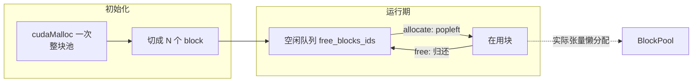
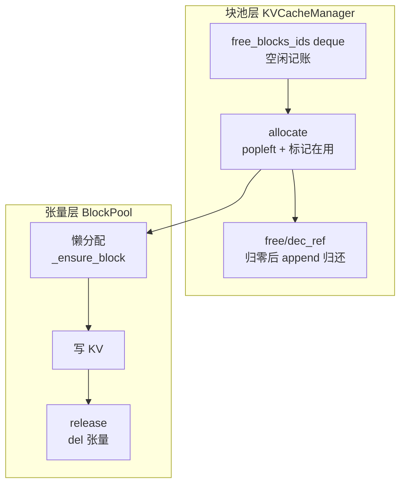

<!--
chapter: ch14
part: part3_memory_system
title: Memory Pool：消除分配与释放的开销
status: done
-->

# 第 14 章 Memory Pool：消除分配与释放的开销

!!! abstract "本章内容"
    分页（ch12）解决了碎片，前缀（ch13）解决了复用，但还差一层：
    **block 的分配/释放本身有成本**。`cudaMalloc` 是同步的、与驱动交互、
    可能触发设备同步（第 3 章 §2.4）——推理路径上每次请求进出都调它，
    延迟不可控。本章推导内存池（Memory Pool）：预分配 + 空闲队列复用，
    把分配成本从"驱动调用"降为"队列操作"。mini-runtime 的
    `free_blocks_ids`（`kv_cache.py:48`）是最简教学实现。

---

## 1. Motivation 动机

第 12 章的分配流程：请求准入时 `allocate`、完成时 `free`。**问题**：
这两个操作每次调用 `cudaMalloc`/`cudaFree` 会怎样？

1. **延迟**：`cudaMalloc` 是同步调用（数十 µs 级），且可能触发
   隐式设备同步（打断 GPU 流水）；
2. **碎片**：请求长度随机 → 分配大小随机 → 外部碎片累积
   （[第 15 章](ch15_cuda_memory_management.md)）；
3. **抖动**：频繁分配/释放造成显存水位波动，影响 PyTorch 分配器的
   预留策略。

!!! example "推理路径上的分配频率"
    每请求准入 + 每请求完成 = 2 次分配操作；并发 100、平均生成
    2 秒 → 每秒 100 次分配。若每次 50µs，仅分配开销就占
    5ms/s 的 CPU 时间——**完全可避免**。

## 2. Theory 理论

### 2.1 从"分配成本"推导池化原理

**问题**：如何让分配/释放接近零成本？

**内存池**：初始化时一次性向 CUDA 申请**整块池**（或按需增长），
运行时只做"池内记账"：



**核心不变量**：`cudaMalloc` 在初始化期只调用一次（或按需扩容）；
运行期分配 = `deque.popleft()`（$O(1)$），释放 = `append`（$O(1)$）。

### 2.2 从"块粒度"推导两种池化设计

**问题**：池的粒度怎么选？

| 设计 | 粒度 | 优点 | 缺点 |
|------|------|------|------|
| 块级池（mini-runtime） | 固定 block_size | 无内部碎片、$O(1)$ 分配 | 只能服务于 KV 一种用途 |
| 字节级池（通用） | 任意大小 | 灵活（激活/权重/KV 通用） | 对齐与碎片管理复杂 |

mini-runtime 选择块级池**不是偶然**：KV 的访问单位天然是 block
（ch12），固定大小 = 零内部碎片 + 零元数据开销。

!!! note "推导：块级池为什么没有内部碎片？"
    内部碎片 = 分配粒度与实际需求的差。块级池的分配单位固定为
    block_size，请求按 `ceil(tokens / block_size)` 申请整块——
    最大浪费是最后一块的未用部分（ch12 思考题 1），**没有**
    "任意大小分配造成的微小空洞"。

### 2.3 从"块的生命周期"推导懒分配

**问题**：池中的块什么时候实际分配张量？

mini-runtime 的 `BlockPool._ensure_block`（`kv_cache.py:143-148`）：
**首次写入时才创建张量**（懒分配）：

```python
if self._blocks[block_id] is None:
    self._blocks[block_id] = [(
        torch.zeros((1, num_kv_heads, block_size, head_dim), ...),
        torch.zeros((1, num_kv_heads, block_size, head_dim), ...),
    ) for _ in range(num_layers)]
```

!!! tip "推导：懒分配省了什么？"
    - 池有 16384 块 × 24 层 × 2 张量 = 78 万个张量——全量初始化
      耗时且占显存；
    - 实际并发远小于池容量，懒分配让**显存只按实际使用增长**。
    代价：首次写入的路径多一次分配（可接受，prefill 首次写入）。

### 2.4 复杂度与权衡

| 指标 | 池化 | 直接 cudaMalloc |
|------|------|-----------------|
| 分配延迟 | $O(1)$（队列操作） | 数十 µs + 可能同步 |
| 初始化成本 | 一次性（或按需） | 无 |
| 显存峰值 | 池总量（可能超出实际需求） | 精确 |
| 灵活性 | 固定块大小 | 任意大小 |

**本质权衡：用"预占显存"换"运行期确定性"**。池总量是显存预算的
显式声明（`NUM_BLOCKS`），超出即拒绝（OOM）——确定性对推理服务
至关重要。

## 3. Industrial Implementations 工业实现

### 3.1 PyTorch Caching Allocator

第 4 章已介绍：PyTorch 的池化分配器（`memory_allocated` vs
`memory_reserved`）。它是"字节级池"的代表——服务于任意张量，
用 `round_up` 对齐减少碎片。**mini-runtime 的块池在 PyTorch 池
之上再池化一层**：块池保证 KV 的确定性，PyTorch 池消化张量分配。

### 3.2 vLLM 的 BlockAllocator

与 mini-runtime 同构：`PrefixCachingAllocator` 维护空闲块、
可驱逐块（前缀缓存）、在用块三组，分配时优先复用可驱逐块
（与 ch13 的 evict 协同）。**工业实现把"分配器"与"缓存"合为
一个对象**，而 mini-runtime 分成了 KVCacheManager + PrefixCache 两个
（耦合点通过 ref_count 连接）——两种拆分各有优劣。

### 3.3 CUDA 的 cudaMallocAsync

CUDA 11.2+ 提供**流序分配器**（stream-ordered allocator）：分配在
stream 上排队，与 kernel 顺序一致，天然避免同步。它比自研池更
通用，但**无法表达"共享引用"语义**（ch13 需要 ref_count）——因此
推理框架仍倾向自研块池。

## 4. mini-runtime Implementation

### 4.1 架构设计

内存池在 mini-runtime 中分为两层：



### 4.2 关键代码路径

| 步骤 | 代码位置 | 说明 |
|------|---------|------|
| 池初始化 | `kv_cache.py:47-50` | N 个 KVBlock + deque + BlockPool |
| 分配 | `kv_cache.py:52-64` | popleft + ref_count=1 + append_block |
| 释放 | `kv_cache.py:66-78` | dec_ref 归零 → 归还 deque |
| 懒分配 | `kv_cache.py:143-148` | 首次写入建张量 |
| 强制释放 | `kv_cache.py:85-93` | shutdown 时 release_all |

### 4.3 一个值得注意的细节：ref_count 与池的交互

`dec_ref`（`kv_cache.py:70-78`）在 ref_count 归零时**同时**做两件事：
归还 free 队列 + 释放张量（`pool.release`）。**池的"空闲"与"物理
显存释放"绑定**——这是块级池的优雅之处：释放操作本身也是
$O(1)$ 的记账。

### 4.4 Theory → Code 对应表

| 理论机制（§2） | mini-runtime 证据 | 验证要点 |
|----------------|------------------|---------|
| 预分配池（§2.1） | `kv_cache.py:47-50` | 初始化建 N 块 |
| $O(1)$ 分配（§2.1） | `kv_cache.py:57` | deque popleft |
| $O(1)$ 释放（§2.1） | `kv_cache.py:76` | deque append |
| 懒分配（§2.3） | `kv_cache.py:143-148` | 首次写入才建张量 |
| 显存上限声明（§2.4） | `runtime_config.py:2` | NUM_BLOCKS=16384 |

## 5. Performance Analysis 性能分析

### 5.1 分配延迟对比

| 操作 | 成本 | 来源 |
|------|------|------|
| `cudaMalloc` | 10–100 µs + 可能同步 | 第 3 章 §2.4 |
| deque popleft | 亚微秒（纯内存操作） | mini-runtime |
| 懒分配张量 | 首次数十 µs | 可接受的冷启动 |

### 5.2 显存水位观察

```bash
PYTHONPATH=. python benchmarks/scenarios/kv_cache.py
# 关注：peak allocated / total blocks 与 utilization
```

**解读**：`utilization` 高（>90%）说明池容量被有效使用；长期低于
50% 说明池过大（`NUM_BLOCKS` 可调小）——**池大小是显存预算的
显式旋钮**。

## 6. Evolution 演进


演进主线：**池从"消除开销"走向"参与语义"**——现代分配器不只是
记账，还要理解"哪些块可驱逐（前缀缓存）"、"哪些可共享（ref_count）"。

## 7. Summary 总结

| 维度 | 结论 |
|------|------|
| 解决的问题 | 把分配/释放从驱动调用降为队列操作，消除延迟抖动 |
| 在 AI Infra 中的位置 | 分页（ch12）与缓存（ch13）的物理底座 |
| 依赖 | 固定块大小约定、引用计数、懒分配 |
| 影响 | 显存水位的确定性；池大小是并发能力的显式预算 |

### 思考题

1. 为什么块级池没有"外部碎片"，但有"内部碎片"？两者各指什么？
2. 若池容量 16384 块全部被懒分配张量占用，显存峰值是多少？
   （0.5B 模型：每块 24 层 × 2 × 2 头 × 64 × 2B = 24KB，估算总量）
3. vLLM 把"分配器"与"前缀缓存"合为一个对象，mini-runtime 分成两个。
   各有什么优缺点？（提示：思考 evict 与 allocate 的竞争关系）

### 延伸阅读

- PyTorch 源码：`c10/cuda/CUDACachingAllocator.cpp`（通用池实现）
- vLLM 源码：`vllm/core/block/block_allocator.py`
- mini-runtime 源码：`mini_runtime/cache/kv_cache.py:42-111`
