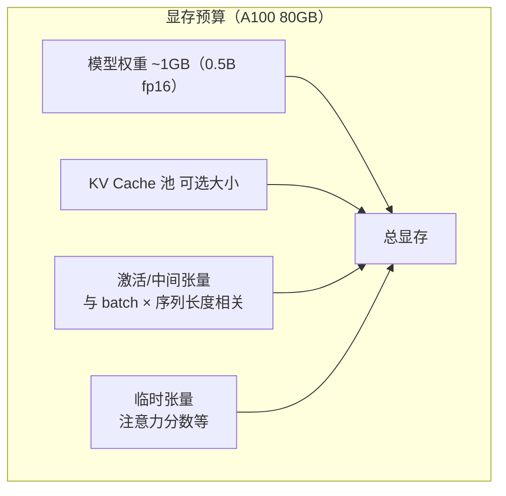
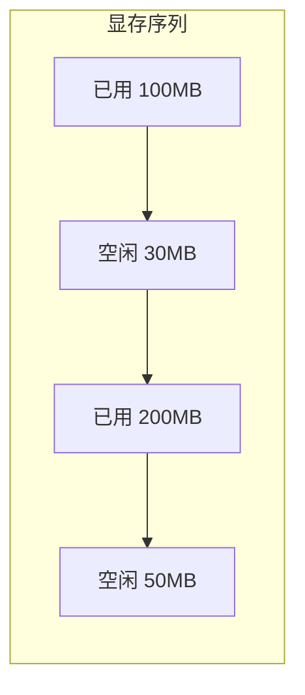
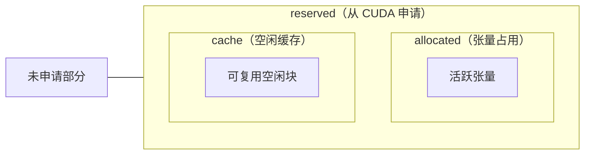
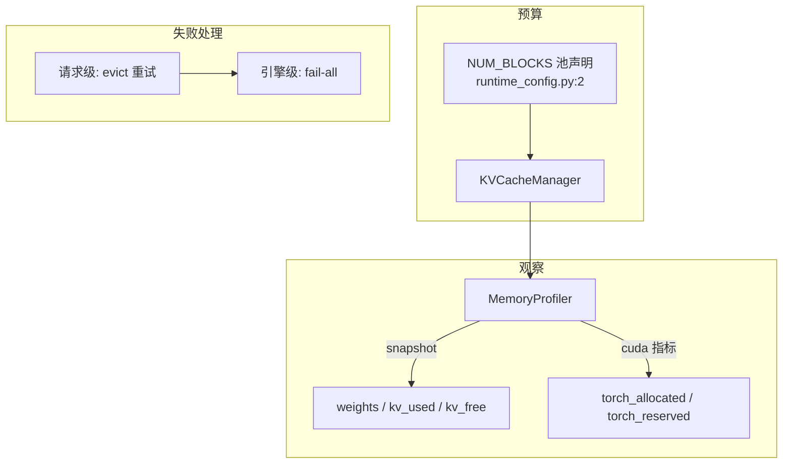
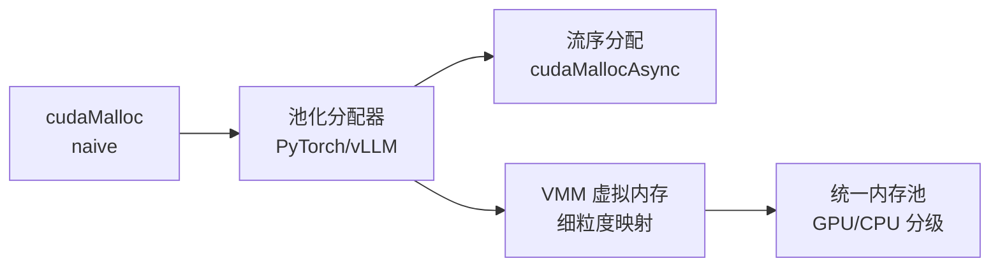

<!--
chapter: ch15
part: part3_memory_system
title: CUDA Memory Management：全局显存策略
status: done
-->

# 第 15 章 CUDA Memory Management：全局显存策略

!!! abstract "本章内容"
    ch11–14 聚焦 KV 显存，但 KV 只是显存预算的一项（权重、激活、临时
    张量同样消耗）。本章把视野拉回全局：显存分配策略的谱系（静态 →
    池化 → 流序）、碎片化的本质与度量、`allocated vs reserved` 模型，
    以及 OOM 时系统应该做什么。mini-runtime 的 `profiler.py:216-237`
    提供了观察这一切的窗口。

---

## 1. Motivation 动机

推理引擎面对一个残酷的事实：**显存总量固定，需求不确定**。



每个请求的进入都同时影响三项：KV（按 token 数分配）、激活（按 batch
和 chunk 长度）、临时张量（按 batch）。**分配策略决定显存水位与抖动**，
直接关联 OOM 率与并发上限。

!!! example "分配策略是生死问题"
    `NUM_BLOCKS = 16384`、block_size=16 → KV 池容量 262144 token。
    若并发请求总需求超过池容量 → 拒绝（OOM）。**池大小设定 = 并发能力
    声明**，而池大小又必须让位给权重与激活——全局预算的分配是推理
    系统设计的第一决策。

## 2. Theory 理论

### 2.1 从"不确定性"推导分配策略谱系

**问题**：显存需求动态变化，分配策略有哪些选择？

| 策略 | 原理 | 确定性 | 利用率 | 代表 |
|------|------|--------|--------|------|
| 静态规划 | 构建期算好一切，运行时零分配 | 最高 | 取决于预测精度 | TensorRT-LLM |
| 池化 | 预分配 + 池内记账 | 高 | 高（池内复用） | vLLM、mini-runtime |
| 流序分配 | 分配排队到 stream | 中 | 高 | cudaMallocAsync |
| 按需 malloc | 每次 cudaMalloc | 低（可能同步） | 低（碎片） | naive 实现 |

**推导**：策略选择的本质是**在"确定性"与"利用率"之间取点**。
静态规划最确定但无法应对动态 batch（第 8 章）——因此在线推理框架
清一色选池化；离线编译（TensorRT-LLM 的固定形状模式）才能承受
静态规划。

### 2.2 从"分配与释放交错"推导碎片化

**问题**：碎片到底是什么？



- **外部碎片**：空闲块总和够用，但**没有单个连续块**满足请求
  （如请求 60MB，空闲只有 30+50）。
- **内部碎片**：分配粒度大于需求（如块池最后一块的未用槽位）。

!!! note "推导：分页如何消解外部碎片？"
    ch12 的分页把"请求连续大块"变成"请求若干固定小块"——小块可以
    落在任何位置，**外部碎片从"无法分配"变成"无法满足的只是对齐"**。
    这就是 PagedAttention 消除 ~60% 显存浪费的机制
    （[第 12 章 §2.1](ch12_paged_kv_cache.md)）。

### 2.3 从"两级记账"推导 allocated vs reserved

PyTorch Caching Allocator 的两级视图（第 4 章 §2.4）：

$$
\text{reserved} \geq \text{allocated} \geq \text{实际使用}
$$



**诊断价值**（mini-runtime `profiler.py:235-237` 正是监控这两项）：

| 信号 | 含义 |
|------|------|
| `reserved` 持续高位 | 分配器持有大量缓存（正常，但显存紧张时需 `empty_cache`） |
| `allocated/reserved` 比值低 | 缓存空闲多 → 曾有大块分配又释放（碎片信号） |
| `allocated` 波动剧烈 | 存在大块临时张量（batch×长度变化） |

!!! warning "empty_cache 的代价"
    `torch.cuda.empty_cache()`（mini-runtime 曾在调试期调用，后移除）
    归还缓存块给 CUDA——但它是**同步**的，会打断 GPU 流水，且下次
    分配要重新向 CUDA 申请。**推理主路径上调用它 = 自伤**。
    正确的做法是调整预算让分配不再抖动（第 2 部分曾讨论这个
    提交历史：`f79ea22` 清理了 scheduler_loop 中的 empty_cache）。

### 2.4 从"显存耗尽"推导 OOM 处理

**问题**：显存真的不够时怎么办？

mini-runtime 的两级 OOM 处理：

| 层级 | 触发 | 处理 | 代码 |
|------|------|------|------|
| 请求级 | 池内块不足 | evict 前缀缓存重试 → 仍失败则拒绝该请求 | `engine.py:142-155` |
| 引擎级 | `torch.OutOfMemoryError` | fail-all + 打印 allocated/reserved | `engine.py:81-87` |

!!! tip "推导：为什么请求级 OOM 不致命？"
    池化下"块不足"是**可预期**的（预算用尽），可以优雅拒绝或等待；
    而 `torch.OutOfMemoryError` 是**意外**的（激活/临时张量超支），
    状态已不可信 → fail-fast。**两类失败的性质不同，处理策略必须
    不同**——这是显存管理中最容易混淆的一点。

### 2.5 设计权衡（Trade-off）

| 维度 | 选择 | 收益 | 代价 |
|------|------|------|------|
| 预算分配 | 权重固定 + KV 池 + 余量 | 简单、可预测 | 激活峰值时 OOM |
| 池大小 | 大池（高并发） | 并发能力强 | 挤占激活空间 |
| 空闲归还 | 不主动归还 | 无同步 | reserved 高企 |
| OOM 策略 | 请求级优雅 + 引擎级 fail-fast | 分层容错 | 实现两套路径 |

## 3. Industrial Implementations 工业实现

### 3.1 TensorRT-LLM：静态规划

构建期确定：权重布局 + KV 池大小 + 工作区（workspace）大小。
运行期**零分配**（除少数动态路径）。极致确定性的代价：
- 模型/形状变化需重新构建；
- 显存预测保守（利用率依赖预测精度）。

### 3.2 vLLM：动态池 + 优雅降级

- `GpuMemoryProfiler` 在启动时测量可用显存，划分权重区与 KV 池
  （`gpu_memory_utilization` 参数）；
- KV 池不足时**抢占**（swap 到 CPU）而非拒绝；
- `torch.cuda.empty_cache` 仅用于**启动时的碎片整理**，运行期不调用。

### 3.3 PyTorch 的扩展方向

`cudaMallocAsync`（流序）与 `CUDA VMM`（虚拟内存管理）是 CUDA 层
的现代方案；`torch.cuda.memory` API 提供 `snapshot()`（分配器快照）
用于碎片诊断。推理框架目前仍以自研池为主——因为需要
ref_count/共享语义（ch13）而通用分配器不提供。

## 4. mini-runtime Implementation

### 4.1 架构设计



### 4.2 关键代码路径

| 功能 | 代码位置 | 说明 |
|------|---------|------|
| 显存快照 | `profiler.py:216-239` | weights + KV + torch 双指标 |
| 峰值统计 | `profiler.py:253-265` | kv_used_peak / utilization |
| 请求级 OOM | `engine.py:142-155` | evict → 重试 → 拒绝 |
| 引擎级 OOM | `engine.py:81-87` | 打印 allocated/reserved 后 fail-all |
| 优雅关闭 | `engine.py:486-487` | release_all 强制释放 |

### 4.3 Theory → Code 对应表

| 理论机制（§2） | mini-runtime 证据 | 验证要点 |
|----------------|------------------|---------|
| 预算声明（§2.1） | `runtime_config.py:2` | NUM_BLOCKS=16384 |
| 两级记账（§2.3） | `profiler.py:236-237` | allocated/reserved |
| 缓存空闲信号（§2.3） | `profiler.py:235-237` | 差值 = 分配器缓存 |
| 分层 OOM（§2.4） | `engine.py:142-155, 81-87` | 请求级/引擎级分离 |
| 碎片整理代价（§2.3） | 提交历史 f79ea22 | empty_cache 从循环中移除 |

## 5. Performance Analysis 性能分析

### 5.1 显存健康度指标体系

| 指标 | 计算 | 健康范围 | 诊断 |
|------|------|---------|------|
| KV 利用率 | used/total blocks | 70–95% | 低→池过大；高→接近瓶颈 |
| 分配器缓存比 | (reserved-allocated)/reserved | <20% | 高→碎片或抖动 |
| 峰值水位 | max_allocated/total | <100% | 100% 且 OOM→预算失衡 |
| OOM 率 | oom/submitted | 0% | >0 需排查预算 |

### 5.2 一个完整的显存实验

```bash
# 观察显存三态：权重 / KV / torch 分配器
PYTHONPATH=. python benchmarks/scenarios/kv_cache.py
# 输出包含 Memory Profile 段：weights、KV total/peak、torch allocated/reserved
```

**解读方法**：先看 KV 利用率（池是否合适），再看
`torch_reserved - torch_allocated`（分配器是否健康），最后看
峰值（是否逼近显存上限）。

## 6. Evolution 演进



演进主线：**从"运行时碰运气"到"构建期规划、运行期确定性"**。
未来方向是分层内存（KV 溢出到 CPU 内存/远端）——把"显存"从
单卡概念变成层级体系（[第 30 章](../part6_distributed_runtime/ch30_multi_node_serving.md)）。

## 7. Summary 总结

| 维度 | 结论 |
|------|------|
| 解决的问题 | 在固定显存内协调权重/KV/激活三类需求，处理耗尽 |
| 在 AI Infra 中的位置 | 全部显存优化的顶层视角；预算与策略的最终决策 |
| 依赖 | 分页（ch12）、池化（ch14）、PyTorch 分配器（第 4 章） |
| 影响 | 决定并发上限、OOM 率、长上下文能力 |

### 思考题

1. 为什么在线推理框架不用"静态规划"？用动态 batch 的需求推导。
2. `torch_reserved - torch_allocated` 持续增长说明什么？何时应该
   调用 `empty_cache`（如果一定要）？
3. 若让 KV 溢出到 CPU 内存（swap），对 TPOT 的影响路径是什么？
   （提示：PCIe 带宽 vs HBM 带宽）

### 延伸阅读

- NVIDIA, *CUDA C++ Programming Guide* Ch. "Memory Management"（cudaMallocAsync 章节）
- PyTorch 文档：*torch.cuda.memory*（snapshot 与诊断工具）
- vLLM 源码：`vllm/worker/model_runner.py`（显存划分逻辑）
- mini-runtime 源码：`mini_runtime/profiler.py:210-269`、`mini_runtime/engine.py:81-87`
