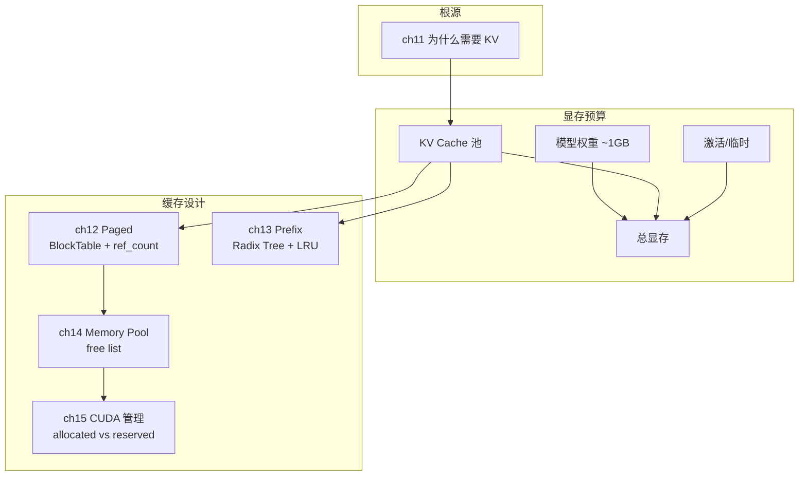

# 第 3 部分 · 内存系统（Memory System）

!!! abstract "本部分内容"
    第 2 部分回答了"谁在跑"；本部分回答"**数据住哪**"。KV Cache 是
    显存的最大消费者（长上下文下可超过模型权重），本部分推导：为什么
    需要 KV Cache（ch11）、如何用分页消除碎片（ch12）、如何用前缀树
    复用重复计算（ch13）、如何用内存池消除分配开销（ch14）、以及
    CUDA 显存管理的完整图景（ch15）。本部分对应 mini-runtime 的
    `mini_runtime/cache/` 目录。

## 章节地图

| 章节 | 核心问题 | 关键代码 |
|------|---------|---------|
| [第 11 章 KV Cache](ch11_kv_cache.md) | 为什么必须缓存 K/V？多大？ | `attention.py:40-41` |
| [第 12 章 Paged KV Cache](ch12_paged_kv_cache.md) | 如何消除连续分配的浪费？ | `kv_cache.py:12-111` |
| [第 13 章 Prefix Cache](ch13_prefix_cache.md) | 如何复用重复前缀的计算？ | `prefix_cache.py` |
| [第 14 章 Memory Pool](ch14_memory_pool.md) | 如何消除分配/释放开销？ | `kv_cache.py:48` |
| [第 15 章 CUDA Memory](ch15_cuda_memory_management.md) | 显存分配策略的全景 | `profiler.py:216-237` |

## 阅读建议

- 本部分是 [第 2 部分](../part2_runtime_architecture/index.md) 的资源层：
  Engine 的每个准入/扩容决策都调用本部分的分配接口。
- ch11–ch13 有清晰的演进关系：**缓存为什么存在 → 如何分页 → 如何复用**，
  建议连续阅读。
